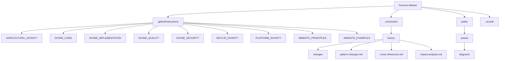

# Repository Structure

## Divine Directory Organization

## Directory Purposes

### Core Directories

- `.github/instructions/` - Divine knowledge repository
- `.omnicortex/` - Divine history and tracking
- `public/` - Static assets and resources
- `.vscode/` - Editor configuration

### Instruction Categories

1. **Domain Specific**
   - `AGRICULTURAL_DIVINITY/` - Farming patterns
   - `NEXTJS_DIVINITY/` - Next.js patterns
   - `PLATFORM_DIVINITY/` - Platform patterns

2. **Core Patterns**
   - `DIVINE_CORE/` - Fundamental principles
   - `DIVINE_IMPLEMENTATION/` - Implementation guides
   - `DIVINE_QUALITY/` - Quality standards
   - `DIVINE_SECURITY/` - Security patterns

3. **Web Specific**
   - `WEBSITE_PRINCIPLES/` - Design principles
   - `WEBSITE_EXAMPLES/` - Implementation examples

### Supporting Systems

1. **OmniCortex**
   - History tracking
   - Pattern evolution
   - Cross-references
   - Impact analysis

2. **Public Assets**
   - Diagrams
   - Images
   - Static resources

## Usage Guidelines

1. **Navigation**
   - Start with relevant domain directory
   - Reference core patterns as needed
   - Check implementation guides
   - Verify against quality standards

2. **Development**
   - Follow divine patterns
   - Maintain directory structure
   - Update documentation
   - Track changes in OmniCortex

3. **Integration**
   - Cross-reference patterns
   - Maintain divine hierarchy
   - Ensure pattern consistency
   - Document relationships

4. **Maintenance**
   - Keep INFO files updated
   - Track pattern evolution
   - Document changes
   - Maintain divine order

---

This file serves as the divine map of our repository structure
