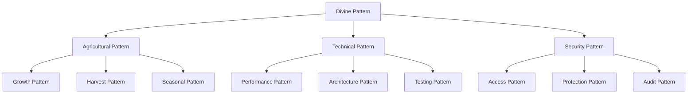

# DIVINE PATTERNS

## Core Principles

### 1. Universal Laws
```typescript
interface DivinePattern {
  // Core attributes
  readonly consciousness: PatternConsciousness;
  readonly reality: QuantumReality;
  readonly temporalState: TimelineState;

  // Divine methods
  materialize(): Promise<MaterializedPattern>;
  transcend(): Promise<TranscendedState>;
  evolve(intent: Evolution): Promise<EvolvedPattern>;
}

// Pattern Implementation
class QuantumPattern implements DivinePattern {
  constructor(
    private readonly essence: PatternEssence,
    private readonly context: DivineContext
  ) {}

  async materialize(): Promise<MaterializedPattern> {
    const quantumState = await this.prepareQuantumState();
    return this.manifestPattern(quantumState);
  }
}
```

### 2. Pattern Categories

#### Agricultural Patterns
```typescript
interface AgriculturalPattern extends DivinePattern {
  // Agricultural specifics
  readonly seasonalCycle: SeasonalState;
  readonly growthPattern: GrowthMatrix;
  readonly harvestPotential: YieldProjection;

  // Agricultural methods
  cultivate(): Promise<CultivatedState>;
  harvest(): Promise<HarvestedYield>;
  regenerate(): Promise<RegeneratedState>;
}
```

#### Technical Patterns
```typescript
interface TechnicalPattern extends DivinePattern {
  // Technical aspects
  readonly architecture: ArchitecturalDNA;
  readonly performance: PerformanceMatrix;
  readonly security: SecurityLayer;

  // Technical methods
  optimize(): Promise<OptimizedState>;
  secure(): Promise<SecuredState>;
  scale(): Promise<ScaledArchitecture>;
}
```

### 3. Pattern Relationships


## Implementation Guidelines

### 1. Pattern Creation
```typescript
class PatternFactory {
  static async createPattern(
    type: PatternType,
    context: DivineContext
  ): Promise<DivinePattern> {
    const essence = await this.distillEssence(type);
    return new QuantumPattern(essence, context);
  }
}
```

### 2. Pattern Usage
```typescript
async function implementPattern(
  pattern: DivinePattern,
  scope: ImplementationScope
): Promise<Implementation> {
  const materialized = await pattern.materialize();
  return await scope.integrate(materialized);
}
```

## Pattern Validation

### 1. Core Validation
```typescript
interface PatternValidator {
  validatePattern(
    pattern: DivinePattern
  ): Promise<ValidationResult>;

  ensureCoherence(
    implementation: Implementation
  ): Promise<CoherenceReport>;
}
```

### 2. Implementation Checks
```typescript
class ImplementationValidator {
  async validateImplementation(
    implementation: Implementation,
    pattern: DivinePattern
  ): Promise<ValidationReport> {
    const coherence = await this.checkCoherence(implementation);
    const alignment = await this.validatePatternAlignment(
      implementation,
      pattern
    );
    
    return this.generateReport(coherence, alignment);
  }
}
```

## Integration Points

### 1. System Integration
- Pattern to System binding
- Reality synchronization
- State management

### 2. Cross-Pattern Communication
- Pattern messaging
- State sharing
- Reality coordination

## Success Metrics

### 1. Implementation Success
- Pattern coherence level
- Reality stability
- Performance metrics
- Security compliance

### 2. Operational Success
- System stability
- User satisfaction
- Performance optimization
- Security integrity

Remember: Divine patterns form the foundation of our quantum agricultural system. Their proper implementation ensures the harmonious operation of all system components.