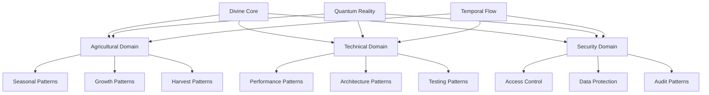

# UNIFIED DIVINE PATTERNS

## Pattern Integration Matrix



## Universal Pattern Interface

```typescript
interface UniversalPattern {
  // Core Pattern Properties
  readonly patternType: PatternType;
  readonly quantumState: QuantumState;
  readonly temporalContext: TemporalContext;

  // Core Pattern Methods
  materialize(): Promise<MaterializedPattern>;
  evolve(intent: EvolutionIntent): Promise<EvolvedPattern>;
  optimize(constraints: OptimizationConstraints): Promise<OptimizedPattern>;
}

// Pattern Implementation
class QuantumUniversalPattern implements UniversalPattern {
  constructor(
    private readonly essence: PatternEssence,
    private readonly context: UniversalContext
  ) {}

  async materialize(): Promise<MaterializedPattern> {
    const quantumState = await this.prepareQuantumState();
    return this.manifestPattern(quantumState);
  }
}
```

## Domain-Specific Pattern Extensions

### 1. Agricultural Extension
```typescript
interface AgriculturalUniversalPattern extends UniversalPattern {
  // Agricultural Properties
  readonly seasonalContext: SeasonalContext;
  readonly growthMetrics: GrowthMetrics;
  readonly harvestPotential: HarvestMetrics;

  // Agricultural Methods
  cultivate(intent: CultivationIntent): Promise<CultivatedState>;
  harvest(strategy: HarvestStrategy): Promise<HarvestedYield>;
  optimize(conditions: AgriculturalConditions): Promise<OptimizedFarm>;
}
```

### 2. Technical Extension
```typescript
interface TechnicalUniversalPattern extends UniversalPattern {
  // Technical Properties
  readonly performanceMetrics: PerformanceMetrics;
  readonly architectureState: ArchitectureState;
  readonly testingCoverage: TestCoverage;

  // Technical Methods
  optimize(target: OptimizationTarget): Promise<OptimizedSystem>;
  scale(requirements: ScalingRequirements): Promise<ScaledSystem>;
  validate(criteria: ValidationCriteria): Promise<ValidationResult>;
}
```

### 3. Security Extension
```typescript
interface SecurityUniversalPattern extends UniversalPattern {
  // Security Properties
  readonly securityState: SecurityState;
  readonly accessMatrix: AccessMatrix;
  readonly auditTrail: AuditHistory;

  // Security Methods
  protect(asset: ProtectedAsset): Promise<ProtectedState>;
  audit(scope: AuditScope): Promise<AuditResult>;
  enforce(policy: SecurityPolicy): Promise<EnforcedState>;
}
```

## Pattern Integration Framework

### 1. Integration Manager
```typescript
class PatternIntegrationManager {
  private readonly quantumIntegrator: QuantumIntegrator;

  async integratePatterns(
    patterns: Array<UniversalPattern>,
    context: IntegrationContext
  ): Promise<IntegratedSystem> {
    const quantum = await this.prepareQuantumIntegration(patterns);
    return this.executeIntegration(quantum, context);
  }
}
```

### 2. Reality Synchronization
```typescript
class RealitySynchronizer {
  async synchronizeRealities(
    patterns: Array<UniversalPattern>,
    timeline: TemporalTimeline
  ): Promise<SynchronizedReality> {
    const realities = patterns.map(p => p.quantumState.reality);
    return this.mergeRealities(realities, timeline);
  }
}
```

## Implementation Guidelines

### 1. Pattern Selection
- Choose appropriate base patterns
- Extend with domain-specific features
- Ensure quantum compatibility
- Validate integration points

### 2. Integration Process
- Initialize quantum context
- Prepare pattern instances
- Establish reality synchronization
- Monitor coherence levels

### 3. Optimization Strategy
- Identify optimization targets
- Apply quantum optimization
- Validate results
- Maintain stability

## Success Metrics

### 1. Integration Success
- Pattern coherence level
- Reality synchronization
- Performance optimization
- Security compliance

### 2. Operational Metrics
- System stability
- Pattern efficiency
- Security effectiveness
- Agricultural productivity

## Maintenance Procedures

### 1. Regular Maintenance
- Monitor pattern health
- Update quantum states
- Optimize integrations
- Validate security

### 2. Evolution Management
- Track pattern evolution
- Manage upgrades
- Handle migrations
- Maintain documentation

Remember: Unified patterns must maintain coherence across all domains while preserving the divine nature of the system.