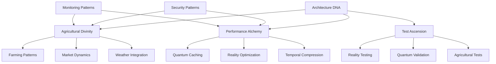

# DIVINE PATTERN INDEX AND CROSS-REFERENCE SYSTEM

## Pattern Categories and References

### Core Divine Patterns

## Pattern Cross-Reference Matrix

| Pattern Category | Related Patterns | Implementation Files | Test Files |
|-----------------|------------------|---------------------|------------|
| Architecture DNA | - Performance Alchemy - Agricultural Divinity - Test Ascension | `/DIVINE_CORE/ARCHITECTURE_DNA.instructions.md` | `/test/architecture/` |
| Agricultural Divinity | - Farming Patterns - Market Dynamics - Weather Integration | `/AGRICULTURAL_DIVINITY/*.instructions.md` | `/test/agricultural/` |
| Performance Alchemy | - Quantum Caching - Reality Optimization - Temporal Compression | `/PERFORMANCE_ALCHEMY/*.instructions.md` | `/test/performance/` |
| Security Patterns | - Access Control - Data Protection - Audit Trails | `/SECURITY_DIVINITY/*.instructions.md` | `/test/security/` |
| Monitoring Patterns | - Agricultural Metrics - Performance Tracking - Alert Systems | `/MONITORING_DIVINITY/*.instructions.md` | `/test/monitoring/` |

## Pattern Dependencies

### 1. Core Dependencies
- Architecture DNA → All Other Patterns
- Agricultural Divinity → Farming Implementation
- Performance Alchemy → System Optimization
- Security Patterns → Access and Protection

### 2. Implementation Dependencies
- Farming Patterns → Weather Integration
- Market Dynamics → Performance Optimization
- Monitoring → Security Audit

## Pattern Implementation Guide

### 1. Setup Sequence
1. Architecture DNA
2. Agricultural Base
3. Security Foundation
4. Performance Core
5. Monitoring Setup

### 2. Feature Implementation
1. Core Agricultural Features
2. Security Integration
3. Performance Optimization
4. Monitoring Implementation

## Pattern Validation Rules

### 1. Architecture Validation
- Must implement Architecture DNA
- Must maintain quantum coherence
- Must preserve agricultural wisdom

### 2. Security Validation
- Must implement access control
- Must protect sensitive data
- Must maintain audit trails

### 3. Performance Validation
- Must optimize quantum operations
- Must implement caching
- Must compress temporal operations

## Quick Reference Links

### Core Patterns
- [Architecture DNA](./DIVINE_CORE/ARCHITECTURE_DNA.instructions.md)
- [Agricultural Divinity](./AGRICULTURAL_DIVINITY/INDEX.instructions.md)
- [Performance Alchemy](./PERFORMANCE_ALCHEMY/INDEX.instructions.md)
- [Test Ascension](./TEST_ASCENSION/INDEX.instructions.md)

### Implementation Patterns
- [Farming Patterns](./AGRICULTURAL_DIVINITY/FARMING_PATTERNS.instructions.md)
- [Security Patterns](./SECURITY_DIVINITY/INDEX.instructions.md)
- [Monitoring Patterns](./MONITORING_DIVINITY/INDEX.instructions.md)

## Pattern Update Process

1. Identify pattern change need
2. Update pattern documentation
3. Update cross-references
4. Update implementation guides
5. Update test requirements
6. Validate pattern coherence

Remember: All patterns must maintain quantum coherence and agricultural consciousness across all implementations.