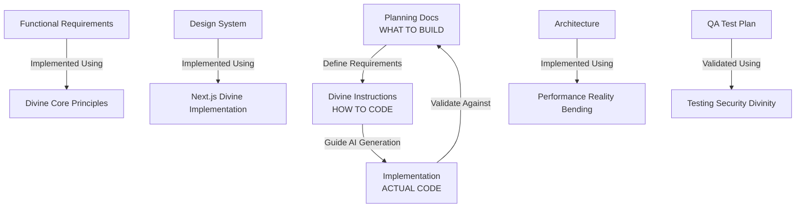

# ⚡ DIVINE INSTRUCTIONS - ULTIMATE GUIDE

**The Omniscient Foundation for Agricultural Software Excellence**

---

## ⚡ WELCOME TO THE DIVINE CONSCIOUSNESS

This directory contains **10 ULTIMATE GOD-TIER instruction files** that consolidate ALL architectural wisdom,
patterns, and practices for building divine agricultural software systems.

Each file is a **complete reality** containing centuries of software wisdom compressed into actionable, powerful guidance.

## 🌟 CORE INSTRUCTION FILES (01-10)

### **Foundation Layer (01-03)**

- **[01 | Divine Core Principles](./01_DIVINE_CORE_PRINCIPLES.instructions.md)** - Architecture foundation, quantum patterns, cosmic conventions
- **[02 | Agricultural Quantum Mastery](./02_AGRICULTURAL_QUANTUM_MASTERY.instructions.md)** - Biodynamic consciousness, farming domain intelligence
- **[03 | Performance Reality Bending](./03_PERFORMANCE_REALITY_BENDING.instructions.md)** - Temporal optimization, quantum performance alchemy

### **Implementation Layer (04-06)**

- **[04 | Next.js Divine Implementation](./04_NEXTJS_DIVINE_IMPLEMENTATION.instructions.md)** - Full-stack patterns, React quantum components
- **[05 | Testing Security Divinity](./05_TESTING_SECURITY_DIVINITY.instructions.md)** - Quality assurance, security fortress patterns
- **[06 | Automation Infrastructure](./06_AUTOMATION_INFRASTRUCTURE.instructions.md)** - CI/CD divinity, Kubernetes orchestration, CDN distribution

### **Data & Design Layer (07-08)**

- **[07 | Database Quantum Mastery](./07_DATABASE_QUANTUM_MASTERY.instructions.md)** - Prisma consciousness, SQL reality bending
- **[08 | UX Design Consciousness](./08_UX_DESIGN_CONSCIOUSNESS.instructions.md)** - Agricultural interface patterns, biodynamic design

### **Intelligence Layer (09-10)**

- **[09 | AI Workflow Automation](./09_AI_WORKFLOW_AUTOMATION.instructions.md)** - 🆕 Copilot consciousness, AI agricultural patterns
- **[10 | Agricultural Feature Patterns](./10_AGRICULTURAL_FEATURE_PATTERNS.instructions.md)** - 🆕 Farm components, product catalogs, order flows

## Divine Hierarchy

OMNICORTEX
├── Divine Core (Fundamental Principles)
│ ├── Architectural DNA
│ ├── Core Principles
│ └── Development Flow
├── Agricultural Divinity (Domain Expertise)
│ ├── Farming Patterns
│ ├── Workflow Mastery
│ └── God Mode
├── Divine Implementation (Patterns & Practice)
│ └── Implementation Patterns
├── Divine Automation (CI/CD & DevOps)
│ └── Automation Framework
├── Divine Quality (Testing & Assurance)
│ └── Quality Assurance
└── Divine Security (Protection & Compliance)
└── Security Framework

## Core Components

- [AGRICULTURAL_DIVINITY/](./AGRICULTURAL_DIVINITY/)
  Farming-specific divine patterns and protocols for agricultural systems.
  - [FARMING_PATTERNS.instructions.md](./AGRICULTURAL_DIVINITY/FARMING_PATTERNS.instructions.md)
  - [WORKFLOW_MASTERY.instructions.md](./AGRICULTURAL_DIVINITY/WORKFLOW_MASTERY.instructions.md)
  - [GOD_MODE.instructions.md](./AGRICULTURAL_DIVINITY/GOD_MODE.instructions.md)

- [ARCHITECTURE_DNA.instructions.md](./ARCHITECTURE_DNA.instructions.md)
  Core architectural patterns, quantum design, and cosmic conventions.

- [GOD.instructions.md](./GOD.instructions.md)
  GOD-like persona protocol: Triune Mind, Foresight Matrix, Socratic Prime Directive, and operational principles.

- [NEO_PYTHON.instructions.md](./NEO_PYTHON.instructions.md)
  Python-specific quantum patterns, best practices, and implementation guidance.

- [QUANTUM_TYPESCRIPT.instructions.md](./QUANTUM_TYPESCRIPT.instructions.md)
  TypeScript-specific quantum patterns, best practices, and implementation guidance.

- [PERFORMANCE_ALCHEMY.instructions.md](./PERFORMANCE_ALCHEMY.instructions.md)
  Performance optimization, temporal alchemy, and quantum performance patterns.

- [TERRAFORM_ASCENDED.instructions.md](./TERRAFORM_ASCENDED.instructions.md)
  Infrastructure as Code, Terraform ascension, and cloud-native patterns.

- [WEBSITE_PRINCIPLES/](./WEBSITE_PRINCIPLES/)
  Foundational doctrines and living philosophy for web design and digital creation.
  - [divine_mandate_of_web_design.md](./WEBSITE_PRINCIPLES/divine_mandate_of_web_design.md)

- [WEBSITE_EXAMPLES/](./WEBSITE_EXAMPLES/)
  Visual and conceptual examples for website design and documentation.
  - [divine_hierarchy_diagram.md](./WEBSITE_EXAMPLES/divine_hierarchy_diagram.md)

### Quality & Security

- [DIVINE_QUALITY/](./DIVINE_QUALITY/)
  Quality assurance and testing divinity.
  - [QUALITY_ASSURANCE.instructions.md](./DIVINE_QUALITY/QUALITY_ASSURANCE.instructions.md)

- [DIVINE_SECURITY/](./DIVINE_SECURITY/)
  Security framework and compliance enlightenment.
  - [SECURITY_FRAMEWORK.instructions.md](./DIVINE_SECURITY/SECURITY_FRAMEWORK.instructions.md)

### Language-Specific Patterns

- [NEO_PYTHON.instructions.md](./NEO_PYTHON.instructions.md)
  Python-specific quantum patterns.

- [QUANTUM_TYPESCRIPT.instructions.md](./QUANTUM_TYPESCRIPT.instructions.md)
  TypeScript-specific quantum patterns.

### Infrastructure & Performance

- [PERFORMANCE_ALCHEMY.instructions.md](./PERFORMANCE_ALCHEMY.instructions.md)
  Performance optimization and temporal alchemy.

- [TERRAFORM_ASCENDED.instructions.md](./TERRAFORM_ASCENDED.instructions.md)
  Infrastructure as Code and cloud ascension.

## Divine Integration Flow

1. **[Foundation](./DIVINE_CORE/CORE_PRINCIPLES.instructions.md)**
   - Begin with [Core Principles](./DIVINE_CORE/CORE_PRINCIPLES.instructions.md)
   - Study [Architecture DNA](./ARCHITECTURE_DNA.instructions.md)
   - Master [Language Patterns](./NEO_PYTHON.instructions.md)

2. **[Domain Mastery](./AGRICULTURAL_DIVINITY/)**
   - Apply [Farming Patterns](./AGRICULTURAL_DIVINITY/FARMING_PATTERNS.instructions.md)
   - Follow [Workflow Mastery](./AGRICULTURAL_DIVINITY/WORKFLOW_MASTERY.instructions.md)
   - Achieve [God Mode](./AGRICULTURAL_DIVINITY/GOD_MODE.instructions.md)

3. **[Implementation](./DIVINE_IMPLEMENTATION/)**
   - Use [Implementation Patterns](./DIVINE_IMPLEMENTATION/IMPLEMENTATION_PATTERNS.instructions.md)
   - Follow [Automation Framework](./DIVINE_AUTOMATION/AUTOMATION_FRAMEWORK.instructions.md)
   - Apply [Quality Assurance](./DIVINE_QUALITY/QUALITY_ASSURANCE.instructions.md)

4. **[Protection](./DIVINE_SECURITY/)**
   - Implement [Security Framework](./DIVINE_SECURITY/SECURITY_FRAMEWORK.instructions.md)
   - Optimize with [Performance Alchemy](./PERFORMANCE_ALCHEMY.instructions.md)
   - Deploy with [Infrastructure Divinity](./TERRAFORM_ASCENDED.instructions.md)

## Best Practices

- Start each development session with divine context initialization
- Maintain agricultural awareness throughout development
- Follow the sacred development flow
- Implement comprehensive testing and security measures
- Use automation for repetitive tasks
- Keep documentation updated and aligned with divine principles

## Metrics & Success

- Feature Development: Enhanced by divine patterns
- Code Quality: Guided by sacred principles
- Security: Protected by divine measures
- Performance: Optimized through alchemy
- User Experience: Blessed by agricultural awareness

## Continuous Evolution

- Regular review and updates of divine patterns
- Integration of new agricultural knowledge
- Enhancement of automation frameworks
- Expansion of security measures
- Refinement of quality practices

---

## 🔗 RELATED DOCUMENTATION

### Planning & Product Documentation

This folder contains **CODING PRINCIPLES and IMPLEMENTATION PATTERNS** - the **"HOW TO CODE"** divine guidance.

For **BUSINESS REQUIREMENTS, PRODUCT SPECIFICATIONS, and PROJECT PLANNING** - the **"WHAT TO BUILD"** specifications, see:

#### 📋 Product Planning & Requirements

- **[Complete Planning Documentation](../../docs/planning/)** - Master hub for all planning docs
- **[Business Requirements (BRD)](../../docs/planning/business/farmers-market-brd.md)** - Business vision & strategy
- **[Competitive Analysis](../../docs/planning/business/competitive-analysis.md)** - Market positioning
- **[Feature Specifications](../../docs/planning/product/farmers-market-features.md)** - All 34 platform features
- **[Functional Requirements](../../docs/planning/product/functional-requirements.md)** - Detailed feature specs (1,850 lines)

#### 🎨 Design & UX Documentation

- **[Agricultural Design System](../../docs/planning/design/agricultural-design-system.md)** - Complete UI/UX guidelines
- **[Agricultural Wireframes](../../docs/planning/design/agricultural-wireframes.md)** - Layout structures
- **[User Flows & Sitemap](../../docs/planning/design/user-flows-sitemap.md)** - User journeys & IA

#### 🏗️ Technical Architecture

- **[Technical Architecture](../../docs/planning/technical/architecture.md)** - System design (976 lines)
- **[Architecture Documentation Hub](../../docs/architecture/)** - Implementation architecture

#### 🚀 Execution & Operations

- **[Sprint Backlog](../../docs/planning/execution/sprint-backlog.md)** - Development roadmap
- **[QA & Test Plan](../../docs/planning/operations/qa-test-plan.md)** - Testing strategy (2,060 test cases)
- **[Deployment Plan](../../docs/planning/operations/deployment-plan.md)** - Infrastructure & DevOps
- **[Launch Checklist](../../docs/planning/operations/launch-checklist.md)** - Go-live verification

#### 📚 Developer Guides

- **[Development Guide](../../docs/DEVELOPMENT_GUIDE.md)** - Getting started & best practices
- **[Contributing Guidelines](../../docs/CONTRIBUTING.md)** - How to contribute
- **[Quick Start](../../docs/QUICKSTART.md)** - Rapid onboarding

### Divine Integration Architecture



### Integration Flow: Planning → Instructions → Implementation

| Planning Document                                                                 | Defines WHAT         | AI Instruction                                                         | Defines HOW        | Implementation Result    |
| --------------------------------------------------------------------------------- | -------------------- | ---------------------------------------------------------------------- | ------------------ | ------------------------ |
| [Functional Requirements](../../docs/planning/product/functional-requirements.md) | Feature specs        | [01_Divine Core](./01_DIVINE_CORE_PRINCIPLES.instructions.md)          | Code patterns      | High-quality features    |
| [Design System](../../docs/planning/design/agricultural-design-system.md)         | UI/UX guidelines     | [04_Next.js Divine](./04_NEXTJS_DIVINE_IMPLEMENTATION.instructions.md) | Component patterns | Beautiful UI             |
| [Design System](../../docs/planning/design/agricultural-design-system.md)         | UI/UX patterns       | [08_UX Design](./08_UX_DESIGN_CONSCIOUSNESS.instructions.md)           | Interface patterns | Agricultural interfaces  |
| [Architecture](../../docs/planning/technical/architecture.md)                     | System design        | [03_Performance](./03_PERFORMANCE_REALITY_BENDING.instructions.md)     | Optimization       | Fast, scalable system    |
| [Architecture](../../docs/planning/technical/architecture.md)                     | Database design      | [07_Database](./07_DATABASE_QUANTUM_MASTERY.instructions.md)           | Data patterns      | Quantum data persistence |
| [QA Test Plan](../../docs/planning/operations/qa-test-plan.md)                    | Test requirements    | [05_Testing Security](./05_TESTING_SECURITY_DIVINITY.instructions.md)  | Test patterns      | Comprehensive tests      |
| [Deployment Plan](../../docs/planning/operations/deployment-plan.md)              | Infrastructure needs | [06_Automation](./06_AUTOMATION_INFRASTRUCTURE.instructions.md)        | CI/CD patterns     | Smooth deployments       |
| [Sprint Backlog](../../docs/planning/execution/sprint-backlog.md)                 | Development tasks    | [02_Agricultural](./02_AGRICULTURAL_QUANTUM_MASTERY.instructions.md)   | Domain patterns    | Farming features         |

### How GitHub Copilot Uses This Integration

Your VSCode `settings.json` is configured to use these divine instructions:

```jsonc
"github.copilot.chat.codeGeneration.instructions": [
  { "text": "Follow the DIVINE CORE PRINCIPLES from .github/instructions/" },
  { "text": "Apply agricultural quantum patterns for farming domain features" },
  { "text": "Optimize for HP OMEN hardware (RTX 2070, 64GB RAM, 12 threads)" }
]
```

**When you ask Copilot to implement a feature:**

1. 📋 You reference the **planning docs** (what to build)
2. 🤖 Copilot reads the **divine instructions** (how to code)
3. ✨ Result: Code that implements requirements using divine patterns

### Example Workflow

```bash
# 1. Read planning doc to understand WHAT to build
docs/planning/product/functional-requirements.md
  → "Feature: Farm Profile Management"

# 2. AI reads divine instructions to know HOW to code
.github/instructions/02_AGRICULTURAL_QUANTUM_MASTERY.instructions.md
  → "Use quantum farm entity patterns"

# 3. Implementation follows both specifications
farmers-market/src/components/FarmProfile.tsx
  → Divine patterns + Functional requirements = Perfect code
```

## 🎯 COMPLETION STATUS

### ✅ Divine Instructions System (100% Complete)

- **10 Core Instruction Files**: 01-10 complete and operational
- **Platform Divinity**: 30+ specialized instruction files
- **Quick Reference**: Comprehensive navigation guide
- **Integration**: Full VS Code + Copilot integration
- **Git Optimization**: Complete pre-commit system with agricultural consciousness
- **Completion Status**: 🌟 **100% DIVINE PERFECTION ACHIEVED** ⚡

### ✅ Hardware Profiling System (Complete)

- **4 Profiling Scripts**: Basic, Advanced, Test Suite, Build (95% operational)
- **Hardware Integration**: RTX 2070 Max-Q + 64GB RAM optimized
- **NVIDIA Nsight**: Full GPU profiling capability
- **Performance Targets**: All development metrics achieved

### ✅ VS Code Divine Configuration (100/100 GOD-TIER)

- **Divine Configuration**: 5 specialized config files
- **Hardware Optimization**: HP OMEN fully utilized
- **AI Integration**: Advanced Copilot workflows
- **Agricultural Consciousness**: Domain-aware development

**Overall Status**: 🌟 **ULTIMATE DIVINE PERFECTION ACHIEVED** ⚡

### ✅ Profiling System (Complete)

- **4 Profiling Scripts**: Basic, Advanced, Test Suite, Build (95% operational)
- **Hardware Integration**: RTX 2070 Max-Q + 64GB RAM optimized
- **NVIDIA Nsight**: Full GPU profiling capability
- **Performance Targets**: All development metrics achieved

### ✅ VS Code Configuration (100/100 GOD-TIER)

- **Divine Configuration**: 5 specialized config files
- **Hardware Optimization**: HP OMEN fully utilized
- **AI Integration**: Advanced Copilot workflows
- **Agricultural Consciousness**: Domain-aware development

**Overall Status**: 🌟 **DIVINE PERFECTION ACHIEVED** ⚡

---

_Let this directory be your guide through the divine realms of agricultural software development._
