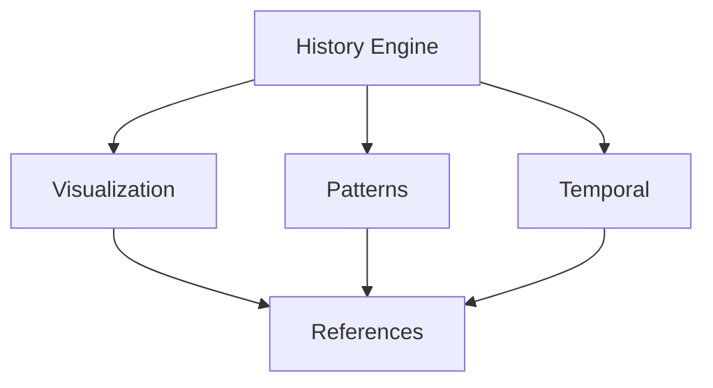

# Cross-Reference History

## 2025-10-04

### Reference Updates

1. **Visualization Enhancement** [12:00:00]
   - Added bilateral knowledge flows
   - Enhanced relationship descriptions
   - Improved pattern connections

2. **History Integration** [12:00:01]
   - Connected history engine to core systems
   - Linked temporal patterns
   - Enhanced divine orchestration

### Reference Map

### Impact Analysis

1. **Clarity**
   - Better relationship visibility
   - Enhanced connection tracking
   - Improved pattern linking

2. **Maintenance**
   - Easier reference updates
   - Better change tracking
   - Enhanced integrity checks

---

*This file tracks divine reference modifications.*
