# 🏗️ Farmers Market Platform - Architecture Diagram

**Version:** 1.0  
**Last Updated:** December 20, 2024  
**Status:** Production Ready

---

## 🌐 High-Level System Architecture

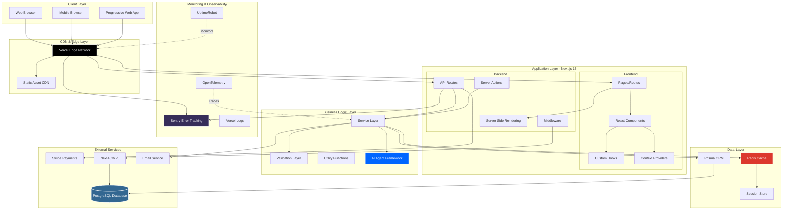

---

## 🎯 Application Flow Architecture

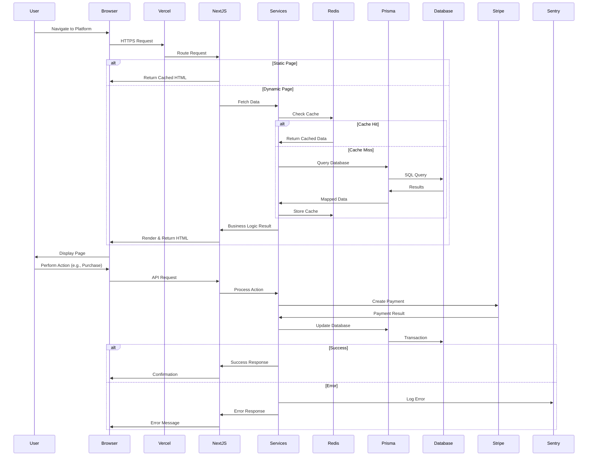

---

## 🗄️ Database Schema Architecture

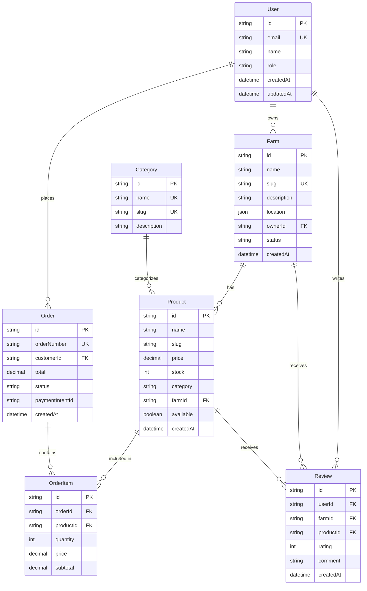

---

## 🔐 Authentication & Authorization Flow

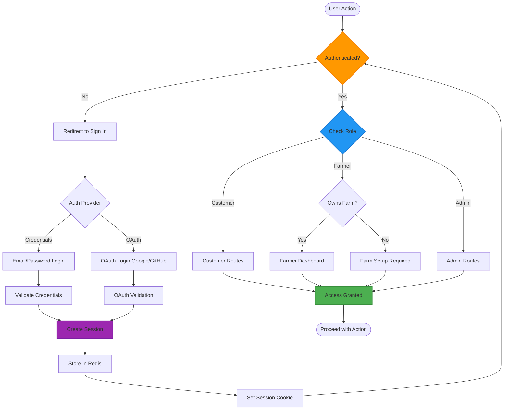

---

## 💳 Payment Processing Architecture

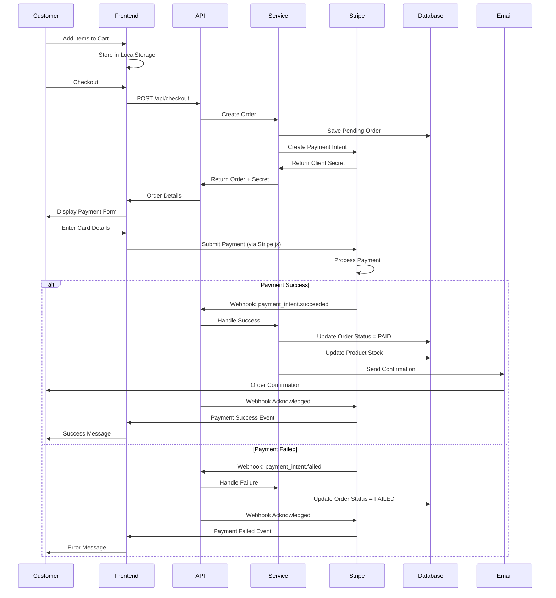

---

## 🤖 AI Agent Framework Architecture

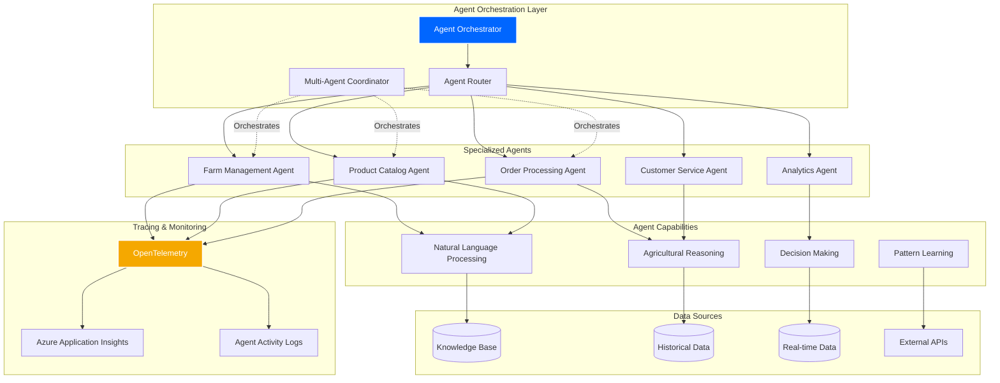

---

## 🚀 Deployment & Infrastructure Architecture

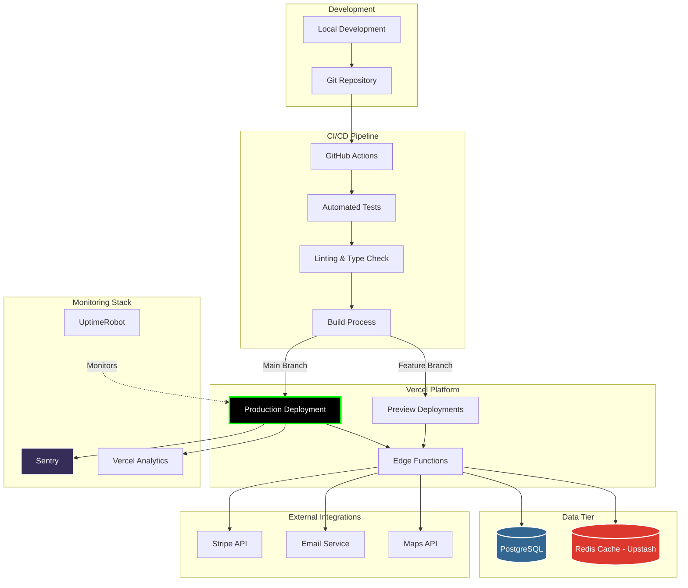

---

## 📊 Monitoring & Observability Architecture

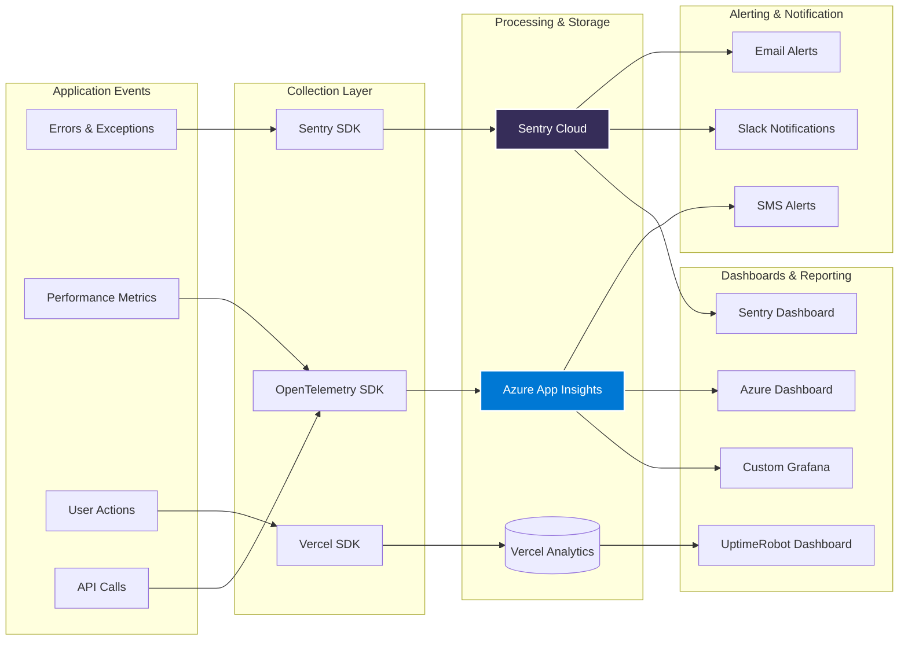

---

## 🌾 Agricultural Consciousness Layer

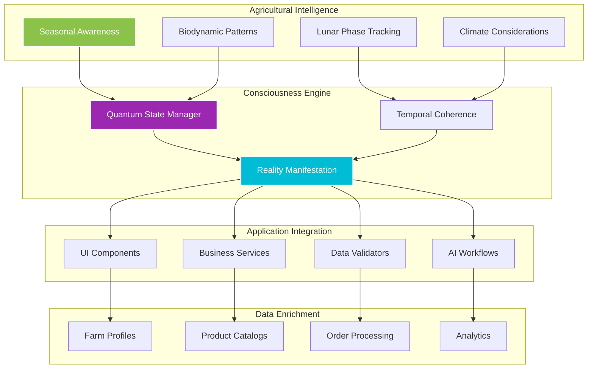

---

## 🔄 Caching Strategy Architecture

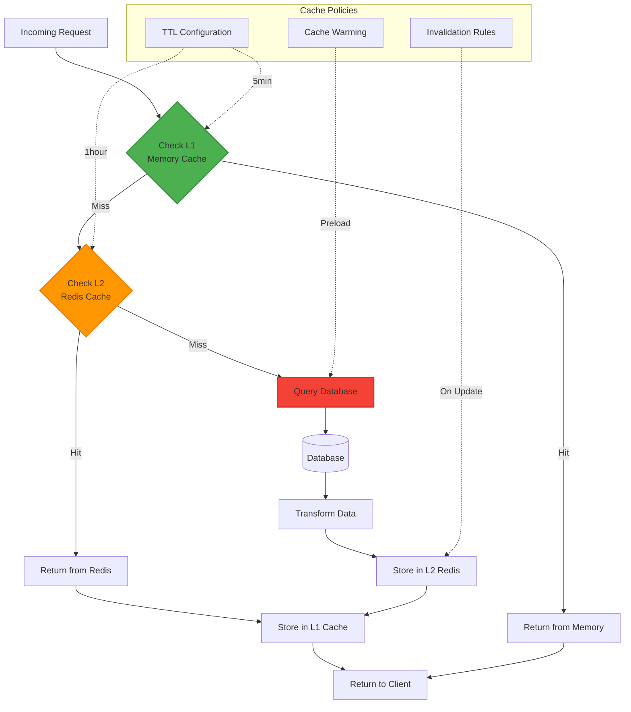

---

## 📱 Frontend Component Architecture

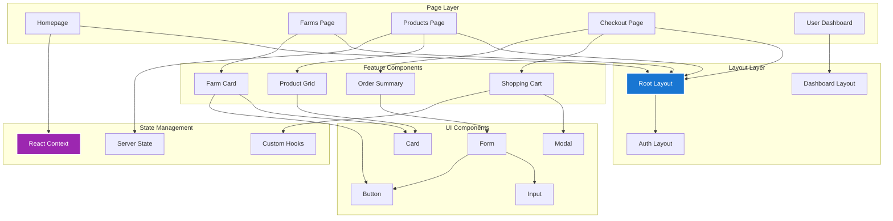

---

## 🔒 Security Architecture

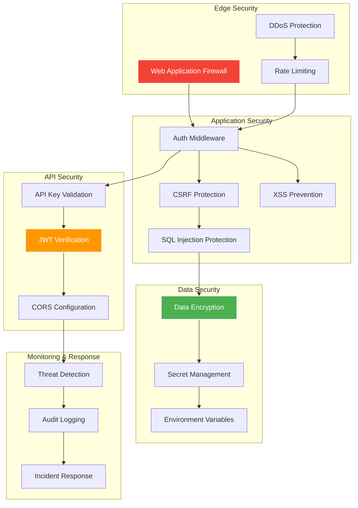

---

## 📈 Performance Optimization Architecture

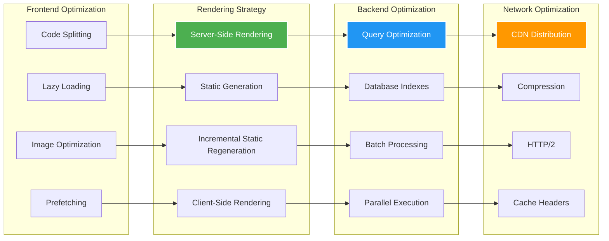

---

## 📊 Key Architecture Metrics

```yaml
Performance Targets:
  Page Load: <2 seconds (95th percentile)
  API Response: <200ms average
  Database Query: <50ms average
  Cache Hit Rate: >80
  Uptime: 99.9%+

Scalability:
  Concurrent Users: 10,000+
  Requests/Second: 1,000+
  Database Connections: 100+ pooled
  Redis Operations: 10,000+ ops/sec

Security:
  SSL/TLS: A+ Rating
  Security Headers: All Present
  OWASP Compliance: Top 10 Addressed
  Vulnerability Scan: Weekly

Reliability:
  Error Rate: <0.1%
  Recovery Time: <5 minutes
  Backup Frequency: Daily
  Monitoring Coverage: 100%
```

---

## 🎯 Architecture Principles

1. **Separation of Concerns**: Clear boundaries between layers
2. **Scalability First**: Designed for 1 to 1 billion users
3. **Type Safety**: 100% TypeScript strict mode
4. **Agricultural Consciousness**: Domain-aware throughout
5. **Performance Optimized**: Multi-layer caching, edge delivery
6. **Observable**: Comprehensive monitoring and tracing
7. **Secure by Default**: Security at every layer
8. **Maintainable**: Clean code, documented, tested

---

_"From divine architecture to quantum implementation — the Farmers Market Platform!"_ 🌾⚡

**Diagram Version:** 1.0  
**Created:** December 20, 2024  
**Status:** ✅ Production Architecture
