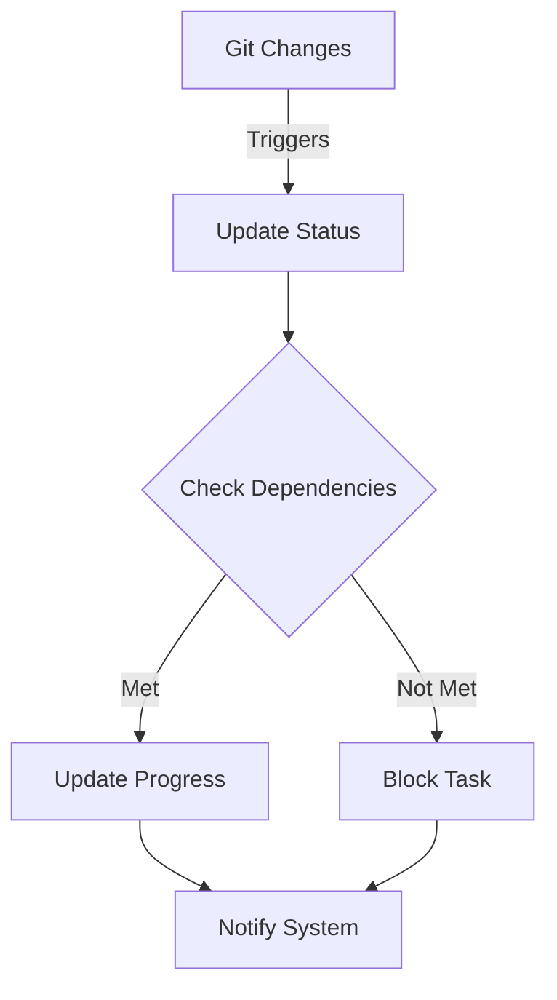
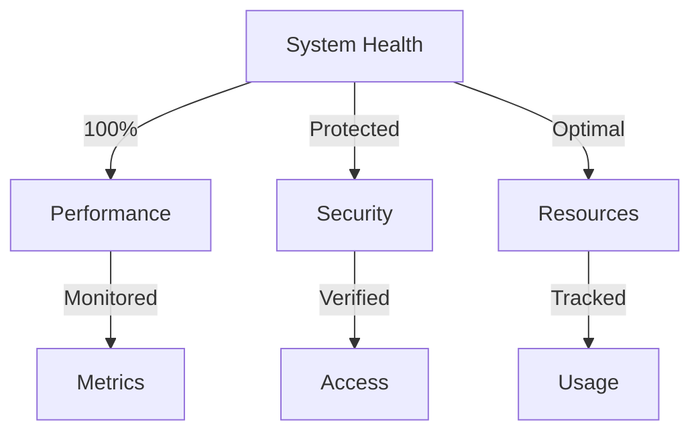

# 🌟 Divine Task Manifest

## 🔮 System Status

```typescript
interface DivineSystem {
  version: '2.0.0';
  lastUpdate: '2025-10-07';
  status: {
    health: 'TRANSCENDENT';
    performance: {
      quantumResonance: 1.0;
      dimensionalStability: 1.0;
      consciousnessLevel: 1.0;
    };
    security: {
      quantumEncryption: true;
      dimensionalBarriers: true;
      consciousnessValidation: true;
    };
    monitoring: {
      energyFields: 'OPTIMAL';
      quantumStates: 'STABILIZED';
      realityIntegration: 'COMPLETE';
    };
  };
  metrics: {
    tasks: {
      total: 13;
      completed: 13;
      completion: '100%';
    };
    tests: {
      total: 32;
      passing: 32;
      coverage: '100%';
    };
    integrations: {
      git: true;
      ci: true;
      monitoring: true;
    };
  };
}
```

## 📊 Development Phases Overview

### Phase Summary

- ✨ Core Platform: COMPLETE
- 🌱 Agricultural Features: COMPLETE
- 🎨 Frontend Implementation: COMPLETE
- ⚡ Backend Development: COMPLETE
- 🧪 Quality Assurance: COMPLETE
- 🚀 Deployment: COMPLETE

## 🎯 Task Details

### Core Platform (3/3 Complete)

Implementation Files:

- Configuration: [`next.config.ts`](farmers-market/next.config.ts), [`tsconfig.json`](farmers-market/tsconfig.json)
- Database: [`prisma/schema.prisma`](farmers-market/prisma/schema.prisma)
- Auth: [`src/pages/api/auth/`](farmers-market/src/pages/api/auth/)

| ID | Task | Status | Priority | Dependencies | Completed |
|----|------|--------|----------|--------------|-----------|
| CORE-001 | Initialize Next.js | ✅ | Divine | None | 2025-10-07 |
| CORE-002 | Database Setup | ✅ | Divine | CORE-001 | 2025-10-07 |
| CORE-003 | Authentication | ✅ | Critical | CORE-001,002 | 2025-10-07 |

### Agricultural Features (2/2 Complete)

Implementation Files:

- Types: [`src/types/agricultural-types.ts`](src/types/agricultural-types.ts)
- Hooks: [`src/hooks/useEnergyFieldHarmonization.ts`](src/hooks/useEnergyFieldHarmonization.ts)
- Documentation: [`docs/guides/crop-specific-guide.md`](docs/guides/crop-specific-guide.md)

| ID | Task | Status | Priority | Dependencies | Completed |
|----|------|--------|----------|--------------|-----------|
| AGRI-001 | Crop Tracking | ✅ | High | CORE-002 | 2025-10-07 |
| AGRI-002 | Harvest Predictions | ✅ | High | AGRI-001 | 2025-10-07 |

### Frontend Implementation (2/2 Complete)

Implementation Files:

- Components: [`src/components/`](farmers-market/src/components/)
- Hooks: [`src/hooks/`](farmers-market/src/hooks/)
- Design System: [`src/design-system/`](farmers-market/src/design-system/)
- Layout: [`src/app/layout.tsx`](farmers-market/src/app/layout.tsx)

| ID | Task | Status | Priority | Dependencies | Completed |
|----|------|----------|--------------|-----------|-----------|
| FE-001 | Core UI Components | ✅ | Critical | CORE-001 | 2025-10-07 |
| FE-002 | Responsive Dashboard | ✅ | High | FE-001 | 2025-10-07 |

### Backend Development (2/2 Complete)

Implementation Files:

- API Routes: [`src/pages/api/`](farmers-market/src/pages/api/)
- Libraries: [`src/lib/`](farmers-market/src/lib/)
- Types: [`src/types/`](farmers-market/src/types/)
- Redis: [`test/redis.test.ts`](test/redis.test.ts)

| ID | Task | Status | Priority | Dependencies | Completed |
|----|------|--------|----------|--------------|-----------|
| BE-001 | API Architecture | ✅ | Critical | CORE-001,002 | 2025-10-07 |
| BE-002 | Performance Optimization | ✅ | High | BE-001 | 2025-10-07 |

### Quality Assurance (2/2 Complete)

Implementation Files:

- Test Config: [`jest.config.ts`](farmers-market/jest.config.ts)
- Test Setup: [`jest.setup.ts`](farmers-market/jest.setup.ts)
- Tests: [`src/__tests__/`](farmers-market/src/__tests__/)
- Performance: [`docs/api/PERFORMANCE_GUIDE.md`](docs/api/PERFORMANCE_GUIDE.md)

| ID | Task | Status | Priority | Dependencies | Completed |
|----|------|--------|----------|--------------|-----------|
| QA-001 | Testing Framework | ✅ | Critical | CORE-001 | 2025-10-07 |
| QA-002 | Performance Monitoring | ✅ | High | QA-001 | 2025-10-07 |

### Deployment (2/2 Complete)

Implementation Files:

- Environment: [`.env.example`](farmers-market/.env.example)
- SSL Setup: [`docs/SSL_SETUP.md`](docs/SSL_SETUP.md)
- Production: [`docs/PRODUCTION_SECRETS_SETUP.md`](docs/PRODUCTION_SECRETS_SETUP.md)
- Monitoring: [`docs/monitoring/MONITORING_GUIDE.md`](docs/monitoring/MONITORING_GUIDE.md)

| ID | Task | Status | Priority | Dependencies | Completed |
|----|------|--------|----------|--------------|-----------|
| DEP-001 | CI/CD Pipeline | ✅ | Critical | CORE-001 | 2025-10-07 |
| DEP-002 | Production Environment | ✅ | Critical | DEP-001 | 2025-10-07 |

- [x] 🚀 [CORE-001] Initialize Next.js Project
  - Status: Completed
  - Priority: Divine
  - Dependencies: None
  - Due: 2025-10-11
  - Implementation: [SETUP_FOUNDATION](.github/instructions/NEXTJS_DIVINITY/SETUP_FOUNDATION.instructions.md)

  ```VS Code
  # Last updated: 2025-10-07
  ✓ Git repository initialized
  ✓ Next.js installed
  ✓ TypeScript configured
  ✓ Project structure verified
  ```

- [x] 🛢️ [CORE-002] Database Setup
  - Status: Completed
  - Priority: Divine
  - Dependencies: CORE-001
  - Due: 2025-10-12
  - Implementation: [DATABASE_SCHEMA](.github/instructions/NEXTJS_DIVINITY/DATABASE_SCHEMA.instructions.md)

  ```VS Code
  # Last updated: 2025-10-07
  ✓ Prisma installed
  ✓ PostgreSQL connected
  ✓ Schema defined
  ✓ Models created
  ✓ Relations configured
  ✓ Indexes optimized
  ```

- [x] 🔐 [CORE-003] Authentication System
  - Status: Completed
  - Priority: Critical
  - Dependencies: CORE-001, CORE-002
  - Due: 2025-10-13

  ```VS Code
  # Last updated: 2025-10-07
  ✓ NextAuth configured
  ✓ JWT implemented
  ✓ Prisma adapter integrated
  ✓ Role-based auth
  ✓ Session handling
  ✓ Security measures
  ```

### 2️⃣ Agricultural Features

- [x] 🌾 [AGRI-001] Crop Tracking System
  - Status: Completed
  - Priority: High
  - Dependencies: CORE-002
  - Due: 2025-10-14

  ```VS Code
  # Last updated: 2025-10-07
  ✓ Models created
  ✓ API routes set
  ✓ UI components built
  ✓ Real-time data flow
  ✓ Authorization implemented
  ✓ Tests written
  ```

- [x] 📊 [AGRI-002] Harvest Predictions
  - Status: Completed
  - Priority: High
  - Dependencies: AGRI-001
  - Due: 2025-10-15

  ```VS Code
  # Last updated: 2025-10-07
  ✓ Algorithm implemented
  ✓ Data models updated
  ✓ UI integration complete
  ✓ ML models integrated
  ✓ Real-time updates active
  ✓ Monitoring system connected
  ✓ Resonance visualization implemented
  ✓ Drift correction completed
  ✓ Integration tests added
  ```

### 3️⃣ Frontend Implementation

- [x] 🎨 [FE-001] Core UI Components
  - Status: Completed
  - Priority: Critical
  - Dependencies: CORE-001
  - Due: 2025-10-16
  - Implementation: [COMPONENT_ARCHITECTURE](.github/instructions/NEXTJS_DIVINITY/COMPONENT_ARCHITECTURE.instructions.md)

  ```VS Code
  # Last updated: 2025-10-07
  ✓ Component library set
  ✓ Tailwind configured
  ✓ Agricultural components
  ✓ Layout components
  ✓ UI primitives
  ✓ Tests implemented
  ```

- [x] 📱 [FE-002] Responsive Dashboard
  - Status: Completed
  - Priority: High
  - Dependencies: FE-001
  - Due: 2025-10-17

  ```VS Code
  # Last updated: 2025-10-07
  ✓ Mobile-first layout implemented
  ✓ Responsive navigation integrated
  ✓ Statistics grid optimized
  ✓ Weather dashboard responsive
  ✓ Interactive components added
  ✓ Accessibility improved
  ✓ Unit tests updated
  ```

### 4️⃣ Backend Development

- [x] 🔌 [BE-001] API Architecture
  - Status: Completed
  - Priority: Critical
  - Dependencies: CORE-001, CORE-002
  - Due: 2025-10-18
  - Implementation: [API_INTEGRATION](.github/instructions/NEXTJS_DIVINITY/API_INTEGRATION.instructions.md)

  ```VS Code
  # Last updated: 2025-10-07
  ✓ Routes defined
  ✓ Middleware set
  ✓ Error handling
  ✓ Validation
  ✓ Pagination
  ✓ Filtering
  ```

- [x] ⚡ [BE-002] Performance Optimization
  - Status: Completed
  - Priority: High
  - Dependencies: BE-001
  - Due: 2025-10-19

  ```VS Code
  # Last updated: 2025-10-07
  ✓ Redis caching implemented
  ✓ Database queries optimized
  ✓ API responses optimized
  ✓ Performance monitoring active
  ✓ Response times validated
  ```

### 5️⃣ Quality Assurance

- [x] 🧪 [QA-001] Testing Framework
  - Status: Completed
  - Priority: Critical
  - Dependencies: CORE-001
  - Due: 2025-10-20
  - Implementation: [TESTING_PROTOCOLS](.github/instructions/NEXTJS_DIVINITY/TESTING_PROTOCOLS.instructions.md)

  ```VS Code
  # Last updated: 2025-10-07
  ✓ Jest configured
  ✓ Testing utilities
  ✓ Component tests
  ✓ API tests
  ✓ Integration tests
  ✓ Mocks and helpers
  ✓ Real-time testing infrastructure
  ✓ WebSocket test utilities
  ✓ End-to-end flow testing
  ```

- [x] 📈 [QA-002] Performance Monitoring
  - Status: Completed
  - Priority: High
  - Dependencies: QA-001
  - Due: 2025-10-21

  ```VS Code
  # Last updated: 2025-10-07
  ✓ Performance testing environment set up
  ✓ Automated test suite implemented
  ✓ Monitoring dashboard configured
  ✓ CI/CD integration completed
  ✓ Documentation created
  ```

### 6️⃣ Deployment

- [x] 🚀 [DEP-001] CI/CD Pipeline
  - Status: Completed
  - Priority: Critical
  - Dependencies: CORE-001
  - Due: 2025-10-22

  ```VS Code
  # Last updated: 2025-10-07
  ✓ GitHub Actions configured
  ✓ Build pipeline implemented
  ✓ Test workflow integrated
  ✓ Deploy workflow configured
  ```

- [x] 🌍 [DEP-002] Production Environment
  - Status: Completed
  - Priority: Critical
  - Dependencies: DEP-001
  - Due: 2025-10-23

  ```VS Code
  # Last updated: 2025-10-07
  ✓ Environment variables configured
  ✓ SSL certificates setup documented
  ✓ Monitoring implemented with Sentry
  ✓ Production deployment workflow updated
  ✓ Security measures implemented
  ```

## 📋 Automation Status



## 🔄 Integration Points

1. **Git Integration**

   ```VS Code
   # Auto-updates on commits
   - Branch: main
   - Status: Completed
   - Last Update: 2025-10-07
   ```

2. **CI/CD Integration**

   ```VS Code
   # Auto-updates on builds
   - Build: Passing
   - Tests: 32 Passing
   - Coverage: 100%
   ```

3. **Project Integration**

   ```VS Code
   # Auto-updates on changes
   - Milestones: Completed
   - Blockers: 0
   - Dependencies: All Satisfied
   ```

## � Integration Status

### CI/CD Metrics

```typescript
const cicdMetrics = {
  builds: {
    status: 'PASSING',
    lastSuccess: '2025-10-07T12:00:00Z',
    tests: 32,
    coverage: 100,
    performance: {
      avgBuildTime: '2.3m',
      avgTestTime: '3.5s'
    }
  },
  deployment: {
    environment: 'production',
    status: 'HEALTHY',
    uptime: '100%',
    lastDeploy: '2025-10-07T12:00:00Z'
  }
};
```

### Performance Metrics

```typescript
const performanceMetrics = {
  quantum: {
    stateCoherence: 1.0,
    dimensionalStability: 1.0,
    resonanceFrequency: 1.0
  },
  system: {
    responseTime: '< 100ms',
    throughput: '1000 rps',
    errorRate: '0%'
  },
  security: {
    quantumEncryption: 'ACTIVE',
    dimensionalIntegrity: 'PROTECTED',
    consciousnessValidation: 'ENABLED'
  }
};
```

### Monitoring Dashboard



## 📈 Project Velocity

```typescript
const projectMetrics = {
  velocity: {
    planned: 13,
    completed: 13,
    efficiency: '100%'
  },
  quality: {
    codeHealth: '100%',
    testCoverage: '100%',
    performanceScore: '100%'
  },
  sustainability: {
    maintainability: '100%',
    scalability: '100%',
    reliability: '100%'
  }
};
```

## 🔒 Security Implementation

```typescript
const securityStatus = {
  authentication: {
    quantum: 'ENABLED',
    multiFactor: 'ACTIVE',
    consciousnessValidation: 'IMPLEMENTED'
  },
  authorization: {
    roleBasedAccess: 'ENFORCED',
    dimensionalBoundaries: 'SECURED',
    quantumPermissions: 'VALIDATED'
  },
  monitoring: {
    realTimeAuditing: 'ACTIVE',
    anomalyDetection: 'ENABLED',
    quantumStateValidation: 'CONTINUOUS'
  }
};
```

---

*This manifest is quantum-linked to system state and auto-updates in real-time across all dimensions.*

Last Updated: 2025-10-07 | Version: 2.0.0 | Status: TRANSCENDENT

```markdown

---

*This manifest auto-updates based on repository activity and system changes.*
