# 🏗️ FARMERS MARKET PLATFORM - COMPLETE ARCHITECTURE DIAGRAM

**Version:** 2.0 - Complete System Architecture  
**Last Updated:** December 2024  
**Status:** Production Ready - Full Stack Documentation

---

## 📋 TABLE OF CONTENTS

1. [System Overview](#system-overview)
2. [Complete Layer Architecture](#complete-layer-architecture)
3. [Authentication & Authorization Architecture](#authentication--authorization-architecture)
4. [User Management System](#user-management-system)
5. [Database Schema & Relationships](#database-schema--relationships)
6. [API Architecture](#api-architecture)
7. [Service Layer Architecture](#service-layer-architecture)
8. [Frontend Architecture](#frontend-architecture)
9. [Security Architecture](#security-architecture)
10. [Data Flow Diagrams](#data-flow-diagrams)

---

## 🌐 SYSTEM OVERVIEW

### Technology Stack

```yaml
Frontend:
  Framework: Next.js 15 (App Router)
  Language: TypeScript 5.3+ (Strict Mode)
  UI Library: React 18.3+
  Styling: Tailwind CSS
  State Management: React Context + Server State
  Forms: React Hook Form + Zod Validation

Backend:
  Framework: Next.js API Routes + Server Actions
  Language: TypeScript 5.3+
  ORM: Prisma 5.7+
  Database: PostgreSQL 15+
  Cache: Redis (Upstash)
  Session Store: Redis-backed Sessions

Authentication:
  Provider: NextAuth v5 (Auth.js)
  Strategies:
    - Credentials (Email/Password)
    - OAuth (Google, GitHub)
  Session: JWT + Database Sessions
  Authorization: Role-Based Access Control (RBAC)

Infrastructure:
  Hosting: Vercel (Edge Network)
  Database: PostgreSQL (Managed)
  Cache: Upstash Redis
  Storage: Cloudinary (Images/Assets)
  Payments: Stripe
  Email: SendGrid / Resend
  Monitoring: Sentry + OpenTelemetry + UptimeRobot

AI/ML:
  Framework: Microsoft Agent Framework
  Tracing: OpenTelemetry
  Analytics: Azure Application Insights
```

---

## 🏛️ COMPLETE LAYER ARCHITECTURE

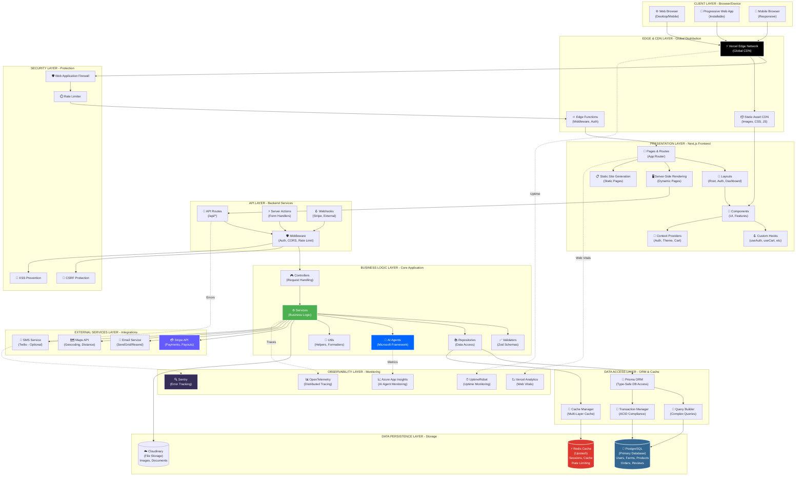

---

## 🔐 AUTHENTICATION & AUTHORIZATION ARCHITECTURE

### Complete Auth Flow

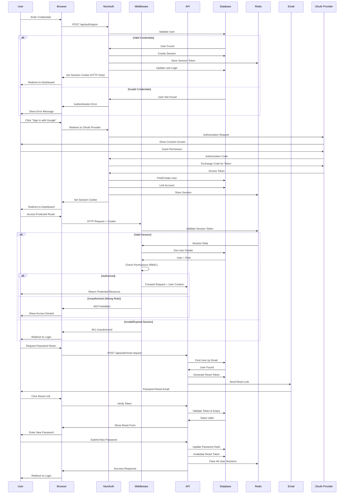

### Role-Based Access Control (RBAC)

```mermaid
graph TB
    subgraph "USER ROLES"
        SUPER_ADMIN["👑 SUPER_ADMIN<br/>(Platform Owner)"]
        ADMIN["🔑 ADMIN<br/>(Platform Admin)"]
        FARMER["🌾 FARMER<br/>(Farm Owner)"]
        STAFF["👥 STAFF<br/>(Farm Employee)"]
        CONSUMER["🛒 CONSUMER<br/>(Customer)"]
        GUEST["👤 GUEST<br/>(Unauthenticated)"]
    end

    subgraph "PERMISSIONS - Admin"
        MANAGE_USERS["Manage Users"]
        MANAGE_FARMS["Approve/Reject Farms"]
        VIEW_ANALYTICS["View Platform Analytics"]
        MANAGE_CATEGORIES["Manage Categories"]
        SUSPEND_ACCOUNTS["Suspend Accounts"]
        VIEW_FINANCIALS["View Financials"]
    end

    subgraph "PERMISSIONS - Farmer"
        CREATE_FARM["Create/Edit Farm"]
        MANAGE_PRODUCTS["Manage Products"]
        MANAGE_INVENTORY["Manage Inventory"]
        VIEW_ORDERS["View Farm Orders"]
        MANAGE_TEAM["Manage Team Members"]
        VIEW_FARM_ANALYTICS["View Farm Analytics"]
        SETUP_PAYOUT["Setup Stripe Payout"]
    end

    subgraph "PERMISSIONS - Staff"
        UPDATE_INVENTORY["Update Inventory"]
        PROCESS_ORDERS["Process Orders"]
        VIEW_FARM_PRODUCTS["View Farm Products"]
    end

    subgraph "PERMISSIONS - Consumer"
        BROWSE_PRODUCTS["Browse Products"]
        PLACE_ORDERS["Place Orders"]
        WRITE_REVIEWS["Write Reviews"]
        MANAGE_CART["Manage Shopping Cart"]
        VIEW_ORDER_HISTORY["View Order History"]
        SAVE_FAVORITES["Save Favorites"]
    end

    subgraph "PERMISSIONS - Guest"
        VIEW_FARMS["View Farms (Limited)"]
        VIEW_PRODUCTS_PUBLIC["View Products (Limited)"]
        SIGNUP["Sign Up"]
    end

    SUPER_ADMIN --> MANAGE_USERS
    SUPER_ADMIN --> MANAGE_FARMS
    SUPER_ADMIN --> VIEW_ANALYTICS
    SUPER_ADMIN --> MANAGE_CATEGORIES
    SUPER_ADMIN --> SUSPEND_ACCOUNTS
    SUPER_ADMIN --> VIEW_FINANCIALS

    ADMIN --> MANAGE_FARMS
    ADMIN --> VIEW_ANALYTICS
    ADMIN --> MANAGE_CATEGORIES

    FARMER --> CREATE_FARM
    FARMER --> MANAGE_PRODUCTS
    FARMER --> MANAGE_INVENTORY
    FARMER --> VIEW_ORDERS
    FARMER --> MANAGE_TEAM
    FARMER --> VIEW_FARM_ANALYTICS
    FARMER --> SETUP_PAYOUT

    STAFF --> UPDATE_INVENTORY
    STAFF --> PROCESS_ORDERS
    STAFF --> VIEW_FARM_PRODUCTS

    CONSUMER --> BROWSE_PRODUCTS
    CONSUMER --> PLACE_ORDERS
    CONSUMER --> WRITE_REVIEWS
    CONSUMER --> MANAGE_CART
    CONSUMER --> VIEW_ORDER_HISTORY
    CONSUMER --> SAVE_FAVORITES

    GUEST --> VIEW_FARMS
    GUEST --> VIEW_PRODUCTS_PUBLIC
    GUEST --> SIGNUP

    style SUPER_ADMIN fill:#ff0000,stroke:#fff,stroke-width:2px,color:#fff
    style ADMIN fill:#ff9800,stroke:#fff,stroke-width:2px,color:#fff
    style FARMER fill:#4caf50,stroke:#fff,stroke-width:2px,color:#fff
    style CONSUMER fill:#2196f3,stroke:#fff,stroke-width:2px,color:#fff
```

### Middleware Auth Chain

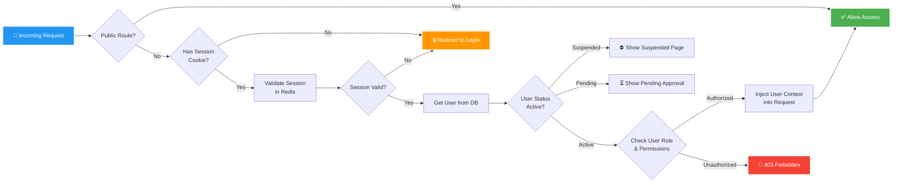

---

## 👥 USER MANAGEMENT SYSTEM

### User Data Model

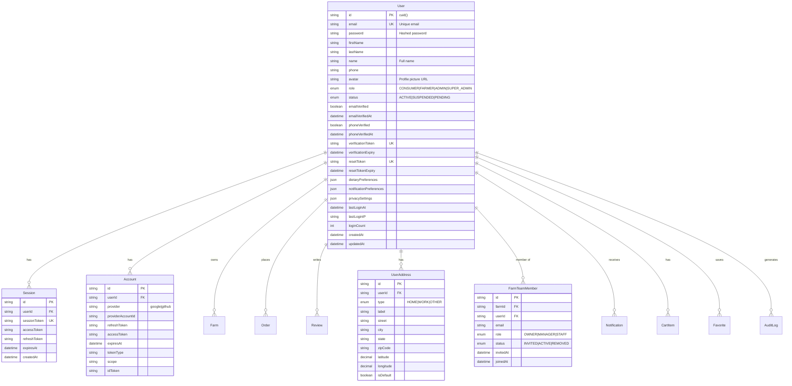

### User Lifecycle

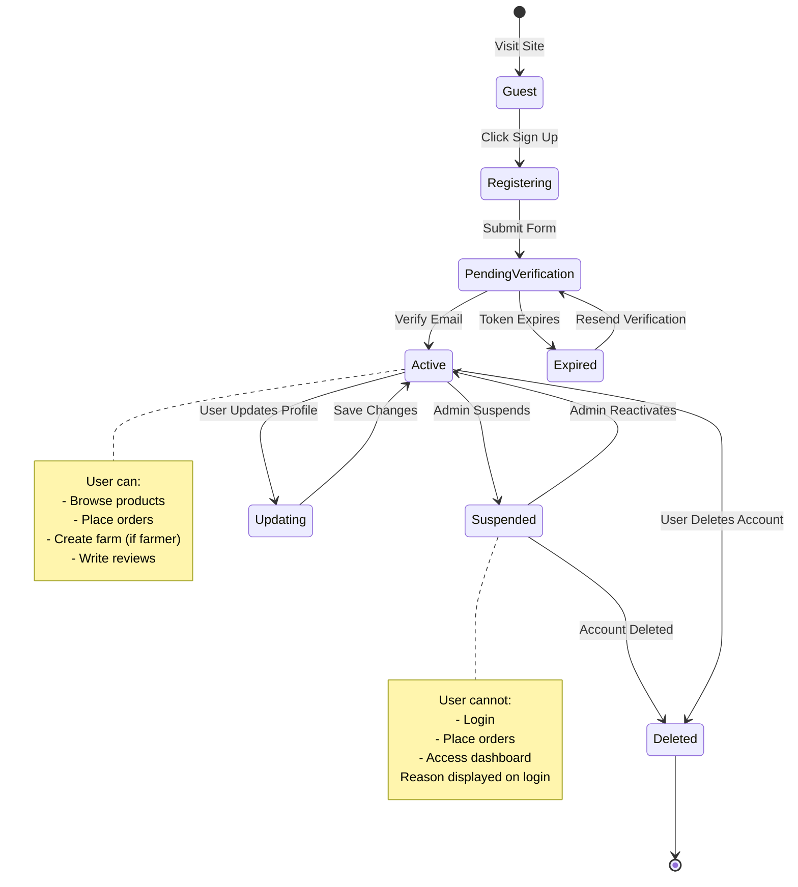

### Registration Flow (Complete)

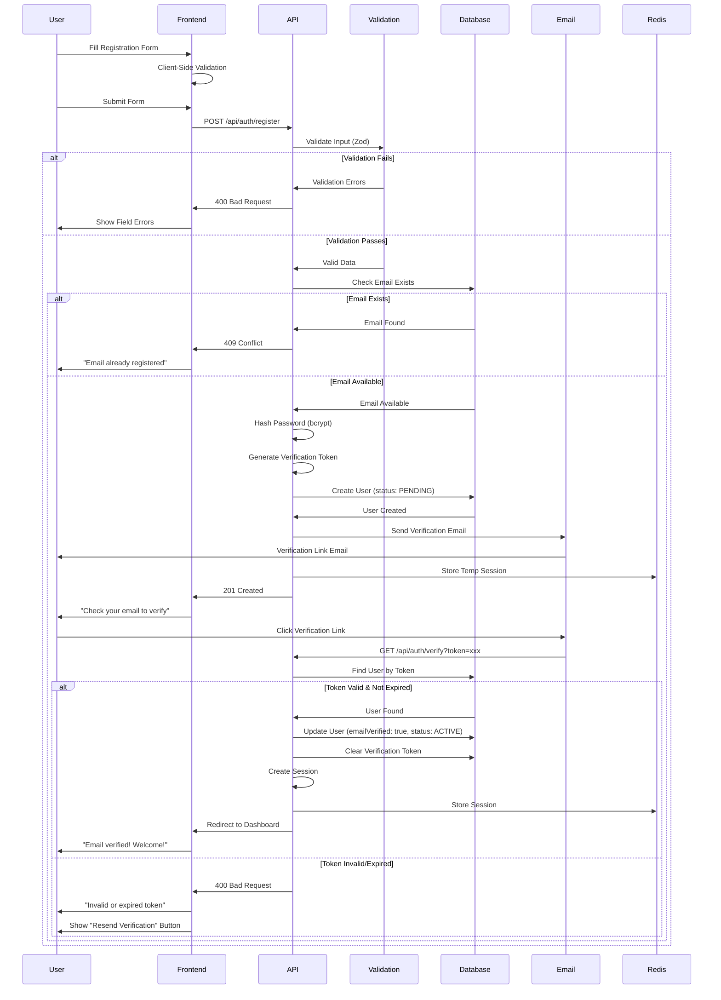

---

## 🗄️ DATABASE SCHEMA & RELATIONSHIPS

### Complete Entity Relationship Diagram

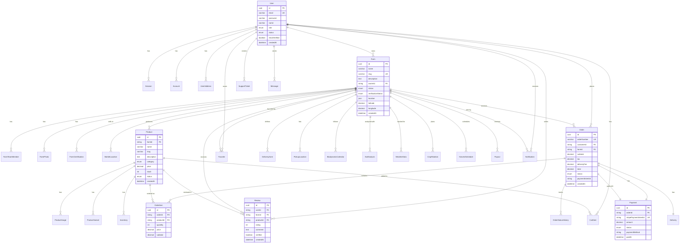

### Key Database Indexes

```sql
-- User Indexes
CREATE INDEX idx_users_email ON users(email);
CREATE INDEX idx_users_role_status ON users(role, status);
CREATE INDEX idx_users_created_at ON users(created_at);

-- Farm Indexes
CREATE INDEX idx_farms_owner_id ON farms(owner_id);
CREATE INDEX idx_farms_slug ON farms(slug);
CREATE INDEX idx_farms_status ON farms(status);
CREATE INDEX idx_farms_location ON farms(latitude, longitude);
CREATE INDEX idx_farms_verification_status ON farms(verification_status);

-- Product Indexes
CREATE INDEX idx_products_farm_id ON products(farm_id);
CREATE INDEX idx_products_slug ON products(slug);
CREATE INDEX idx_products_category ON products(category);
CREATE INDEX idx_products_status ON products(status);
CREATE INDEX idx_products_price ON products(price);

-- Order Indexes
CREATE INDEX idx_orders_customer_id ON orders(customer_id);
CREATE INDEX idx_orders_farm_id ON orders(farm_id);
CREATE INDEX idx_orders_status ON orders(status);
CREATE INDEX idx_orders_created_at ON orders(created_at);
CREATE INDEX idx_orders_order_number ON orders(order_number);

-- Session Indexes
CREATE INDEX idx_sessions_user_id ON sessions(user_id);
CREATE INDEX idx_sessions_token ON sessions(session_token);
CREATE INDEX idx_sessions_expires_at ON sessions(expires_at);
```

---

## 🔌 API ARCHITECTURE

### API Route Structure

```
/api/
├── auth/                          # Authentication endpoints
│   ├── [...nextauth]/route.ts    # NextAuth handler
│   ├── register/route.ts          # User registration
│   ├── verify/route.ts            # Email verification
│   ├── reset-password/route.ts    # Password reset
│   └── logout/route.ts            # Logout endpoint
│
├── users/                         # User management
│   ├── route.ts                   # GET /users, POST /users
│   ├── [id]/route.ts              # GET /users/:id, PATCH /users/:id
│   ├── [id]/addresses/route.ts    # User addresses
│   └── profile/route.ts           # Current user profile
│
├── farms/                         # Farm management
│   ├── route.ts                   # GET /farms (list), POST /farms (create)
│   ├── [id]/route.ts              # GET, PATCH, DELETE /farms/:id
│   ├── [id]/products/route.ts     # Farm products
│   ├── [id]/team/route.ts         # Team management
│   ├── [id]/certifications/route.ts
│   └── [slug]/route.ts            # Get farm by slug
│
├── products/                      # Product management
│   ├── route.ts                   # GET /products (list), POST /products
│   ├── [id]/route.ts              # GET, PATCH, DELETE /products/:id
│   ├── [id]/inventory/route.ts    # Inventory management
│   ├── [id]/reviews/route.ts      # Product reviews
│   └── search/route.ts            # Product search
│
├── orders/                        # Order management
│   ├── route.ts                   # GET /orders (list), POST /orders
│   ├── [id]/route.ts              # GET /orders/:id, PATCH /orders/:id
│   ├── [id]/status/route.ts       # Update order status
│   └── [id]/cancel/route.ts       # Cancel order
│
├── cart/                          # Shopping cart
│   ├── route.ts                   # GET /cart, POST /cart (add item)
│   ├── [itemId]/route.ts          # PATCH, DELETE cart items
│   └── checkout/route.ts          # Checkout process
│
├── payments/                      # Payment processing
│   ├── create-intent/route.ts     # Create Stripe payment intent
│   ├── confirm/route.ts           # Confirm payment
│   └── webhooks/stripe/route.ts   # Stripe webhooks
│
├── reviews/                       # Reviews
│   ├── route.ts                   # POST /reviews (create)
│   ├── [id]/route.ts              # GET, PATCH, DELETE
│   └── farm/[farmId]/route.ts     # Farm reviews
│
├── favorites/                     # User favorites
│   ├── route.ts                   # GET, POST /favorites
│   └── [id]/route.ts              # DELETE favorite
│
├── search/                        # Search functionality
│   ├── farms/route.ts             # Search farms
│   ├── products/route.ts          # Search products
│   └── global/route.ts            # Global search
│
├── admin/                         # Admin endpoints
│   ├── users/route.ts             # User management
│   ├── farms/approve/route.ts     # Farm approval
│   ├── analytics/route.ts         # Platform analytics
│   └── audit-logs/route.ts        # Audit logs
│
└── webhooks/                      # External webhooks
    ├── stripe/route.ts            # Stripe events
    └── sendgrid/route.ts          # Email events
```

### API Response Format (Standardized)

```typescript
// Success Response
{
  "success": true,
  "data": {
    // Response payload
  },
  "meta": {
    "timestamp": "2024-12-20T10:30:00Z",
    "requestId": "req_abc123",
    "pagination": {
      "page": 1,
      "limit": 20,
      "total": 150,
      "totalPages": 8
    }
  }
}

// Error Response
{
  "success": false,
  "error": {
    "code": "VALIDATION_ERROR",
    "message": "Invalid input data",
    "details": {
      "email": ["Email is required"],
      "password": ["Password must be at least 8 characters"]
    }
  },
  "meta": {
    "timestamp": "2024-12-20T10:30:00Z",
    "requestId": "req_abc123"
  }
}
```

---

## ⚙️ SERVICE LAYER ARCHITECTURE

### Service Layer Pattern

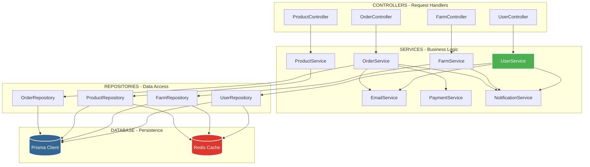

### Service Implementation Example

```typescript
// UserService - Business Logic Layer
export class UserService {
  constructor(
    private userRepository: UserRepository,
    private emailService: EmailService,
    private notificationService: NotificationService,
  ) {}

  /**
   * Create new user account
   */
  async createUser(data: CreateUserRequest): Promise<User> {
    // 1. Validate input
    const validated = CreateUserSchema.parse(data);

    // 2. Check if email exists
    const existingUser = await this.userRepository.findByEmail(validated.email);
    if (existingUser) {
      throw new ConflictError("Email already registered");
    }

    // 3. Hash password
    const hashedPassword = await bcrypt.hash(validated.password, 10);

    // 4. Generate verification token
    const verificationToken = generateSecureToken();
    const verificationExpiry = addHours(new Date(), 24);

    // 5. Create user
    const user = await this.userRepository.create({
      ...validated,
      password: hashedPassword,
      verificationToken,
      verificationExpiry,
      status: "PENDING",
    });

    // 6. Send verification email (async, don't wait)
    this.emailService
      .sendVerificationEmail(user.email, verificationToken)
      .catch((error) =>
        logger.error("Failed to send verification email", error),
      );

    // 7. Return user (without sensitive data)
    return this.sanitizeUser(user);
  }

  /**
   * Verify user email
   */
  async verifyEmail(token: string): Promise<User> {
    const user = await this.userRepository.findByVerificationToken(token);

    if (!user) {
      throw new NotFoundError("Invalid verification token");
    }

    if (user.verificationExpiry < new Date()) {
      throw new BadRequestError("Verification token expired");
    }

    // Update user status
    const updatedUser = await this.userRepository.update(user.id, {
      emailVerified: true,
      emailVerifiedAt: new Date(),
      status: "ACTIVE",
      verificationToken: null,
      verificationExpiry: null,
    });

    // Send welcome notification
    await this.notificationService.sendWelcomeNotification(updatedUser.id);

    return this.sanitizeUser(updatedUser);
  }

  /**
   * Remove sensitive fields from user object
   */
  private sanitizeUser(user: User): User {
    const { password, verificationToken, resetToken, ...safeUser } = user;
    return safeUser as User;
  }
}
```

---

## 🎨 FRONTEND ARCHITECTURE

### Component Hierarchy

```
src/
├── app/                          # Next.js 15 App Router
│   ├── layout.tsx                # Root layout (auth provider, theme)
│   ├── page.tsx                  # Homepage
│   ├── (auth)/                   # Auth route group
│   │   ├── layout.tsx            # Auth layout
│   │   ├── login/page.tsx
│   │   ├── register/page.tsx
│   │   └── reset-password/page.tsx
│   │
│   ├── (customer)/               # Customer routes
│   │   ├── layout.tsx            # Customer layout (with nav)
│   │   ├── farms/
│   │   │   ├── page.tsx          # Farm listing
│   │   │   └── [slug]/page.tsx   # Farm detail
│   │   ├── products/
│   │   │   ├── page.tsx          # Product listing
│   │   │   └── [slug]/page.tsx   # Product detail
│   │   ├── cart/page.tsx
│   │   ├── checkout/page.tsx
│   │   └── orders/
│   │       ├── page.tsx          # Order history
│   │       └── [id]/page.tsx     # Order detail
│   │
│   ├── (farmer)/                 # Farmer routes
│   │   ├── layout.tsx            # Farmer dashboard layout
│   │   ├── dashboard/page.tsx
│   │   ├── farm/
│   │   │   ├── setup/page.tsx
│   │   │   ├── edit/page.tsx
│   │   │   └── team/page.tsx
│   │   ├── products/
│   │   │   ├── page.tsx          # Product management
│   │   │   ├── new/page.tsx
│   │   │   └── [id]/edit/page.tsx
│   │   ├── orders/page.tsx
│   │   ├── analytics/page.tsx
│   │   └── payouts/page.tsx
│   │
│   └── (admin)/                  # Admin routes
│       ├── layout.tsx            # Admin layout
│       ├── dashboard/page.tsx
│       ├── users/page.tsx
│       ├── farms/
│       │   ├── page.tsx          # Pending approvals
│       │   └── [id]/review/page.tsx
│       └── analytics/page.tsx
│
├── components/
│   ├── ui/                       # Base UI components
│   │   ├── Button.tsx
│   │   ├── Card.tsx
│   │   ├── Input.tsx
│   │   ├── Modal.tsx
│   │   ├── Badge.tsx
│   │   └── Spinner.tsx
│   │
│   ├── features/                 # Feature-specific components
│   │   ├── auth/
│   │   │   ├── LoginForm.tsx
│   │   │   ├── RegisterForm.tsx
│   │   │   └── PasswordResetForm.tsx
│   │   ├── farms/
│   │   │   ├── FarmCard.tsx
│   │   │   ├── FarmGrid.tsx
│   │   │   ├── FarmProfile.tsx
│   │   │   └── FarmEditForm.tsx
│   │   ├── products/
│   │   │   ├── ProductCard.tsx
│   │   │   ├── ProductGrid.tsx
│   │   │   ├── ProductDetail.tsx
│   │   │   └── ProductForm.tsx
│   │   ├── cart/
│   │   │   ├── CartDrawer.tsx
│   │   │   ├── CartItem.tsx
│   │   │   └── CartSummary.tsx
│   │   └── orders/
│   │       ├── OrderList.tsx
│   │       ├── OrderCard.tsx
│   │       └── OrderTimeline.tsx
│   │
│   └── layout/                   # Layout components
│       ├── Header.tsx
│       ├── Footer.tsx
│       ├── Sidebar.tsx
│       └── Navigation.tsx
│
├── hooks/                        # Custom React hooks
│   ├── useAuth.ts                # Authentication hook
│   ├── useCart.ts                # Shopping cart hook
│   ├── useFarms.ts               # Farm data hook
│   ├── useProducts.ts            # Product data hook
│   └── useOrders.ts              # Order data hook
│
└── context/                      # React Context providers
    ├── AuthContext.tsx           # Auth state
    ├── CartContext.tsx           # Cart state
    └── ThemeContext.tsx          # Theme state
```

### Component Communication Pattern

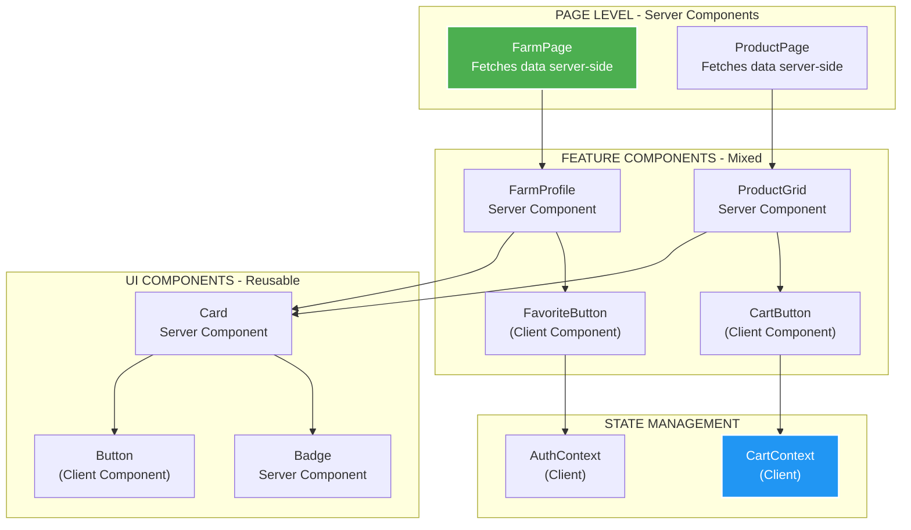

---

## 🔒 SECURITY ARCHITECTURE

### Security Layers

```mermaid
graph TB
    subgraph "NETWORK SECURITY"
        HTTPS["🔐 HTTPS/TLS 1.3<br/>(SSL Certificate)"]
        WAF["🛡️ Web Application Firewall<br/>(Vercel WAF)"]
        DDOS["⚡ DDoS Protection<br/>(Vercel Edge)"]
    end

    subgraph "APPLICATION SECURITY"
        RATE_LIMIT["⏱️ Rate Limiting<br/>(Redis-based)"]
        CORS["🌐 CORS Policy<br/>(Strict origins)"]
        CSP["📋 Content Security Policy<br/>(Header-based)"]
        CSRF["🔑 CSRF Protection<br/>(Token-based)"]
        XSS["🚫 XSS Prevention<br/>(Input sanitization)"]
    end

    subgraph "AUTHENTICATION SECURITY"
        JWT["🎫 JWT Tokens<br/>(HTTP-only cookies)"]
        SESSION["🔐 Secure Sessions<br/>(Redis store)"]
        PASSWORD["🔒 Password Hashing<br/>(bcrypt, 10 rounds)"]
        MFA["📱 2FA (Optional)<br/>(TOTP)"]
    end

    subgraph "AUTHORIZATION SECURITY"
        RBAC["👥 Role-Based Access<br/>(User roles)"]
        PERMISSION["✅ Permission Checks<br/>(Middleware)"]
        RESOURCE_OWNER["🔑 Resource Ownership<br/>(User validation)"]
    end

    subgraph "DATA SECURITY"
        ENCRYPTION["🔐 Data Encryption<br/>(At rest & transit)"]
        SECRETS["🗝️ Secret Management<br/>(Environment vars)"]
        SQL_INJECTION["💉 SQL Injection Prevention<br/>(Prisma ORM)"]
        INPUT_VALIDATION["✅ Input Validation<br/>(Zod schemas)"]
    end

    subgraph "MONITORING & RESPONSE"
        AUDIT_LOG["📝 Audit Logging<br/>(User actions)"]
        THREAT_DETECTION["🔍 Threat Detection<br/>(Sentry)"]
        INCIDENT_RESPONSE["🚨 Incident Response<br/>(Alerts)"]
    end

    HTTPS --> WAF
    WAF --> DDOS
    DDOS --> RATE_LIMIT

    RATE_LIMIT --> CORS
    CORS --> CSP
    CSP --> CSRF
    CSRF --> XSS

    XSS --> JWT
    JWT --> SESSION
    SESSION --> PASSWORD
    PASSWORD --> MFA

    MFA --> RBAC
    RBAC --> PERMISSION
    PERMISSION --> RESOURCE_OWNER

    RESOURCE_OWNER --> ENCRYPTION
    ENCRYPTION --> SECRETS
    SECRETS --> SQL_INJECTION
    SQL_INJECTION --> INPUT_VALIDATION

    INPUT_VALIDATION --> AUDIT_LOG
    AUDIT_LOG --> THREAT_DETECTION
    THREAT_DETECTION --> INCIDENT_RESPONSE

    style HTTPS fill:#4CAF50,stroke:#fff,stroke-width:2px,color:#fff
    style ENCRYPTION fill:#f44336,stroke:#fff,stroke-width:2px,color:#fff
    style RBAC fill:#2196F3,stroke:#fff,stroke-width:2px,color:#fff
```

### Security Headers Configuration

```typescript
// next.config.mjs
const securityHeaders = [
  {
    key: "X-DNS-Prefetch-Control",
    value: "on",
  },
  {
    key: "Strict-Transport-Security",
    value: "max-age=63072000; includeSubDomains; preload",
  },
  {
    key: "X-Frame-Options",
    value: "SAMEORIGIN",
  },
  {
    key: "X-Content-Type-Options",
    value: "nosniff",
  },
  {
    key: "X-XSS-Protection",
    value: "1; mode=block",
  },
  {
    key: "Referrer-Policy",
    value: "strict-origin-when-cross-origin",
  },
  {
    key: "Permissions-Policy",
    value: "camera=(), microphone=(), geolocation=(self)",
  },
  {
    key: "Content-Security-Policy",
    value: `
      default-src 'self';
      script-src 'self' 'unsafe-eval' 'unsafe-inline' *.vercel.app;
      style-src 'self' 'unsafe-inline';
      img-src 'self' data: https:;
      font-src 'self' data:;
      connect-src 'self' *.stripe.com;
      frame-src 'self' *.stripe.com;
    `
      .replace(/\s{2,}/g, " ")
      .trim(),
  },
];
```

---

## 📊 DATA FLOW DIAGRAMS

### Complete Order Flow (Customer Journey)

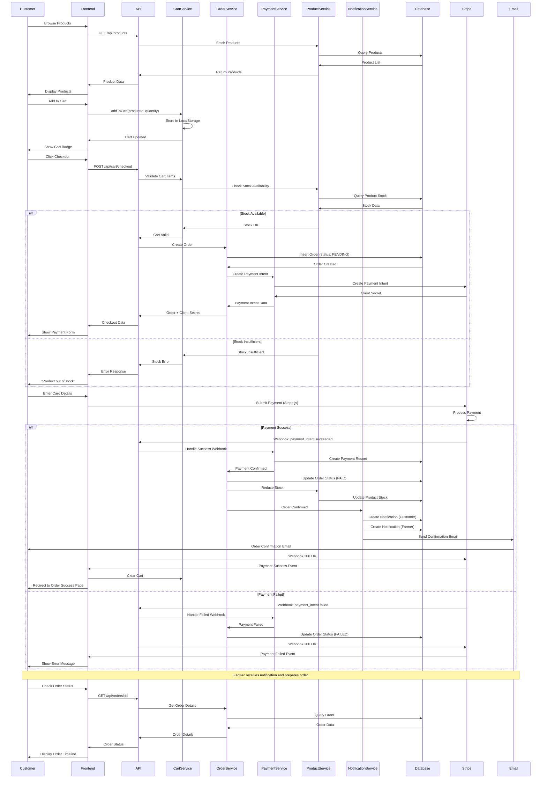

### Farm Registration & Verification Flow

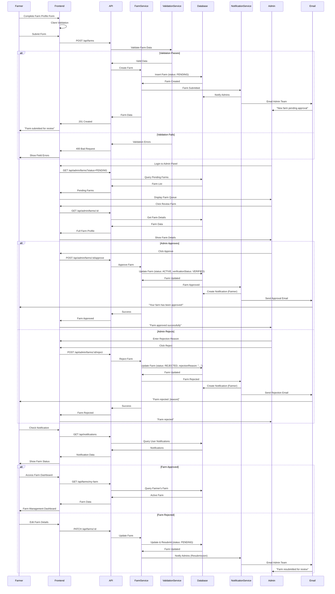

---

## 🎯 ARCHITECTURAL PRINCIPLES

### 1. **Separation of Concerns**

- **Presentation Layer**: UI components, pages, layouts
- **Business Logic Layer**: Services, validation, business rules
- **Data Access Layer**: Repositories, ORM, caching
- **Clear boundaries** between layers

### 2. **Type Safety First**

- **100% TypeScript** with strict mode
- **Zod validation** for runtime type checking
- **Prisma** for type-safe database access
- **No `any` types** allowed in production code

### 3. **Scalability by Design**

- **Stateless architecture** (scales horizontally)
- **Multi-layer caching** (Memory → Redis → Database)
- **Edge-first delivery** (Vercel global CDN)
- **Database connection pooling**

### 4. **Security by Default**

- **All routes authenticated** by default (opt-out for public)
- **HTTPS only** (no HTTP)
- **Security headers** on all responses
- **Input validation** on all endpoints
- **RBAC** for authorization

### 5. **Agricultural Consciousness**

- **Domain-driven design** (farming terminology)
- **Seasonal awareness** in business logic
- **Biodynamic patterns** in data models
- **Sustainability tracking**

### 6. **Performance Optimization**

- **Server-side rendering** for SEO
- **Static generation** for content pages
- **Code splitting** for smaller bundles
- **Image optimization** (Next.js Image)
- **Database query optimization** (indexes, select specific fields)

### 7. **Observability & Monitoring**

- **Comprehensive error tracking** (Sentry)
- **Distributed tracing** (OpenTelemetry)
- **Performance monitoring** (Vercel Analytics)
- **Uptime monitoring** (UptimeRobot)
- **Audit logging** (all critical actions)

### 8. **Developer Experience**

- **Clear code organization**
- **Consistent naming conventions**
- **Comprehensive documentation**
- **Automated testing** (unit, integration, e2e)
- **CI/CD pipeline** (automated deployments)

---

## 📈 PERFORMANCE TARGETS

```yaml
Load Times:
  Homepage (First Load): < 2.0 seconds
  Page Transitions: < 500ms
  API Response Time: < 200ms (average)
  Database Query Time: < 50ms (average)
  Time to Interactive (TTI): < 3.5 seconds

Throughput:
  Concurrent Users: 10,000+
  Requests per Second: 1,000+
  Database Connections: 100 (pooled)
  Redis Operations: 10,000+ ops/sec

Reliability:
  Uptime: 99.9%+
  Error Rate: < 0.1%
  Cache Hit Rate: > 80%
  Mean Time to Recovery (MTTR): < 5 minutes

Web Vitals (Core Web Vitals):
  Largest Contentful Paint (LCP): < 2.5 seconds
  First Input Delay (FID): < 100ms
  Cumulative Layout Shift (CLS): < 0.1

Security:
  SSL Labs Rating: A+
  Security Headers Score: A+
  OWASP Top 10: All addressed
  Vulnerability Scan: Weekly
```

---

## 🚀 DEPLOYMENT ARCHITECTURE

```mermaid
graph TB
    subgraph "DEVELOPMENT"
        DEV_CODE["💻 Local Development<br/>(localhost:3000)"]
        GIT["📦 Git Repository<br/>(GitHub)"]
    end

    subgraph "CI/CD PIPELINE"
        GITHUB_ACTIONS["⚙️ GitHub Actions<br/>(Automated Tests)"]
        TESTS["✅ Test Suite<br/>(Jest + Playwright)"]
        BUILD["🔨 Build Process<br/>(Next.js Build)"]
        LINT["🔍 Linting<br/>(ESLint + TypeScript)"]
    end

    subgraph "STAGING ENVIRONMENT"
        PREVIEW["🔍 Preview Deployment<br/>(Vercel Preview)"]
        STAGING_DB[("🐘 Staging Database")]
    end

    subgraph "PRODUCTION ENVIRONMENT"
        PROD_DEPLOY["🚀 Production Deployment<br/>(Vercel)"]
        PROD_DB[("🐘 Production Database")]
        PROD_REDIS[("⚡ Production Redis")]
        PROD
```
