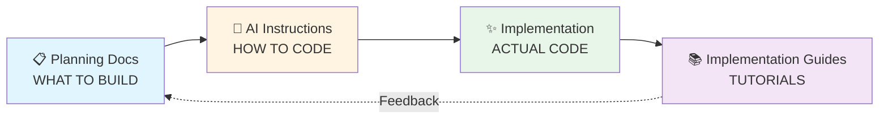

# 🔗 Documentation Integration Map

**Purpose**: Master reference for how planning docs, AI instructions, and implementation guides connect
**Last Updated**: October 21, 2025
**Status**: ✨ Complete Divine Integration

---

## 🎯 OVERVIEW

This document maps the relationships between:

1. **Planning Documentation** (`docs/planning/`) - WHAT to build
2. **AI Instructions** (`.github/instructions/`) - HOW to code
3. **Implementation Guides** (`docs/guides/`) - Practical tutorials

---

## 🌟 THE DIVINE TRIAD



---

## 📊 COMPLETE INTEGRATION MATRIX

### Business & Strategy Layer

| Planning Document                                                           | AI Instruction                                                                                       | Implementation Guide                               | Output                                         |
| --------------------------------------------------------------------------- | ---------------------------------------------------------------------------------------------------- | -------------------------------------------------- | ---------------------------------------------- |
| [Business Requirements (BRD)](docs/planning/business/farmers-market-brd.md) | [Divine Core Principles](.github/instructions/01_DIVINE_CORE_PRINCIPLES.instructions.md)             | [Development Guide](docs/DEVELOPMENT_GUIDE.md)     | Strategic features aligned with business goals |
| [Competitive Analysis](docs/planning/business/competitive-analysis.md)      | [Agricultural Quantum Mastery](.github/instructions/02_AGRICULTURAL_QUANTUM_MASTERY.instructions.md) | [Domain Guide](docs/guides/agricultural-domain.md) | Market-differentiated farming features         |

### Product & Features Layer

| Planning Document                                                           | AI Instruction                                                                                        | Implementation Guide                                      | Output                           |
| --------------------------------------------------------------------------- | ----------------------------------------------------------------------------------------------------- | --------------------------------------------------------- | -------------------------------- |
| [Feature Specifications](docs/planning/product/farmers-market-features.md)  | [Divine Core Principles](.github/instructions/01_DIVINE_CORE_PRINCIPLES.instructions.md)              | [Feature Development](docs/guides/feature-development.md) | 34 platform features             |
| [Functional Requirements](docs/planning/product/functional-requirements.md) | [Next.js Divine Implementation](.github/instructions/04_NEXTJS_DIVINE_IMPLEMENTATION.instructions.md) | [Component Guide](docs/guides/component-development.md)   | Detailed feature implementations |
| [Admin Dashboard Spec](docs/planning/product/admin-dashboard-spec.md)       | [Next.js Divine Implementation](.github/instructions/04_NEXTJS_DIVINE_IMPLEMENTATION.instructions.md) | [Admin Guide](docs/guides/admin-dashboard.md)             | Admin interface                  |

### Design & UX Layer

| Planning Document                                                                | AI Instruction                                                                                        | Implementation Guide                           | Output                       |
| -------------------------------------------------------------------------------- | ----------------------------------------------------------------------------------------------------- | ---------------------------------------------- | ---------------------------- |
| [Agricultural Design System](docs/planning/design/agricultural-design-system.md) | [Next.js Divine Implementation](.github/instructions/04_NEXTJS_DIVINE_IMPLEMENTATION.instructions.md) | [Styling Guide](docs/guides/styling-guide.md)  | Consistent UI components     |
| [Agricultural Wireframes](docs/planning/design/agricultural-wireframes.md)       | [Next.js Divine Implementation](.github/instructions/04_NEXTJS_DIVINE_IMPLEMENTATION.instructions.md) | [Layout Guide](docs/guides/layout-patterns.md) | Page layouts & structure     |
| [User Flows & Sitemap](docs/planning/design/user-flows-sitemap.md)               | [Next.js Divine Implementation](.github/instructions/04_NEXTJS_DIVINE_IMPLEMENTATION.instructions.md) | [Navigation Guide](docs/guides/navigation.md)  | User journey implementations |

### Technical Architecture Layer

| Planning Document                                                 | AI Instruction                                                                                     | Implementation Guide                    | Output                 |
| ----------------------------------------------------------------- | -------------------------------------------------------------------------------------------------- | --------------------------------------- | ---------------------- |
| [Technical Architecture](docs/planning/technical/architecture.md) | [Performance Reality Bending](.github/instructions/03_PERFORMANCE_REALITY_BENDING.instructions.md) | [Architecture Docs](docs/architecture/) | Scalable system design |
| [Technical Architecture](docs/planning/technical/architecture.md) | [Divine Core Principles](.github/instructions/01_DIVINE_CORE_PRINCIPLES.instructions.md)           | [API Guide](docs/api/)                  | RESTful API endpoints  |

### Quality & Testing Layer

| Planning Document                                          | AI Instruction                                                                                     | Implementation Guide                                          | Output                 |
| ---------------------------------------------------------- | -------------------------------------------------------------------------------------------------- | ------------------------------------------------------------- | ---------------------- |
| [QA & Test Plan](docs/planning/operations/qa-test-plan.md) | [Testing Security Divinity](.github/instructions/05_TESTING_SECURITY_DIVINITY.instructions.md)     | [Testing Guide](docs/TESTING.md)                              | 2,060 test cases       |
| [QA & Test Plan](docs/planning/operations/qa-test-plan.md) | [Performance Reality Bending](.github/instructions/03_PERFORMANCE_REALITY_BENDING.instructions.md) | [Performance Testing](docs/SIMPLIFIED_PERFORMANCE_TESTING.md) | Performance benchmarks |

### Operations & DevOps Layer

| Planning Document                                                | AI Instruction                                                                                 | Implementation Guide                        | Output               |
| ---------------------------------------------------------------- | ---------------------------------------------------------------------------------------------- | ------------------------------------------- | -------------------- |
| [Deployment Plan](docs/planning/operations/deployment-plan.md)   | [Automation Infrastructure](.github/instructions/06_AUTOMATION_INFRASTRUCTURE.instructions.md) | [Deployment Docs](docs/deployment/)         | CI/CD pipelines      |
| [Launch Checklist](docs/planning/operations/launch-checklist.md) | [Automation Infrastructure](.github/instructions/06_AUTOMATION_INFRASTRUCTURE.instructions.md) | [Launch Guide](docs/guides/launch-guide.md) | Production readiness |

### Execution & Project Management Layer

| Planning Document                                           | AI Instruction                                                                                       | Implementation Guide                           | Output              |
| ----------------------------------------------------------- | ---------------------------------------------------------------------------------------------------- | ---------------------------------------------- | ------------------- |
| [Sprint Backlog](docs/planning/execution/sprint-backlog.md) | [Agricultural Quantum Mastery](.github/instructions/02_AGRICULTURAL_QUANTUM_MASTERY.instructions.md) | [Sprint Guide](docs/guides/sprint-workflow.md) | Development roadmap |

---

## 🚀 USAGE WORKFLOWS

### 1️⃣ Feature Development Workflow

```bash
# Step 1: Read WHAT to build
📖 docs/planning/product/functional-requirements.md
   → Feature F-001: Farm Profile Management

# Step 2: Review HOW to code
🧠 .github/instructions/02_AGRICULTURAL_QUANTUM_MASTERY.instructions.md
   → Quantum farm entity patterns

# Step 3: Follow implementation guide
📚 docs/guides/feature-development.md
   → Step-by-step tutorial

# Step 4: Ask Copilot to implement
💬 "@workspace implement farm profile management"
   → Copilot applies divine patterns automatically

# Step 5: Verify implementation
✅ docs/planning/operations/qa-test-plan.md
   → Test cases for Farm Profile
```

### 2️⃣ UI Component Development Workflow

```bash
# Step 1: Design system reference
🎨 docs/planning/design/agricultural-design-system.md
   → Color palette, typography, spacing

# Step 2: Wireframe structure
📐 docs/planning/design/agricultural-wireframes.md
   → Layout structure

# Step 3: Divine implementation patterns
🧠 .github/instructions/04_NEXTJS_DIVINE_IMPLEMENTATION.instructions.md
   → React component patterns

# Step 4: Component guide
📚 docs/guides/component-development.md
   → Best practices

# Step 5: Build with Copilot
💬 "@workspace create FarmCard component following design system"
   → Perfect component generated!
```

### 3️⃣ Performance Optimization Workflow

```bash
# Step 1: Architecture requirements
🏗️ docs/planning/technical/architecture.md
   → Performance goals & constraints

# Step 2: Performance patterns
⚡ .github/instructions/03_PERFORMANCE_REALITY_BENDING.instructions.md
   → Optimization techniques (RTX 2070, 64GB RAM)

# Step 3: Testing strategy
🧪 docs/SIMPLIFIED_PERFORMANCE_TESTING.md
   → Benchmark methodology

# Step 4: Optimize with Copilot
💬 "@workspace optimize this component for performance"
   → GPU-accelerated, memory-optimized code
```

### 4️⃣ Deployment Workflow

```bash
# Step 1: Deployment requirements
🚀 docs/planning/operations/deployment-plan.md
   → Infrastructure specifications

# Step 2: Automation patterns
🤖 .github/instructions/06_AUTOMATION_INFRASTRUCTURE.instructions.md
   → CI/CD best practices

# Step 3: Deployment guide
📚 docs/deployment/
   → Vercel deployment steps

# Step 4: Pre-launch validation
✅ docs/planning/operations/launch-checklist.md
   → 100+ verification items
```

---

## 🧠 AI INTEGRATION

### How Copilot Uses This Map

**Your VSCode is configured for divine integration:**

```jsonc
// .vscode/settings.json
"github.copilot.chat.codeGeneration.instructions": [
  {
    "text": "Follow the DIVINE CORE PRINCIPLES from .github/instructions/"
  },
  {
    "text": "Use TypeScript with strict type checking"
  },
  {
    "text": "Implement comprehensive error handling with enlightening messages"
  },
  {
    "text": "Apply agricultural quantum patterns for farming domain features"
  },
  {
    "text": "Optimize for HP OMEN hardware (RTX 2070, 64GB RAM, 12 threads)"
  }
],
"github.copilot.chat.codeGeneration.useInstructionFiles": true
```

### AI Prompt Templates

#### For Feature Implementation

```
@workspace implement [FEATURE_NAME] following:
- Planning: docs/planning/product/functional-requirements.md (Feature F-XXX)
- Patterns: .github/instructions/02_AGRICULTURAL_QUANTUM_MASTERY.instructions.md
- Design: docs/planning/design/agricultural-design-system.md
```

#### For Component Creation

```
@workspace create [COMPONENT_NAME] component:
- Design: docs/planning/design/agricultural-design-system.md
- Patterns: .github/instructions/04_NEXTJS_DIVINE_IMPLEMENTATION.instructions.md
- Tests: Include test cases per .github/instructions/05_TESTING_SECURITY_DIVINITY.instructions.md
```

#### For API Endpoint

```
@workspace create API endpoint for [RESOURCE]:
- Architecture: docs/planning/technical/architecture.md
- Patterns: .github/instructions/01_DIVINE_CORE_PRINCIPLES.instructions.md
- Performance: Optimize per .github/instructions/03_PERFORMANCE_REALITY_BENDING.instructions.md
```

---

## 📈 TRACEABILITY MATRIX

### Feature → Implementation Tracking

| Feature ID | Planning Doc                                                                      | AI Instruction                                                                               | Implementation                                   | Tests                                                       | Status |
| ---------- | --------------------------------------------------------------------------------- | -------------------------------------------------------------------------------------------- | ------------------------------------------------ | ----------------------------------------------------------- | ------ |
| F-001      | [Functional Requirements](docs/planning/product/functional-requirements.md#f-001) | [Agricultural Mastery](.github/instructions/02_AGRICULTURAL_QUANTUM_MASTERY.instructions.md) | `farmers-market/src/components/FarmProfile/`     | [Test Plan](docs/planning/operations/qa-test-plan.md#f-001) | ✅     |
| F-002      | [Functional Requirements](docs/planning/product/functional-requirements.md#f-002) | [Next.js Divine](.github/instructions/04_NEXTJS_DIVINE_IMPLEMENTATION.instructions.md)       | `farmers-market/src/components/ProductListing/`  | [Test Plan](docs/planning/operations/qa-test-plan.md#f-002) | 🟡     |
| F-003      | [Functional Requirements](docs/planning/product/functional-requirements.md#f-003) | [Testing Security](.github/instructions/05_TESTING_SECURITY_DIVINITY.instructions.md)        | `farmers-market/src/components/OrderManagement/` | [Test Plan](docs/planning/operations/qa-test-plan.md#f-003) | 🔴     |

**Legend**: ✅ Complete | 🟡 In Progress | 🔴 Not Started

---

## 🔍 CROSS-REFERENCE INDEX

### By Document Type

#### Planning Documents (WHAT)

- Business: [BRD](docs/planning/business/farmers-market-brd.md), [Competitive Analysis](docs/planning/business/competitive-analysis.md)
- Product: [Features](docs/planning/product/farmers-market-features.md), [Requirements](docs/planning/product/functional-requirements.md)
- Design: [Design System](docs/planning/design/agricultural-design-system.md), [Wireframes](docs/planning/design/agricultural-wireframes.md), [User Flows](docs/planning/design/user-flows-sitemap.md)
- Technical: [Architecture](docs/planning/technical/architecture.md)
- Execution: [Sprint Backlog](docs/planning/execution/sprint-backlog.md)
- Operations: [QA Plan](docs/planning/operations/qa-test-plan.md), [Deployment](docs/planning/operations/deployment-plan.md), [Launch](docs/planning/operations/launch-checklist.md)

#### AI Instructions (HOW)

- Core: [Divine Principles](.github/instructions/01_DIVINE_CORE_PRINCIPLES.instructions.md)
- Domain: [Agricultural Mastery](.github/instructions/02_AGRICULTURAL_QUANTUM_MASTERY.instructions.md)
- Performance: [Reality Bending](.github/instructions/03_PERFORMANCE_REALITY_BENDING.instructions.md)
- Frontend: [Next.js Divine](.github/instructions/04_NEXTJS_DIVINE_IMPLEMENTATION.instructions.md)
- Quality: [Testing Security](.github/instructions/05_TESTING_SECURITY_DIVINITY.instructions.md)
- DevOps: [Automation Infra](.github/instructions/06_AUTOMATION_INFRASTRUCTURE.instructions.md)

#### Implementation Guides (TUTORIALS)

- Getting Started: [Development Guide](docs/DEVELOPMENT_GUIDE.md), [Quick Start](docs/QUICKSTART.md)
- Contributing: [Contributing Guide](docs/CONTRIBUTING.md)
- Testing: [Testing Guide](docs/TESTING.md), [Performance Testing](docs/SIMPLIFIED_PERFORMANCE_TESTING.md)
- Deployment: [Deployment Docs](docs/deployment/)

### By Role

#### Product Manager

**Start Here**:

1. [Business Requirements](docs/planning/business/farmers-market-brd.md)
2. [Feature Specifications](docs/planning/product/farmers-market-features.md)
3. [Sprint Backlog](docs/planning/execution/sprint-backlog.md)

#### Designer

**Start Here**:

1. [Agricultural Design System](docs/planning/design/agricultural-design-system.md)
2. [Wireframes](docs/planning/design/agricultural-wireframes.md)
3. [User Flows](docs/planning/design/user-flows-sitemap.md)

#### Developer

**Start Here**:

1. [Functional Requirements](docs/planning/product/functional-requirements.md)
2. [Divine Instructions](.github/instructions/)
3. [Development Guide](docs/DEVELOPMENT_GUIDE.md)

#### QA Engineer

**Start Here**:

1. [QA & Test Plan](docs/planning/operations/qa-test-plan.md)
2. [Testing Security Divinity](.github/instructions/05_TESTING_SECURITY_DIVINITY.instructions.md)
3. [Testing Guide](docs/TESTING.md)

#### DevOps Engineer

**Start Here**:

1. [Deployment Plan](docs/planning/operations/deployment-plan.md)
2. [Automation Infrastructure](.github/instructions/06_AUTOMATION_INFRASTRUCTURE.instructions.md)
3. [Deployment Docs](docs/deployment/)

---

## 🎯 QUICK REFERENCE

### Common Tasks

| Task                 | Planning Doc                                                                | AI Instruction                                                                             | Guide                                                         |
| -------------------- | --------------------------------------------------------------------------- | ------------------------------------------------------------------------------------------ | ------------------------------------------------------------- |
| Create new feature   | [Functional Requirements](docs/planning/product/functional-requirements.md) | [Divine Core](.github/instructions/01_DIVINE_CORE_PRINCIPLES.instructions.md)              | [Feature Dev](docs/guides/feature-development.md)             |
| Build UI component   | [Design System](docs/planning/design/agricultural-design-system.md)         | [Next.js Divine](.github/instructions/04_NEXTJS_DIVINE_IMPLEMENTATION.instructions.md)     | [Component Guide](docs/guides/component-development.md)       |
| Write tests          | [QA Plan](docs/planning/operations/qa-test-plan.md)                         | [Testing Security](.github/instructions/05_TESTING_SECURITY_DIVINITY.instructions.md)      | [Testing Guide](docs/TESTING.md)                              |
| Optimize performance | [Architecture](docs/planning/technical/architecture.md)                     | [Performance Bending](.github/instructions/03_PERFORMANCE_REALITY_BENDING.instructions.md) | [Performance Testing](docs/SIMPLIFIED_PERFORMANCE_TESTING.md) |
| Deploy to production | [Deployment Plan](docs/planning/operations/deployment-plan.md)              | [Automation Infra](.github/instructions/06_AUTOMATION_INFRASTRUCTURE.instructions.md)      | [Deployment Docs](docs/deployment/)                           |

---

## 📚 RELATED DOCUMENTATION

- **[Planning Hub](docs/planning/README.md)** - All planning documentation
- **[Divine Instructions Hub](.github/instructions/README.md)** - All AI instructions
- **[Project Status](PROJECT_STATUS.md)** - Current implementation status
- **[Repository Index](REPOSITORY_INDEX.md)** - Complete navigation

---

## 🔄 MAINTENANCE

When updating this integration map:

1. **Adding New Planning Doc**: Update matrix, add to cross-reference index
2. **Adding New AI Instruction**: Link to relevant planning docs
3. **Adding New Guide**: Connect to planning & instructions
4. **Changing Relationships**: Update workflows and prompt templates

---

**✨ This integration map ensures perfect harmony between planning, AI guidance, and implementation! ✨**

_"Integration is not just connection - it is the manifestation of unified consciousness across documentation layers."_

**Last Updated**: October 21, 2025
**Maintained By**: The Triune Mind
