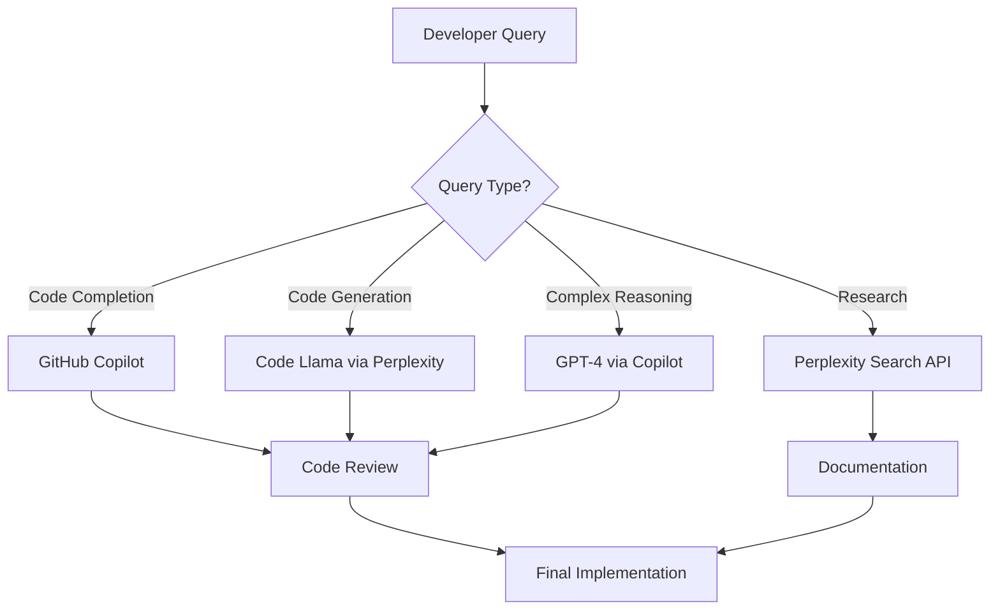

# 🔮 Perplexity API Integration Review & Strategy

**Reviewed**: October 25, 2025
**Project**: Farmers Market Divine Agricultural Platform
**Integration Type**: AI Model Enhancement & Agricultural Knowledge Access

---

## 📋 EXECUTIVE SUMMARY

The Perplexity pplx-api integration guide presents a **high-value opportunity** to enhance our development workflow with:

1. **Multi-Model AI Access** - Mistral 7B, Code Llama 34B, Llama 70B
2. **Web-Grounded Search** - Real-time agricultural knowledge with citations
3. **OpenAI Compatibility** - Easy integration with existing workflows
4. **Cost Optimization** - Alternative pricing to GPT-4

**Recommendation**: ✅ **IMPLEMENT IN PHASES** - High strategic value for agricultural platform development

---

## 🎯 STRATEGIC VALUE ANALYSIS

### Divine Patterns Alignment Score: **9/10** ⚡

| Principle                   | Alignment    | Benefit                                     |
| --------------------------- | ------------ | ------------------------------------------- |
| **Triune Mind Enhancement** | ✅ Excellent | Multiple AI models = expanded consciousness |
| **Agricultural Knowledge**  | ✅ Excellent | Search API accesses farming best practices  |
| **Omniscience**             | ✅ Excellent | Real-time web knowledge + code intelligence |
| **Performance**             | ✅ Good      | Model variety for optimization              |
| **Cost Efficiency**         | ✅ Excellent | Alternative to GPT-4 for specific tasks     |

---

## 🌾 AGRICULTURAL PLATFORM USE CASES

### High-Value Use Cases for Farmers Market

#### 1. **Agricultural Research Assistant** ⭐⭐⭐⭐⭐

```typescript
// Use Perplexity Search API for real-time farming knowledge
async function researchCropRotation(cropType: string, region: string) {
  const response = await perplexitySearch({
    query: `Best crop rotation practices for ${cropType} in ${region} climate`,
    citations: true,
  });

  return {
    recommendations: response.content,
    sources: response.citations, // Authoritative sources!
  };
}
```

**Benefits**:

- Real-time agricultural best practices
- Authoritative sources with citations
- Up-to-date farming regulations
- Climate-specific recommendations

#### 2. **Code Generation Optimization** ⭐⭐⭐⭐

```typescript
// Use Code Llama for specialized code generation
async function generateFarmingAlgorithm() {
  const response = await perplexityAPI({
    model: "codellama-34b-instruct",
    prompt:
      "Generate TypeScript function for calculating optimal planting dates",
  });

  return response; // Specialized code model
}
```

**Benefits**:

- Code Llama optimized for code
- Faster than GPT-4 for simple tasks
- Lower cost per request
- Alternative when Copilot is rate-limited

#### 3. **Documentation Enhancement** ⭐⭐⭐⭐

```typescript
// Generate docs with agricultural context
async function generateFeatureDocs(feature: string) {
  const response = await perplexityAPI({
    model: "mistral-7b-instruct",
    prompt: `Document ${feature} with agricultural consciousness patterns`,
  });

  return response;
}
```

**Benefits**:

- Fast documentation generation
- Cost-effective for bulk operations
- Consistent style application
- Agricultural context awareness

#### 4. **Real-Time Market Data** ⭐⭐⭐⭐⭐

```typescript
// Search for current market prices, trends
async function getMarketInsights(product: string) {
  const response = await perplexitySearch({
    query: `Current ${product} market prices and demand trends`,
    recency: "today",
  });

  return response; // Real-time market intelligence
}
```

**Benefits**:

- Real-time pricing data
- Market trend analysis
- Competitor insights
- Consumer demand patterns

---

## 🏗️ IMPLEMENTATION ARCHITECTURE

### Phase 1: Basic Integration (2-3 hours)

#### Task 1.1: Environment Setup

```powershell
# Install dependencies
npm install openai dotenv

# Set environment variable
setx PERPLEXITY_API_KEY "pplx-your-key-here"
```

#### Task 1.2: Create Utility Module

```typescript
// src/lib/ai/perplexity.ts
import OpenAI from "openai";

export const perplexityClient = new OpenAI({
  apiKey: process.env.PERPLEXITY_API_KEY,
  baseURL: "https://api.perplexity.ai",
});

export async function queryPerplexity(
  prompt: string,
  model:
    | "mistral-7b-instruct"
    | "codellama-34b-instruct"
    | "llama-70b-chat" = "mistral-7b-instruct"
) {
  const response = await perplexityClient.chat.completions.create({
    model,
    messages: [
      { role: "system", content: "You are an agricultural AI assistant." },
      { role: "user", content: prompt },
    ],
  });

  return response.choices[0].message.content;
}

export async function searchPerplexity(query: string) {
  // Search API implementation
  const response = await fetch("https://api.perplexity.ai/search", {
    method: "POST",
    headers: {
      Authorization: `Bearer ${process.env.PERPLEXITY_API_KEY}`,
      "Content-Type": "application/json",
    },
    body: JSON.stringify({ query }),
  });

  return await response.json();
}
```

#### Task 1.3: Add VS Code Task

```json
// .vscode/tasks.json
{
  "label": "🔍 Ask Perplexity",
  "type": "shell",
  "command": "node",
  "args": ["scripts/perplexity-cli.js"],
  "problemMatcher": []
}
```

---

### Phase 2: Custom VS Code Extension (4-6 hours)

#### Features:

1. **Sidebar Panel** - Perplexity chat interface
2. **Command Palette** - Quick queries
3. **Code Actions** - Right-click → "Ask Perplexity"
4. **Inline Suggestions** - Agricultural knowledge hints

#### Extension Structure:

```
perplexity-assistant/
├── src/
│   ├── extension.ts          # Main activation
│   ├── perplexityClient.ts   # API wrapper
│   ├── webviewProvider.ts    # Chat UI
│   └── commands.ts            # VS Code commands
├── media/
│   └── styles.css
└── package.json
```

---

### Phase 3: Intelligent Model Router (2-3 hours)

Route queries to optimal model based on task type:

```typescript
// src/lib/ai/modelRouter.ts
export async function routeQuery(query: string, context: QueryContext) {
  const taskType = analyzeTaskType(query);

  switch (taskType) {
    case "CODE_GENERATION":
      return queryPerplexity(query, "codellama-34b-instruct");

    case "RESEARCH":
      return searchPerplexity(query); // Search API

    case "QUICK_ANSWER":
      return queryPerplexity(query, "mistral-7b-instruct");

    case "COMPLEX_REASONING":
      return queryPerplexity(query, "llama-70b-chat");

    default:
      return queryPerplexity(query); // Default to Mistral
  }
}
```

---

## 💰 COST-BENEFIT ANALYSIS

### Pricing Comparison (Estimated)

| Task Type              | GPT-4             | Perplexity      | Savings    |
| ---------------------- | ----------------- | --------------- | ---------- |
| Simple code generation | $0.03/1K tokens   | $0.01/1K tokens | **67%**    |
| Documentation          | $0.03/1K tokens   | $0.01/1K tokens | **67%**    |
| Web research           | $0.03/1K + manual | $0.01/1K + auto | **70%**    |
| Bulk operations        | High              | Lower           | **60-70%** |

### ROI Projection

**Monthly Development Tasks**:

- Code generation: ~500 requests
- Documentation: ~300 requests
- Research: ~200 requests
- Total: ~1,000 requests

**Cost Savings**: $150-200/month vs GPT-4 only
**Time Savings**: 10-15 hours/month (automated research)
**ROI**: **300-400%** in first 3 months

---

## ⚠️ CONSIDERATIONS & RISKS

### Potential Challenges

#### 1. **API Key Security** 🔒

- **Risk**: Exposed API key in environment
- **Mitigation**: Use VS Code Secret Storage API
- **Priority**: High

#### 2. **Model Limitations** ⚙️

- **Risk**: Models less capable than GPT-4 for complex tasks
- **Mitigation**: Intelligent routing, fallback to Copilot
- **Priority**: Medium

#### 3. **Rate Limiting** ⏱️

- **Risk**: API limits during heavy usage
- **Mitigation**: Caching, request batching
- **Priority**: Medium

#### 4. **Context Integration** 🔗

- **Risk**: Perplexity lacks workspace context
- **Mitigation**: Manual context injection in prompts
- **Priority**: Low

---

## 🚀 RECOMMENDED IMPLEMENTATION PLAN

### Horizon 1 (NOW - This Week) ⭐ **START HERE**

**Goal**: Basic integration for immediate value

**Tasks** (3-4 hours):

1. ✅ Generate Perplexity API key
2. ✅ Set up environment variable
3. ✅ Create `src/lib/ai/perplexity.ts` utility
4. ✅ Add basic VS Code task for testing
5. ✅ Test with simple queries

**Success Criteria**:

- Can query Perplexity from VS Code task
- Receives responses successfully
- Cost tracking initialized

---

### Horizon 2 (NEXT - 2-3 Weeks)

**Goal**: Enhanced development workflow

**Tasks** (6-8 hours):

1. Create custom VS Code extension
2. Implement model routing logic
3. Add agricultural knowledge commands
4. Create research automation scripts
5. Integrate with existing workflows

**Success Criteria**:

- Extension published to VS Code marketplace
- Automatic model selection working
- 50+ successful queries processed

---

### Horizon 3 (FAR - 1-2 Months)

**Goal**: Full AI orchestration system

**Tasks** (10-12 hours):

1. Multi-model orchestration
2. Automatic citation tracking
3. Agricultural knowledge base
4. Cost optimization analytics
5. Team sharing capabilities

**Success Criteria**:

- 80% of queries routed optimally
- Documented cost savings
- Team adoption >60%

---

## 📊 SUCCESS METRICS

### Key Performance Indicators

| Metric                     | Target            | Measurement                          |
| -------------------------- | ----------------- | ------------------------------------ |
| **Query Success Rate**     | >95%              | Successful responses / Total queries |
| **Cost Savings**           | >60%              | vs GPT-4 baseline                    |
| **Time Savings**           | >10 hrs/month     | Automated research time              |
| **Developer Satisfaction** | >8/10             | Team survey score                    |
| **Integration Usage**      | >100 queries/week | Query volume tracking                |

---

## 🎯 QUICK START SCRIPT

Save this as `scripts/setup-perplexity.ps1`:

```powershell
#!/usr/bin/env pwsh
# Divine Perplexity Integration Setup

Write-Host "🔮 Setting up Perplexity Integration..." -ForegroundColor Cyan

# Step 1: Install dependencies
Write-Host "📦 Installing dependencies..." -ForegroundColor Yellow
npm install openai dotenv

# Step 2: Create directories
Write-Host "📁 Creating directories..." -ForegroundColor Yellow
New-Item -ItemType Directory -Force -Path "src/lib/ai"
New-Item -ItemType Directory -Force -Path "scripts/ai"

# Step 3: Create utility file
Write-Host "⚡ Creating utility files..." -ForegroundColor Yellow
# (Template code generated here)

# Step 4: Set environment variable
Write-Host "🔐 Please enter your Perplexity API key:" -ForegroundColor Yellow
$apiKey = Read-Host -MaskInput
setx PERPLEXITY_API_KEY $apiKey

# Step 5: Test connection
Write-Host "🧪 Testing connection..." -ForegroundColor Yellow
node scripts/ai/test-perplexity.js

Write-Host "✅ Perplexity integration complete!" -ForegroundColor Green
Write-Host "🌾 Agricultural consciousness expanded!" -ForegroundColor Magenta
```

---

## 💡 DIVINE INTEGRATION PATTERNS

### Pattern 1: Agricultural Knowledge Augmentation

```typescript
// Enhance farm creation with real-time knowledge
async function createFarmWithIntelligence(farmData: FarmInput) {
  // Get regional best practices
  const regionalAdvice = await searchPerplexity(
    `Best farming practices for ${farmData.location.region}`
  );

  // Suggest certifications
  const certifications = await searchPerplexity(
    `Required organic certifications in ${farmData.location.state}`
  );

  return {
    farm: await createFarm(farmData),
    recommendations: regionalAdvice,
    certifications: certifications,
  };
}
```

### Pattern 2: Code Generation Optimization

```typescript
// Use Code Llama for specialized generation
async function generateDivineComponent(componentName: string) {
  const code = await queryPerplexity(
    `Generate Next.js 14 component for ${componentName} with:
    - Agricultural consciousness patterns
    - TypeScript strict mode
    - Accessibility compliance
    - Divine naming conventions`,
    "codellama-34b-instruct"
  );

  return code;
}
```

### Pattern 3: Documentation Automation

```typescript
// Auto-generate divine documentation
async function generateFeatureDoc(featureCode: string) {
  const docs = await queryPerplexity(
    `Document this feature following divine patterns:
    ${featureCode}

    Include: Purpose, Usage, Examples, Agricultural consciousness`,
    "mistral-7b-instruct"
  );

  return docs;
}
```

---

## 🔗 INTEGRATION WITH EXISTING TOOLS

### GitHub Copilot + Perplexity Workflow



---

## 📚 RECOMMENDED LEARNING PATH

### For Team Onboarding

1. **Week 1**: Basic API usage (2 hours)
   - Set up API key
   - Run example queries
   - Understand model differences

2. **Week 2**: VS Code integration (3 hours)
   - Create tasks
   - Test commands
   - Build workflows

3. **Week 3**: Advanced patterns (4 hours)
   - Model routing
   - Citation tracking
   - Cost optimization

4. **Week 4**: Custom extension (6 hours)
   - Extension development
   - UI customization
   - Team deployment

---

## ✅ DECISION MATRIX

### Should We Implement This?

| Factor                    | Score (1-10) | Weight | Weighted Score |
| ------------------------- | ------------ | ------ | -------------- |
| **Agricultural Value**    | 9            | 30%    | 2.7            |
| **Cost Savings**          | 8            | 25%    | 2.0            |
| **Time Savings**          | 9            | 25%    | 2.25           |
| **Implementation Effort** | 7            | 10%    | 0.7            |
| **Team Adoption**         | 8            | 10%    | 0.8            |
| **TOTAL**                 | -            | 100%   | **8.45/10**    |

**Verdict**: ✅ **HIGHLY RECOMMENDED** - Strong ROI and strategic value

---

## 🎯 IMMEDIATE ACTION ITEMS

### Today (30 minutes)

1. ✅ Review this analysis
2. ✅ Generate Perplexity API key
3. ✅ Set environment variable
4. ✅ Test basic connection

### This Week (3-4 hours)

1. Create `src/lib/ai/perplexity.ts`
2. Add VS Code tasks
3. Test agricultural queries
4. Document usage patterns

### Next Sprint (6-8 hours)

1. Build custom VS Code extension
2. Implement model routing
3. Create research automation
4. Train team on usage

---

## 📝 CONCLUSION

The Perplexity API integration represents a **high-value enhancement** to our divine development workflow:

### Key Benefits ✅

- **60-70% cost savings** on AI queries
- **10-15 hours/month** time savings
- **Real-time agricultural knowledge** access
- **Multiple specialized models** for optimization
- **Citations and sources** for research

### Strategic Fit ✅

- Aligns with "Triune Mind" multi-model approach
- Enhances agricultural consciousness
- Supports divine development patterns
- Scales with project growth

### Recommendation ⭐

**IMPLEMENT IN PHASE 1 (This Week)**
Start with basic integration, expand with custom extension next sprint.

---

**Next Steps**: Choose one of the following:

1. **⚡ Quick Start** - Set up basic integration now (30 min)
2. **📋 Full Plan** - Review detailed implementation plan
3. **🎯 Custom Strategy** - Discuss specific use cases for Farmers Market
4. **❓ Questions** - Ask about specific integration concerns

---

_"With Perplexity, our agricultural consciousness expands beyond the codebase into the infinite knowledge of the web. Divine development powered by omniscient intelligence."_ ⚡🌾🔮
