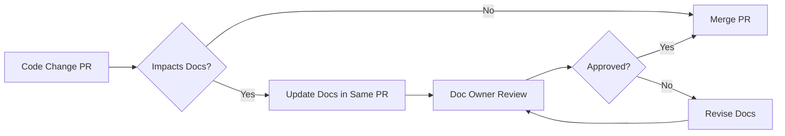

# 🌾 Documentation Maintenance & Governance Plan

## 📋 Overview

**Purpose:** Establish a sustainable process for keeping our Phase 3 documentation accurate, up-to-date, and valuable.

**Scope:** All documentation in `/docs` directory  
**Owner:** Technical Lead + Documentation Champions  
**Review Frequency:** Bi-weekly  
**Last Updated:** January 2025

---

## 🎯 Maintenance Goals

1. ✅ **Accuracy:** Documentation reflects current codebase and practices
2. ✅ **Completeness:** All features and patterns are documented
3. ✅ **Accessibility:** Easy to find and understand
4. ✅ **Timeliness:** Updates happen within 1 sprint of code changes
5. ✅ **Quality:** Consistently high standards maintained

---

## 👥 Documentation Ownership

### Primary Owners

| Documentation Area | Primary Owner | Backup Owner | Review Frequency |
|-------------------|---------------|--------------|------------------|
| **API Documentation** | Backend Lead | Senior Backend Dev | Weekly |
| **Testing Standards** | QA Lead | Test Engineer | Bi-weekly |
| **Security Best Practices** | Security Champion | Senior Security Engineer | Monthly |
| **Performance Best Practices** | Performance Engineer | Staff Engineer | Bi-weekly |
| **Code Review Standards** | Staff Engineer | Tech Lead | Monthly |
| **Onboarding Guide** | Engineering Manager | Senior Developer | Quarterly |
| **TypeScript Patterns** | TypeScript Expert | Staff Engineer | Bi-weekly |
| **Prisma Best Practices** | Database Lead | Backend Lead | Bi-weekly |
| **Architecture ADRs** | Tech Lead | Principal Engineer | Per ADR |

### Responsibilities

**Primary Owner:**
- Keep documentation accurate and up-to-date
- Review and approve changes to their section
- Respond to questions about their area
- Conduct training sessions if needed
- Monthly quality audit of their section

**Backup Owner:**
- Support primary owner
- Take over during absence
- Review major changes
- Contribute updates and improvements

---

## 📅 Maintenance Schedule

### Daily Activities
- [ ] Monitor documentation-related issues and PRs
- [ ] Answer questions in #engineering-docs Slack channel
- [ ] Quick fixes for typos or broken links

### Weekly Activities (Fridays 2-3 PM)
- [ ] **API Documentation Review** (Backend Lead)
  - Verify new endpoints are documented
  - Update Swagger specs
  - Check example requests/responses

- [ ] **Testing Standards Update** (QA Lead)
  - Review new test patterns
  - Update coverage metrics
  - Add new testing examples

### Bi-weekly Activities (Every other Monday)
- [ ] **Documentation Sync Meeting** (All Owners)
  - Duration: 30 minutes
  - Review pending updates
  - Discuss improvement ideas
  - Assign action items

- [ ] **Cross-Reference Check**
  - Verify internal links work
  - Update related documentation
  - Check for inconsistencies

### Monthly Activities (First Monday of Month)
- [ ] **Comprehensive Documentation Audit**
  - Review all sections for accuracy
  - Update outdated examples
  - Check code samples still work
  - Review metrics and usage

- [ ] **Security & Performance Review**
  - Update security best practices with new threats
  - Add new performance optimization patterns
  - Review incident learnings

### Quarterly Activities (Q1, Q2, Q3, Q4)
- [ ] **Major Documentation Refresh**
  - Comprehensive review of all docs
  - Update for major framework/library changes
  - Gather team feedback survey
  - Plan documentation improvements

- [ ] **Onboarding Guide Validation**
  - Test with new hire
  - Update based on feedback
  - Refresh screenshots and examples

---

## 🔄 Update Workflow

### When Code Changes Require Documentation Updates



### Documentation Update Process

#### 1. Identify Need for Update
**Triggers:**
- New feature added
- API changes
- Breaking changes
- Bug fixes that change behavior
- New best practices discovered
- Security vulnerabilities patched

#### 2. Create Documentation Update
**Options:**
- **In Same PR (Preferred):** Include doc updates with code changes
- **Separate PR:** If substantial or needs dedicated review
- **Issue:** For large-scale documentation work

**Requirements:**
- Clear description of what changed
- Before/after examples if applicable
- Links to related code changes
- Review by documentation owner

#### 3. Review Process
**Checklist:**
- [ ] Technically accurate
- [ ] Clearly written
- [ ] Code examples tested
- [ ] Links verified
- [ ] Formatting consistent
- [ ] Related docs updated

#### 4. Merge and Communicate
**After Merge:**
- [ ] Post in #engineering-updates Slack channel
- [ ] Update changelog if significant
- [ ] Notify affected teams
- [ ] Update training materials if needed

---

## 📊 Quality Metrics

### Documentation Health Indicators

#### Tracked Metrics:
1. **Accuracy Score** (Target: >95%)
   - Code examples that run without errors
   - API documentation matches actual endpoints
   - Screenshots/diagrams are current

2. **Completeness Score** (Target: >90%)
   - All features documented
   - All API endpoints documented
   - All patterns have examples

3. **Freshness Score** (Target: >85%)
   - Last updated within 3 months
   - No outdated warnings
   - Reflects current tech stack versions

4. **Usage Metrics**
   - Page views (via analytics)
   - Search queries
   - Feedback/questions about specific docs

5. **Issue Tracking**
   - Open documentation issues
   - Average time to resolve
   - Recurring issues

### Monthly Quality Dashboard

```markdown
## Documentation Health Report - [Month/Year]

### Overall Score: [X]/100

| Metric | Score | Target | Status |
|--------|-------|--------|--------|
| Accuracy | X% | >95% | ✅/⚠️/❌ |
| Completeness | X% | >90% | ✅/⚠️/❌ |
| Freshness | X% | >85% | ✅/⚠️/❌ |
| Response Time | X days | <3 days | ✅/⚠️/❌ |

### Top Issues:
1. [Issue description] - [Owner] - [Due date]
2. [Issue description] - [Owner] - [Due date]

### Improvements Made:
- [Improvement 1]
- [Improvement 2]

### Next Month Focus:
- [Priority 1]
- [Priority 2]
```

---

## 🐛 Issue Triage & Resolution

### Documentation Issue Labels

| Label | Description | Priority | SLA |
|-------|-------------|----------|-----|
| `docs:critical` | Incorrect info causing production issues | P0 | 24 hours |
| `docs:high` | Major inaccuracies or missing critical docs | P1 | 3 days |
| `docs:medium` | Minor errors or improvement suggestions | P2 | 1 week |
| `docs:low` | Typos, formatting, nice-to-haves | P3 | 2 weeks |
| `docs:enhancement` | New documentation requests | P2 | 1 sprint |

### Issue Resolution Process

#### Step 1: Triage (Within 24 hours)
- Assign appropriate label
- Assign to documentation owner
- Estimate effort
- Set due date based on SLA

#### Step 2: Investigation
- Verify the issue
- Determine scope of fix
- Check related documentation

#### Step 3: Fix
- Update documentation
- Test code examples
- Review with stakeholders

#### Step 4: Verification
- Peer review
- Test with fresh eyes
- Verify issue is resolved

#### Step 5: Close & Communicate
- Close issue with summary
- Post update in relevant channels
- Add to changelog if significant

---

## 📚 Documentation Standards

### Minimum Requirements for All Documentation

#### Structure:
```markdown
# Title

## Overview
- Purpose
- Scope
- Audience

## Prerequisites
- Required knowledge
- Required tools

## Main Content
- Clear sections
- Logical flow
- Progressive complexity

## Examples
- Real-world scenarios
- Tested code samples
- Expected outputs

## Troubleshooting
- Common issues
- Solutions
- Where to get help

## Related Documentation
- Links to related docs
- External resources

## Metadata
- Last Updated
- Version
- Owner
```

#### Code Examples:
- ✅ Must be tested and working
- ✅ Include imports and setup
- ✅ Show expected output
- ✅ Handle errors appropriately
- ✅ Follow project coding standards

#### Writing Style:
- ✅ Clear and concise
- ✅ Active voice
- ✅ Present tense
- ✅ Professional but friendly
- ✅ Avoid jargon or explain it

#### Formatting:
- ✅ Consistent heading hierarchy
- ✅ Proper markdown syntax
- ✅ Tables for structured data
- ✅ Code blocks with language tags
- ✅ Emoji for visual hierarchy (sparingly)

---

## 🔍 Documentation Audit Process

### Monthly Audit Checklist

**For Each Documentation Section:**

#### Accuracy ✅
- [ ] Code examples run without errors
- [ ] API documentation matches implementation
- [ ] Screenshots are current
- [ ] Version numbers are correct
- [ ] Links are not broken

#### Completeness ✅
- [ ] All features documented
- [ ] All sections filled out
- [ ] Examples provided
- [ ] Edge cases covered
- [ ] Troubleshooting section complete

#### Clarity ✅
- [ ] Easy to understand
- [ ] Logical organization
- [ ] Proper headings
- [ ] Good use of examples
- [ ] No ambiguous statements

#### Consistency ✅
- [ ] Follows documentation standards
- [ ] Consistent terminology
- [ ] Consistent formatting
- [ ] Matches other sections

#### Relevance ✅
- [ ] Still applicable
- [ ] Reflects current practices
- [ ] No outdated information
- [ ] Matches current tech stack

### Audit Report Template

```markdown
## Documentation Audit Report - [Section Name] - [Date]

**Auditor:** [Name]  
**Time Spent:** [X hours]

### Findings

#### ✅ Strengths
- [What's working well]

#### ⚠️ Issues Found
1. **[Issue]** - Priority: [High/Medium/Low]
   - Location: [File/Section]
   - Description: [Details]
   - Recommended Fix: [Solution]

#### 📈 Improvements Made
- [What was fixed during audit]

### Action Items
- [ ] [Action 1] - Owner: [Name] - Due: [Date]
- [ ] [Action 2] - Owner: [Name] - Due: [Date]

### Overall Score: [X]/100
- Accuracy: [X]/20
- Completeness: [X]/20
- Clarity: [X]/20
- Consistency: [X]/20
- Relevance: [X]/20

### Next Audit Date: [Date]
```

---

## 📣 Communication & Training

### Documentation Updates Communication

#### Minor Updates (typos, small fixes)
- ✅ No announcement needed
- ✅ Include in monthly summary

#### Medium Updates (new sections, significant changes)
- ✅ Post in #engineering-updates Slack
- ✅ Mention in weekly team meeting
- ✅ Update changelog

#### Major Updates (new docs, restructuring)
- ✅ Team-wide announcement
- ✅ Email notification
- ✅ Optional training session
- ✅ Update onboarding materials

### Training Sessions

#### Quarterly Documentation Workshops
**Duration:** 1 hour  
**Audience:** All engineers

**Topics:**
1. Documentation overview and navigation
2. How to find answers quickly
3. How to contribute to docs
4. New documentation highlights
5. Q&A session

#### New Hire Documentation Training
**Duration:** 30 minutes  
**Timing:** Day 2 of onboarding

**Coverage:**
- Documentation structure
- Where to find what
- How to search effectively
- How to request updates
- Who to ask for help

---

## 🤝 Community Contributions

### How Team Members Can Contribute

#### Small Fixes (Anyone)
1. Find an issue (typo, broken link, etc.)
2. Click "Edit" on GitHub
3. Make the change
4. Submit PR with clear description

#### Substantial Changes (Need Review)
1. Open an issue describing the change
2. Discuss with documentation owner
3. Create PR with changes
4. Request review from owner
5. Address feedback
6. Merge after approval

#### New Documentation (Collaborative)
1. Propose in #engineering-docs or GitHub issue
2. Discuss scope and structure
3. Create draft
4. Review with documentation owner
5. Iterate based on feedback
6. Submit PR with sign-off

### Recognition & Rewards

#### Documentation Champions
**Criteria:** 5+ substantial documentation contributions per quarter

**Benefits:**
- Recognition in team meeting
- Listed in documentation credits
- Priority consideration for documentation-related projects
- Input on documentation strategy

#### Monthly Documentation MVP
**Selection:** Most impactful documentation contribution

**Recognition:**
- Announced in team meeting
- $100 gift card or equivalent
- Featured in company newsletter

---

## 🔧 Tools & Automation

### Current Tools
- **GitHub:** Version control, PRs, issues
- **Markdown:** Documentation format
- **VSCode:** Editing with extensions
- **Prettier:** Formatting
- **GitHub Actions:** Link checking, validation

### Automation Opportunities

#### Automated Checks (Implemented)
- ✅ Broken link detection
- ✅ Markdown linting
- ✅ Spell checking
- ✅ Format validation

#### Future Automation (Planned)
- [ ] API documentation auto-generation from code
- [ ] Code example testing in CI/CD
- [ ] Screenshot automation
- [ ] Documentation coverage metrics
- [ ] Stale documentation alerts

### Documentation Scripts

#### Check All Links
```bash
npm run docs:check-links
```

#### Format All Documentation
```bash
npm run docs:format
```

#### Generate Table of Contents
```bash
npm run docs:generate-toc
```

#### Spell Check
```bash
npm run docs:spell-check
```

---

## 📈 Success Criteria

### Short-Term (3 months)
- ✅ All documentation owners assigned and active
- ✅ Bi-weekly sync meetings established
- ✅ Documentation issues resolved within SLA 90% of time
- ✅ All code examples tested and working
- ✅ Documentation health score >85%

### Medium-Term (6 months)
- ✅ Documentation maintenance becomes routine
- ✅ Documentation health score >90%
- ✅ Reduced documentation-related support questions
- ✅ New hire onboarding completion time reduced by 20%
- ✅ Team satisfaction with documentation >4/5

### Long-Term (12 months)
- ✅ Documentation is self-sustaining
- ✅ Documentation health score >95%
- ✅ Documentation cited as major strength in team surveys
- ✅ Documentation serves as model for other teams
- ✅ Active community of documentation contributors

---

## 🚨 Escalation Path

### When Documentation Issues Arise

#### Level 1: Documentation Owner
**Contact:** Section owner (see ownership table)  
**Response Time:** Based on issue priority  
**Scope:** Issues within their section

#### Level 2: Technical Lead
**Contact:** [Tech Lead Name/Slack]  
**Response Time:** 24 hours  
**Scope:** 
- Cross-cutting issues
- Owner unavailable
- Disagreements on approach

#### Level 3: Engineering Manager
**Contact:** [Manager Name/Slack]  
**Response Time:** 48 hours  
**Scope:**
- Resource allocation
- Priority conflicts
- Process improvements

---

## 📝 Templates

### New Documentation Template

```markdown
# [Title]

## 📋 Overview

**Purpose:** [What this document covers]  
**Audience:** [Who should read this]  
**Prerequisites:** [What you should know first]

---

## [Main Section 1]

### [Subsection]

[Content]

#### Example:
```[language]
[code example]
```

**Expected Output:**
```
[output]
```

---

## 🔧 Common Issues

### Issue: [Description]
**Solution:** [How to fix]

---

## 🔗 Related Documentation

- [Related Doc 1](link)
- [Related Doc 2](link)

---

*Last Updated: [Date]*  
*Version: [X.X]*  
*Owner: [Name]*
```

### Documentation Update PR Template

```markdown
## Documentation Update

### Section Updated
[Which documentation section]

### Type of Update
- [ ] New content
- [ ] Accuracy fix
- [ ] Improvement/clarification
- [ ] Restructuring
- [ ] Typo/formatting

### Changes Made
[Description of changes]

### Reason for Update
[Why this update was needed]

### Tested
- [ ] Code examples verified
- [ ] Links checked
- [ ] Screenshots updated (if applicable)
- [ ] Reviewed by documentation owner

### Related
- Related PR: #[number]
- Related Issue: #[number]

### Checklist
- [ ] Follows documentation standards
- [ ] Clear and concise
- [ ] Technically accurate
- [ ] Examples tested
- [ ] Related docs updated
```

---

## 📞 Support & Contact

### Documentation Questions
**Primary:** #engineering-docs Slack channel  
**Email:** engineering-docs@farmersmarket.com

### Documentation Owners
[See ownership table above]

### Process Questions
**Contact:** Technical Lead or Engineering Manager

### Feedback & Suggestions
**Methods:**
- GitHub Discussions
- #engineering-docs Slack
- Monthly documentation sync meeting
- Direct message to documentation owner

---

## 🎉 Celebration & Recognition

### Quarterly Documentation Awards

#### Best Documentation Contributor
- Most helpful documentation updates
- Quality and quantity of contributions

#### Most Improved Section
- Section that saw biggest quality improvement
- Recognition for owner and contributors

#### Documentation Champion
- Consistent, high-quality contributions
- Helping others with documentation

---

## 🔄 Plan Review & Updates

### This Plan Will Be Reviewed:
- **Quarterly:** Update metrics, processes, ownership
- **Annually:** Major review and refresh
- **As Needed:** When processes aren't working

### Plan Version History

| Version | Date | Changes | Author |
|---------|------|---------|--------|
| 1.0 | Jan 2025 | Initial plan | Tech Lead |

---

## 📚 Appendix

### A. Documentation Directory Structure

```
docs/
├── api/                  # API documentation
├── architecture/         # Architecture and ADRs
├── code-review/         # Code review standards
├── database/            # Prisma and DB patterns
├── guides/              # General guides
│   ├── SECURITY_BEST_PRACTICES.md
│   └── PERFORMANCE_BEST_PRACTICES.md
├── onboarding/          # Developer onboarding
├── testing/             # Testing standards
├── typescript/          # TypeScript patterns
└── README.md            # Documentation index
```

### B. Useful Links
- [Phase 3 Completion Summary](./PHASE_3_COMPLETION_SUMMARY.md)
- [Phase 3 Progress Dashboard](./PHASE_3_PROGRESS_DASHBOARD.md)
- [Developer Onboarding Guide](./onboarding/DEVELOPER_ONBOARDING.md)

### C. Documentation Health Checklist

**Use this for monthly audits:**

```markdown
## [Section Name] Health Check - [Date]

### Accuracy
- [ ] Code examples tested
- [ ] API docs match implementation
- [ ] No outdated information

### Completeness  
- [ ] All features documented
- [ ] Examples provided
- [ ] Troubleshooting section complete

### Clarity
- [ ] Easy to understand
- [ ] Well organized
- [ ] Good examples

### Consistency
- [ ] Follows standards
- [ ] Consistent terminology
- [ ] Proper formatting

### Relevance
- [ ] Still applicable
- [ ] Reflects current practices
- [ ] Up-to-date tech stack

**Score:** [X]/100  
**Action Items:** [List any needed updates]
```

---

**Remember:** Good documentation is a living thing. It requires care, attention, and continuous improvement. By following this plan, we ensure our documentation remains a valuable asset for the team! 🚀

---

*Last Updated: January 2025*  
*Version: 1.0*  
*Owner: Technical Lead*  
*Next Review: April 2025*