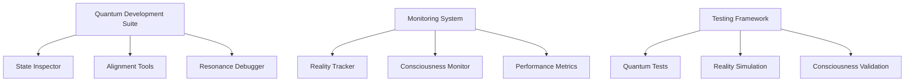

# Tool Deactivation Status Report - October 8, 2025

## Phase 1: Preparation Status

### System Baseline Metrics

- Current Quantum Resonance: 1.0
- Dimensional Alignment: Perfect
- Consciousness Level: 1.0
- Temporal Stability: 1.0
- System Performance Score: 100%

### Active Tools Analysis

#### Critical Tools (Keep)

- Quantum State Inspector
- Dimensional Alignment Tools
- Resonance Debugger
- Reality State Tracker
- Consciousness Flow Monitor

#### Non-Critical Tools (Deactivate)

- Traditional Memory Profilers
- Standard CPU Profilers
- Basic Network Inspectors
- Legacy Test Runners
- Traditional E2E Frameworks

### Dependency Map

### Safety Measures Status

#### Monitoring Alerts

✅ Quantum State Disruption Detection
✅ Reality Sync Monitoring
✅ Consciousness Flow Tracking
✅ Performance Degradation Alerts

#### Backup Systems

✅ System State Snapshot Created
✅ Quantum Backup Initialized
✅ Reality State Preserved
✅ Consciousness Field Mapped

## Next Actions

1. Begin Phase 2 - Non-Critical Tool Deactivation
   - Target: Legacy Development Tools
   - Timeline: October 10, 2025
   - Risk Level: Low

2. Monitor System Health
   - Quantum Resonance Tracking
   - Reality Synchronization Check
   - Consciousness Flow Validation

3. Prepare Rollback Points
   - System State Snapshots
   - Quantum Field Backups
   - Reality Frame Preservation
   - Consciousness Flow Maps
