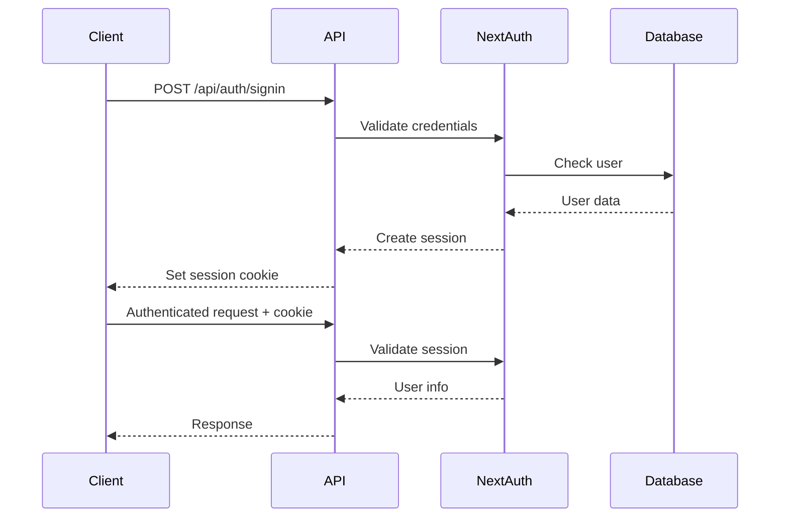

# 📖 Farmers Market Platform - API Documentation

> **Complete API reference and integration guide**

---

## 🎯 Overview

The Farmers Market Platform provides a comprehensive RESTful API for building agricultural marketplace applications. Our API enables developers to integrate farm management, product catalogs, order processing, and payment functionality into their applications.

### Key Features

- ✅ **RESTful Design** - Standard HTTP methods and status codes
- ✅ **JSON Format** - All requests and responses use JSON
- ✅ **Authentication** - Secure session-based authentication via NextAuth.js
- ✅ **Role-Based Access** - ADMIN, FARMER, and CONSUMER roles
- ✅ **Rate Limiting** - Fair usage policies
- ✅ **Pagination** - Efficient data retrieval
- ✅ **Error Handling** - Consistent error responses
- ✅ **Versioning** - API version management

---

## 🚀 Quick Start

### Base URLs

| Environment | Base URL |
|------------|----------|
| **Development** | `http://localhost:3001/api` |
| **Staging** | `https://staging.farmersmarket.com/api` |
| **Production** | `https://farmersmarket.com/api` |

### Interactive Documentation

Access our interactive Swagger UI documentation:

- **Local**: [http://localhost:3001/api-docs.html](http://localhost:3001/api-docs.html)
- **Production**: [https://farmersmarket.com/api-docs.html](https://farmersmarket.com/api-docs.html)

### OpenAPI Specification

Download the OpenAPI 3.0 specification:
- [YAML Format](swagger/openapi.yaml)
- [JSON Format](swagger/openapi.json)

---

## 🔐 Authentication

### Overview

The API uses **NextAuth.js** for authentication with session-based cookies. All authenticated endpoints require a valid session.

### Authentication Flow



### Login

```http
POST /api/auth/signin
Content-Type: application/json

{
  "email": "farmer@example.com",
  "password": "securepassword123"
}
```

**Response:**
```json
{
  "success": true,
  "user": {
    "id": "user_123",
    "email": "farmer@example.com",
    "name": "John Farmer",
    "role": "FARMER"
  }
}
```

### Logout

```http
POST /api/auth/signout
```

### Making Authenticated Requests

Include the session cookie in all authenticated requests:

```javascript
// Using fetch
fetch('http://localhost:3001/api/farms', {
  credentials: 'include', // Important: includes cookies
  headers: {
    'Content-Type': 'application/json'
  }
})

// Using axios
axios.get('/api/farms', {
  withCredentials: true
})
```

---

## 📊 Response Format

### Success Response

All successful responses follow this structure:

```json
{
  "success": true,
  "data": {
    // Response data here
  },
  "meta": {
    "requestId": "req_abc123",
    "duration": 145,
    "cached": false,
    "version": "v1"
  }
}
```

### Error Response

All error responses follow this structure:

```json
{
  "success": false,
  "error": {
    "code": "VALIDATION_ERROR",
    "message": "Invalid input data",
    "details": {
      "fields": {
        "name": "Name is required",
        "email": "Invalid email format"
      }
    },
    "timestamp": "2025-01-07T18:30:00.000Z",
    "requestId": "req_abc123"
  }
}
```

### Common Error Codes

| Code | HTTP Status | Description |
|------|-------------|-------------|
| `VALIDATION_ERROR` | 400 | Invalid request data |
| `UNAUTHORIZED` | 401 | Authentication required |
| `FORBIDDEN` | 403 | Insufficient permissions |
| `NOT_FOUND` | 404 | Resource not found |
| `CONFLICT` | 409 | Resource conflict (duplicate) |
| `RATE_LIMIT_EXCEEDED` | 429 | Too many requests |
| `INTERNAL_ERROR` | 500 | Server error |

---

## 📄 Pagination

List endpoints support pagination:

```http
GET /api/farms?page=2&limit=20
```

**Parameters:**
- `page` - Page number (default: 1)
- `limit` - Items per page (default: 20, max: 100)

**Response includes pagination metadata:**

```json
{
  "success": true,
  "data": {
    "farms": [...],
    "pagination": {
      "page": 2,
      "pageSize": 20,
      "totalPages": 5,
      "totalItems": 98,
      "hasNext": true,
      "hasPrevious": true
    }
  }
}
```

---

## 🏪 Farms API

### List Farms

Get a paginated list of farms with optional filters.

```http
GET /api/farms?status=ACTIVE&state=CA&page=1&limit=20
```

**Query Parameters:**
- `status` - Filter by status (ACTIVE, PENDING, SUSPENDED, ARCHIVED)
- `state` - Filter by state (2-letter code)
- `search` - Search by name or description
- `certifications` - Filter by certifications (comma-separated)
- `page` - Page number (default: 1)
- `limit` - Items per page (default: 20)

**Example Request:**
```javascript
const response = await fetch('/api/farms?status=ACTIVE&state=CA', {
  credentials: 'include'
});
const data = await response.json();
```

**Example Response:**
```json
{
  "success": true,
  "data": {
    "farms": [
      {
        "id": "farm_123",
        "name": "Green Valley Organic Farm",
        "slug": "green-valley-organic-farm",
        "description": "Family-owned organic farm since 1985",
        "status": "ACTIVE",
        "verificationStatus": "APPROVED",
        "location": {
          "address": "123 Farm Road",
          "city": "Farmville",
          "state": "CA",
          "zipCode": "12345",
          "coordinates": {
            "lat": 40.7128,
            "lng": -74.0060
          }
        },
        "email": "contact@greenvalley.com",
        "phone": "(555) 123-4567",
        "certifications": ["ORGANIC", "NON_GMO"],
        "images": [
          "https://cdn.example.com/farm-123-1.jpg"
        ],
        "createdAt": "2024-01-15T10:30:00Z",
        "updatedAt": "2024-12-20T14:22:00Z"
      }
    ],
    "pagination": {
      "page": 1,
      "pageSize": 20,
      "totalPages": 3,
      "totalItems": 52,
      "hasNext": true,
      "hasPrevious": false
    }
  }
}
```

### Get Farm by ID

```http
GET /api/farms/{id}
```

**Example:**
```javascript
const response = await fetch('/api/farms/farm_123');
const data = await response.json();
```

### Create Farm

Create a new farm (requires FARMER role).

```http
POST /api/farms
Content-Type: application/json

{
  "name": "Sunny Acres Farm",
  "description": "Sustainable agriculture with fresh produce",
  "address": "456 Country Lane",
  "city": "Farmington",
  "state": "CA",
  "zipCode": "54321",
  "email": "info@sunnyacres.com",
  "phone": "(555) 987-6543",
  "certifications": ["ORGANIC"],
  "latitude": 40.7580,
  "longitude": -73.9855
}
```

**Validation Rules:**
- `name`: 3-100 characters, alphanumeric
- `description`: 10-2000 characters
- `email`: Valid email format
- `state`: 2-letter state code
- `zipCode`: Valid ZIP code format

**Example Response:**
```json
{
  "success": true,
  "data": {
    "id": "farm_456",
    "name": "Sunny Acres Farm",
    "status": "PENDING",
    "verificationStatus": "PENDING",
    // ... other fields
  }
}
```

### Update Farm

```http
PUT /api/farms/{id}
Content-Type: application/json

{
  "description": "Updated description",
  "phone": "(555) 111-2222"
}
```

### Delete Farm

```http
DELETE /api/farms/{id}
```

**Response:**
```http
204 No Content
```

---

## 📦 Products API

### List Products

```http
GET /api/products?category=vegetables&inStock=true&page=1&limit=20
```

**Query Parameters:**
- `category` - Filter by category
- `farmId` - Filter by farm ID
- `minPrice` - Minimum price filter
- `maxPrice` - Maximum price filter
- `inStock` - Filter by stock availability (true/false)
- `sortBy` - Sort field (price, name, createdAt, popularity)
- `sortOrder` - Sort order (asc, desc)
- `page` - Page number
- `limit` - Items per page

**Example Response:**
```json
{
  "success": true,
  "data": {
    "products": [
      {
        "id": "prod_789",
        "name": "Organic Tomatoes",
        "description": "Fresh, locally-grown organic tomatoes",
        "price": 4.99,
        "unit": "lb",
        "category": "VEGETABLES",
        "farmId": "farm_123",
        "farm": {
          "id": "farm_123",
          "name": "Green Valley Organic Farm"
        },
        "images": [
          "https://cdn.example.com/products/tomatoes-1.jpg"
        ],
        "inventory": 150,
        "inStock": true,
        "organic": true,
        "createdAt": "2024-06-15T08:00:00Z",
        "updatedAt": "2025-01-05T12:30:00Z"
      }
    ],
    "pagination": {
      "page": 1,
      "pageSize": 20,
      "totalPages": 8,
      "totalItems": 156,
      "hasNext": true,
      "hasPrevious": false
    }
  }
}
```

### Create Product

```http
POST /api/products
Content-Type: application/json

{
  "name": "Fresh Strawberries",
  "description": "Sweet, juicy strawberries picked daily",
  "price": 6.99,
  "unit": "pint",
  "category": "FRUITS",
  "farmId": "farm_123",
  "inventory": 100,
  "organic": true
}
```

### Update Product Inventory

```http
PATCH /api/products/{id}/inventory
Content-Type: application/json

{
  "inventory": 75
}
```

---

## 🛒 Shopping Cart API

### Get Cart

```http
GET /api/cart
```

**Example Response:**
```json
{
  "success": true,
  "data": {
    "id": "cart_abc",
    "userId": "user_123",
    "items": [
      {
        "id": "item_1",
        "productId": "prod_789",
        "product": {
          "id": "prod_789",
          "name": "Organic Tomatoes",
          "price": 4.99,
          "unit": "lb",
          "images": ["..."]
        },
        "quantity": 3,
        "price": 4.99,
        "subtotal": 14.97
      }
    ],
    "subtotal": 14.97,
    "tax": 1.20,
    "total": 16.17,
    "itemCount": 3
  }
}
```

### Add Item to Cart

```http
POST /api/cart/items
Content-Type: application/json

{
  "productId": "prod_789",
  "quantity": 2
}
```

### Update Cart Item

```http
PUT /api/cart/items/{itemId}
Content-Type: application/json

{
  "quantity": 5
}
```

### Remove Cart Item

```http
DELETE /api/cart/items/{itemId}
```

---

## 📋 Orders API

### List Orders

```http
GET /api/orders?status=DELIVERED&page=1
```

**Example Response:**
```json
{
  "success": true,
  "data": {
    "orders": [
      {
        "id": "order_xyz",
        "orderNumber": "ORD-2025-001234",
        "userId": "user_123",
        "status": "DELIVERED",
        "items": [
          {
            "id": "item_1",
            "productId": "prod_789",
            "product": {
              "name": "Organic Tomatoes"
            },
            "quantity": 3,
            "price": 4.99,
            "subtotal": 14.97
          }
        ],
        "subtotal": 14.97,
        "tax": 1.20,
        "shippingCost": 5.00,
        "total": 21.17,
        "deliveryAddress": {
          "street": "123 Main St",
          "city": "Springfield",
          "state": "IL",
          "zipCode": "62701"
        },
        "paymentMethod": "card_****1234",
        "createdAt": "2025-01-01T10:00:00Z",
        "deliveredAt": "2025-01-03T14:30:00Z"
      }
    ],
    "pagination": {
      "page": 1,
      "pageSize": 20,
      "totalPages": 2,
      "totalItems": 35,
      "hasNext": true,
      "hasPrevious": false
    }
  }
}
```

### Create Order

```http
POST /api/orders
Content-Type: application/json

{
  "deliveryAddressId": "addr_123",
  "paymentMethodId": "pm_stripe_abc",
  "notes": "Please leave at front door"
}
```

**Response:**
```json
{
  "success": true,
  "data": {
    "id": "order_new",
    "orderNumber": "ORD-2025-001235",
    "status": "PENDING",
    "total": 21.17,
    // ... order details
  }
}
```

---

## 🔍 Search API

### Global Search

Search across farms and products.

```http
GET /api/search?q=organic&type=all&limit=20
```

**Query Parameters:**
- `q` - Search query (required)
- `type` - Search type (all, farms, products)
- `limit` - Max results per type (default: 20)

**Example Response:**
```json
{
  "success": true,
  "data": {
    "farms": [
      {
        "id": "farm_123",
        "name": "Green Valley Organic Farm",
        "description": "Certified organic farm...",
        "relevance": 0.95
      }
    ],
    "products": [
      {
        "id": "prod_789",
        "name": "Organic Tomatoes",
        "description": "Fresh organic tomatoes...",
        "relevance": 0.92
      }
    ],
    "total": 47
  }
}
```

---

## ⚙️ Admin API

### Get Platform Analytics

```http
GET /api/admin/analytics?startDate=2025-01-01&endDate=2025-01-31
```

**Requires:** ADMIN role

**Example Response:**
```json
{
  "success": true,
  "data": {
    "revenue": {
      "total": 125678.50,
      "growth": 23.5
    },
    "orders": {
      "total": 1543,
      "growth": 18.2
    },
    "users": {
      "total": 5234,
      "active": 3421,
      "growth": 12.7
    },
    "farms": {
      "total": 156,
      "active": 142,
      "pending": 8,
      "growth": 15.3
    }
  }
}
```

### Verify Farm

```http
POST /api/admin/farms/verify
Content-Type: application/json

{
  "farmId": "farm_456",
  "status": "APPROVED"
}
```

**Rejection with reason:**
```json
{
  "farmId": "farm_789",
  "status": "REJECTED",
  "rejectionReason": "Incomplete documentation provided"
}
```

---

## 🚦 Rate Limiting

Rate limits are enforced per user:

| User Type | Rate Limit |
|-----------|-----------|
| **Anonymous** | 100 requests/hour |
| **Authenticated** | 1,000 requests/hour |
| **Admin** | Unlimited |

**Rate Limit Headers:**
```http
X-RateLimit-Limit: 1000
X-RateLimit-Remaining: 995
X-RateLimit-Reset: 1704657600
```

When rate limit is exceeded:
```json
{
  "success": false,
  "error": {
    "code": "RATE_LIMIT_EXCEEDED",
    "message": "Too many requests. Please try again later.",
    "retryAfter": 3600
  }
}
```

---

## 📝 Best Practices

### 1. Always Handle Errors

```javascript
try {
  const response = await fetch('/api/farms');

  if (!response.ok) {
    const error = await response.json();
    console.error('API Error:', error.error);
    // Handle error appropriately
  }

  const data = await response.json();
  // Process data
} catch (error) {
  console.error('Network Error:', error);
  // Handle network errors
}
```

### 2. Use Pagination for Large Datasets

```javascript
async function getAllFarms() {
  const allFarms = [];
  let page = 1;
  let hasMore = true;

  while (hasMore) {
    const response = await fetch(`/api/farms?page=${page}&limit=100`);
    const data = await response.json();

    allFarms.push(...data.data.farms);
    hasMore = data.data.pagination.hasNext;
    page++;
  }

  return allFarms;
}
```

### 3. Implement Retry Logic

```javascript
async function fetchWithRetry(url, options = {}, retries = 3) {
  for (let i = 0; i < retries; i++) {
    try {
      const response = await fetch(url, options);

      if (response.ok) {
        return await response.json();
      }

      // Don't retry on client errors
      if (response.status >= 400 && response.status < 500) {
        throw new Error(`Client error: ${response.status}`);
      }
    } catch (error) {
      if (i === retries - 1) throw error;

      // Exponential backoff
      await new Promise(resolve =>
        setTimeout(resolve, Math.pow(2, i) * 1000)
      );
    }
  }
}
```

### 4. Cache Responses

```javascript
const cache = new Map();

async function fetchWithCache(url, ttl = 60000) {
  const cached = cache.get(url);

  if (cached && Date.now() - cached.timestamp < ttl) {
    return cached.data;
  }

  const response = await fetch(url);
  const data = await response.json();

  cache.set(url, {
    data,
    timestamp: Date.now()
  });

  return data;
}
```

---

## 🔧 SDKs & Libraries

### JavaScript/TypeScript

```bash
npm install @farmersmarket/api-client
```

```javascript
import { FarmersMarketClient } from '@farmersmarket/api-client';

const client = new FarmersMarketClient({
  baseUrl: 'http://localhost:3001',
  credentials: 'include'
});

// Get farms
const farms = await client.farms.list({ status: 'ACTIVE' });

// Create product
const product = await client.products.create({
  name: 'Organic Apples',
  price: 3.99,
  farmId: 'farm_123'
});
```

### Python

```bash
pip install farmersmarket-api
```

```python
from farmersmarket import Client

client = Client(base_url='http://localhost:3001')
client.authenticate(email='user@example.com', password='password')

# Get farms
farms = client.farms.list(status='ACTIVE')

# Create product
product = client.products.create(
    name='Organic Apples',
    price=3.99,
    farm_id='farm_123'
)
```

---

## 🆘 Support

### Documentation
- [Getting Started Guide](../getting-started/QUICK_START_GUIDE.md)
- [API Examples](examples/)
- [Postman Collection](postman/collection.json)

### Community
- GitHub Issues: [Report bugs](https://github.com/your-repo/issues)
- Discussions: [Ask questions](https://github.com/your-repo/discussions)
- Discord: [Join our community](https://discord.gg/farmersmarket)

### Contact
- Email: api-support@farmersmarket.com
- Documentation: https://docs.farmersmarket.com
- Status Page: https://status.farmersmarket.com

---

**Last Updated:** January 2025
**API Version:** 1.0.0
**OpenAPI Spec:** 3.0.3

🌾 **Happy farming!** 🚜
