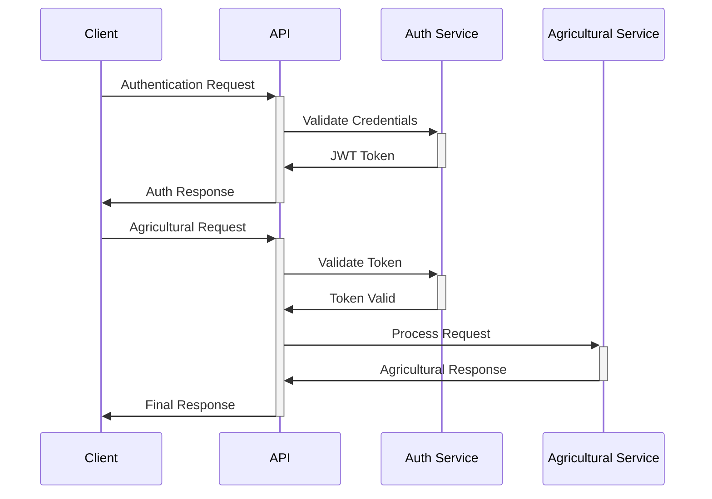

# API Documentation

## 🔌 API Endpoints

### Authentication
```typescript
// POST /api/auth/login
interface LoginRequest {
  email: string;
  password: string;
}

// POST /api/auth/register
interface RegisterRequest {
  email: string;
  password: string;
  role: 'farmer' | 'customer' | 'admin';
  farmDetails?: FarmRegistration;
}
```

### Agricultural APIs

#### Crop Management
```typescript
// GET /api/crops
interface CropQuery {
  season?: 'spring' | 'summer' | 'fall' | 'winter';
  organic?: boolean;
  region?: string;
}

// POST /api/crops
interface CropCreation {
  name: string;
  season: string[];
  organic: boolean;
  harvestDate: Date;
  price: number;
}
```

#### Market Features
```typescript
// GET /api/market/inventory
interface InventoryQuery {
  farmerId?: string;
  available?: boolean;
  category?: string;
}

// POST /api/market/orders
interface OrderCreation {
  products: Array<{
    productId: string;
    quantity: number;
  }>;
  deliveryDetails: DeliveryInfo;
}
```

## 🔐 Authentication & Authorization

### JWT Format
```typescript
interface JWTPayload {
  userId: string;
  role: UserRole;
  farmId?: string;
  region?: string;
  permissions: string[];
}
```

### Role-Based Access
```typescript
enum UserRole {
  FARMER = 'farmer',
  CUSTOMER = 'customer',
  ADMIN = 'admin'
}

interface RolePermissions {
  farmer: string[];
  customer: string[];
  admin: string[];
}
```

## 📡 Real-time Features

### WebSocket Events
```typescript
interface WebSocketEvents {
  'inventory-update': InventoryUpdate;
  'order-status': OrderStatusUpdate;
  'price-change': PriceUpdate;
}
```

## 🔄 Integration Flow



## 📚 Implementation Guides

- [API Integration Guide](../../.github/instructions/NEXTJS_DIVINITY/API_INTEGRATION.instructions.md)
- [Security Framework](../../.github/instructions/DIVINE_SECURITY/SECURITY_FRAMEWORK.instructions.md)
- [Performance Optimization](../../.github/instructions/PERFORMANCE_ALCHEMY.instructions.md)

## 🧪 Testing

### Authentication Tests
```typescript
describe('Authentication API', () => {
  it('should authenticate valid credentials', async () => {
    // Test implementation
  });
  
  it('should validate JWT tokens', async () => {
    // Test implementation
  });
});
```

### Agricultural Tests
```typescript
describe('Crop Management API', () => {
  it('should handle seasonal queries', async () => {
    // Test implementation
  });
  
  it('should validate harvest dates', async () => {
    // Test implementation
  });
});
```

## 🔍 Error Handling

```typescript
interface APIError {
  code: string;
  message: string;
  details?: Record<string, any>;
}

enum ErrorCodes {
  AUTH_FAILED = 'AUTH_001',
  INVALID_INPUT = 'VAL_001',
  NOT_FOUND = 'NF_001',
  SERVER_ERROR = 'SRV_001'
}
```

## 📈 Monitoring

### Metrics
```typescript
interface APIMetrics {
  endpoint: string;
  method: string;
  statusCode: number;
  responseTime: number;
  timestamp: Date;
}
```

### Health Checks
```typescript
interface HealthCheck {
  service: string;
  status: 'healthy' | 'degraded' | 'down';
  lastChecked: Date;
  metrics: Record<string, number>;
}
```

---

*This API documentation is automatically updated based on implementation changes.*