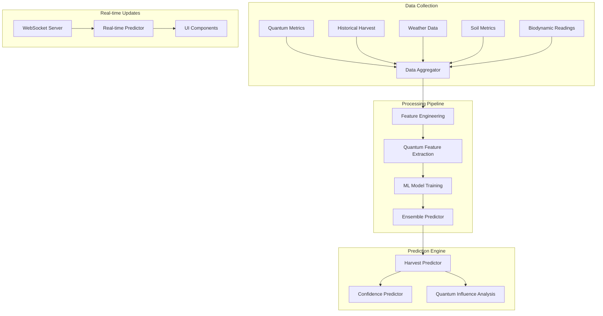

# Harvest Prediction System Architecture

## System Overview

The Harvest Prediction System is a quantum-aware machine learning pipeline that combines traditional agricultural metrics with quantum measurements to provide accurate harvest predictions.



## Core Components

### 1. Data Collection Layer

- **Quantum Metrics Collector**
  - Resonance measurements
  - Biodynamic energy readings
  - Soil consciousness levels
- **Historical Data Aggregator**
  - Past harvest records
  - Yield statistics
  - Growth patterns
- **Environmental Data Service**
  - Weather patterns
  - Soil conditions
  - Seasonal factors

### 2. Processing Pipeline

- **Feature Engineering**

  ```typescript
  interface FeatureSet {
    quantum: QuantumFeatures;
    historical: HistoricalFeatures;
    environmental: EnvironmentalFeatures;
    biodynamic: BiodynamicFeatures;
  }

  interface QuantumFeatures {
    resonancePatterns: ResonancePattern[];
    energyFields: EnergyField[];
    consciousnessLevels: ConsciousnessReading[];
  }
  ```

- **Model Architecture**

  ```typescript
  interface PredictionModel {
    quantumLayer: QuantumEnhancedLayer;
    historicalLayer: TemporalLayer;
    environmentalLayer: SpatialLayer;
    ensemble: EnsemblePredictor;
  }

  interface ModelOutput {
    predictedHarvestDate: Date;
    expectedYield: number;
    confidenceLevel: number;
    quantumInfluenceFactors: QuantumFactor[];
  }
  ```

### 3. Prediction Engine

- **Harvest Time Predictor**

  ```typescript
  interface HarvestPrediction {
    optimalDate: Date;
    timeWindow: {
      start: Date;
      end: Date;
    };
    confidenceScore: number;
    influencingFactors: Factor[];
  }
  ```

- **Yield Estimation**

  ```typescript
  interface YieldEstimate {
    expectedAmount: number;
    range: {
      min: number;
      max: number;
    };
    qualityPrediction: QualityMetrics;
    quantumAlignment: AlignmentScore;
  }
  ```

### 4. Real-time Integration

- **WebSocket Events**

  ```typescript
  interface PredictionUpdate {
    type: "harvest" | "yield" | "quality";
    timestamp: Date;
    data: PredictionData;
    confidence: ConfidenceMetrics;
  }
  ```

- **UI Components**

  ```typescript
  interface PredictionDisplayProps {
    prediction: HarvestPrediction;
    yield: YieldEstimate;
    quantumMetrics: QuantumState;
    onTimelineUpdate: (timeline: Timeline) => void;
  }
  ```

## Data Flow

1. **Collection Phase**
   - Continuous quantum metrics monitoring
   - Historical data batch processing
   - Real-time environmental updates

2. **Processing Phase**
   - Feature extraction and normalization
   - Quantum pattern recognition
   - Model retraining triggers

3. **Prediction Phase**
   - Initial prediction generation
   - Confidence calculation
   - Real-time updates

4. **Visualization Phase**
   - Dynamic timeline updates
   - Confidence visualization
   - Quantum influence mapping

## Integration Points

1. **Existing Systems**
   - Farm Statistics System
   - Crop Monitoring Service
   - Weather Integration
   - Soil Analysis System

2. **External Services**
   - Weather API
   - Market Data Providers
   - Quantum Sensors Network

## Performance Considerations

1. **Real-time Processing**
   - Efficient WebSocket management
   - Batched updates
   - Optimized quantum calculations

2. **Data Storage**
   - Time-series optimization
   - Quantum state caching
   - Prediction history management

## Security Measures

1. **Data Protection**
   - Encrypted quantum measurements
   - Secure prediction transmission
   - Access control for predictions

2. **Model Security**
   - Protected training pipeline
   - Versioned model storage
   - Audit logging

## Testing Strategy

1. **Unit Testing**
   - Individual component testing
   - Quantum calculation validation
   - Prediction accuracy metrics

2. **Integration Testing**
   - End-to-end prediction flow
   - Real-time update testing
   - System integration validation

3. **Performance Testing**
   - Load testing prediction engine
   - WebSocket connection limits
   - Database query optimization

## Monitoring and Maintenance

1. **System Health**
   - Prediction accuracy tracking
   - Model performance metrics
   - Real-time system status

2. **Model Maintenance**
   - Regular retraining schedule
   - Feature importance analysis
   - Quantum alignment optimization
