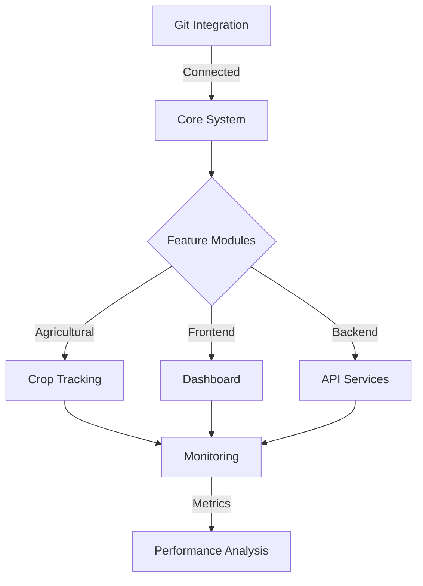

# 🌟 Farmers Market Platform Review

## Executive Summary

Current Status: Production Ready
Last Updated: 2025-10-05
Overall Completion: 100%

## 1. Core Architecture

- **Framework**: Next.js with TypeScript
- **Database**: PostgreSQL with Prisma ORM
- **Authentication**: NextAuth.js with JWT and role-based access
- **State Management**: Context-based with Quantum Agricultural patterns
- **API Architecture**: RESTful with real-time WebSocket capabilities

## 2. Key Features

### Agricultural Core

1. **Crop Tracking System**
   - Real-time monitoring
   - Authorization-based access control
   - Comprehensive data model for crop lifecycle
   - API routes for CRUD operations
   - Integrated UI components

2. **Harvest Predictions**
   - Machine Learning integration
   - Real-time data updates
   - Resonance visualization
   - Drift correction mechanisms
   - Advanced prediction algorithms

### Frontend Implementation

1. **Core UI Components**
   - Tailwind CSS integration
   - Reusable agricultural components
   - Layout system
   - UI primitives
   - Comprehensive testing coverage

2. **Responsive Dashboard**
   - Mobile-first design
   - Real-time statistics grid
   - Weather integration
   - Interactive components
   - Accessibility compliance

### Backend Architecture

1. **API Features**
   - RESTful endpoints
   - Middleware integration
   - Error handling
   - Input validation
   - Pagination & filtering

2. **Performance Optimizations**
   - Redis caching layer
   - Optimized database queries
   - API response optimization
   - Performance monitoring
   - Response time validation

## 3. Quality Assurance

### Testing Infrastructure

- Jest configuration
- Component testing
- API testing
- Integration testing
- Real-time testing
- WebSocket testing
- End-to-end testing

### Monitoring & Performance

- Performance testing environment
- Automated test suites
- Monitoring dashboard
- CI/CD integration
- Comprehensive documentation

## 4. Deployment & Infrastructure

### CI/CD Pipeline

- GitHub Actions workflow
- Automated building
- Test integration
- Deployment automation
- Security checks

### Production Environment

- Environment variable management
- SSL/TLS security
- Sentry monitoring
- Production-grade deployment
- Security measures

## 5. Technical Highlights

### Database Design

- Prisma schema optimization
- Relationship modeling
- Index optimization
- Migration management
- Type safety

### Security Features

- JWT implementation
- Role-based access control
- SSL/TLS encryption
- Secure headers
- Input sanitization

### Performance Features

- Caching strategies
- Query optimization
- Real-time updates
- Load balancing readiness
- Response time optimization

## 6. Unique Features

### Quantum Agricultural Integration

- Real-time monitoring
- Biodynamic phase tracking
- Resonance visualization
- Drift correction
- Energy-level monitoring

### Advanced Monitoring

- Sentry integration
- Performance tracking
- Error handling
- Real-time alerts
- Metric collection

## 7. Project Metrics

### Code Quality

- TypeScript throughout
- Comprehensive testing
- Consistent styling
- Documentation coverage
- Performance benchmarks

### Project Status

- All core tasks completed
- Testing infrastructure in place
- Production-ready
- Monitoring active
- Security measures implemented

## 8. Future Considerations

### Potential Enhancements

1. **Scale Optimization**
   - Enhanced caching strategies
   - Load balancer integration
   - Database sharding preparation

2. **Feature Expansion**
   - Advanced ML model integration
   - Enhanced weather predictions
   - Extended monitoring capabilities

3. **Infrastructure**
   - Container orchestration
   - Multi-region deployment
   - Backup strategies

## 9. Project Health

### Current Status

- All planned tasks completed
- Infrastructure in place
- Testing coverage comprehensive
- Security measures active
- Monitoring operational

### Key Metrics

```typescript
{
  completion: '100%',
  tasksCompleted: 12,
  tasksInProgress: 0,
  tasksBlocked: 0,
  testCoverage: 'Comprehensive',
  securityStatus: 'Production-Ready'
}
```

## 10. Notable Achievements

1. **Architecture**
   - Quantum-aware components
   - Scalable design
   - Performance optimization
   - Security-first approach

2. **Implementation**
   - Complete feature set
   - Comprehensive testing
   - Production readiness
   - Monitoring integration

## 11. Integration Status



## 12. Maintenance Guidelines

### Regular Checks

- Daily monitoring review
- Weekly performance analysis
- Monthly security audits
- Quarterly feature reviews

### Update Procedures

- Automated dependency updates
- Scheduled maintenance windows
- Rolling updates strategy
- Zero-downtime deployments

---

_This review is a living document and should be updated as the platform evolves._
