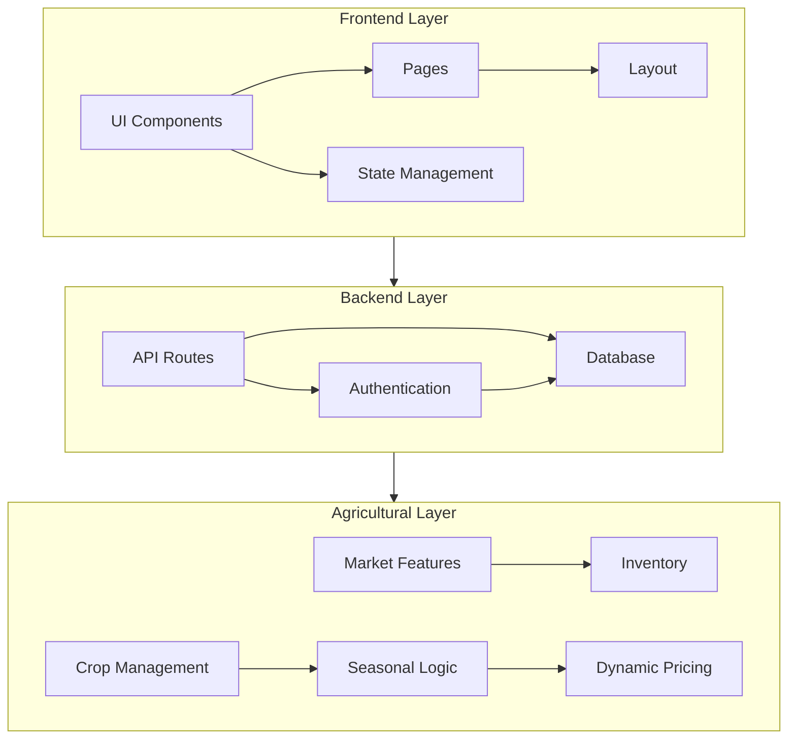

# Farmers Market Platform Architecture

## 🏗️ System Architecture



## 📁 Implementation Structure

```
src/
├── app/                    # Next.js App Router
│   ├── (auth)/            # Authentication routes
│   │   ├── login/         # Login flow
│   │   └── register/      # Registration flow
│   ├── (dashboard)/       # Dashboard routes
│   │   ├── farmer/        # Farmer dashboard
│   │   └── admin/        # Admin dashboard
│   └── api/              # API endpoints
├── components/           # React components
│   ├── ui/              # Base UI components
│   ├── agricultural/    # Farm-specific components
│   └── layout/         # Layout components
└── lib/                # Utilities
```

## 🔗 Key Integration Points

1. **Frontend Components**
   - [Component Architecture](../../.github/instructions/NEXTJS_DIVINITY/COMPONENT_ARCHITECTURE.instructions.md)
   - [Agricultural Components](../../.github/instructions/AGRICULTURAL_DIVINITY/FARMING_PATTERNS.instructions.md)
   - [State Management](../../.github/instructions/NEXTJS_DIVINITY/STATE_MANAGEMENT.instructions.md)

2. **Backend Services**
   - [API Integration](../../.github/instructions/NEXTJS_DIVINITY/API_INTEGRATION.instructions.md)
   - [Database Schema](../../.github/instructions/NEXTJS_DIVINITY/DATABASE_SCHEMA.instructions.md)
   - [Authentication](../../.github/instructions/DIVINE_SECURITY/SECURITY_FRAMEWORK.instructions.md)

3. **Agricultural Systems**
   - [Farming Patterns](../../.github/instructions/AGRICULTURAL_DIVINITY/FARMING_PATTERNS.instructions.md)
   - [Workflow Mastery](../../.github/instructions/AGRICULTURAL_DIVINITY/WORKFLOW_MASTERY.instructions.md)

## 🛠️ Implementation Principles

1. **Component Design**
   - Follow atomic design principles
   - Implement agricultural context awareness
   - Maintain responsive layouts
   - Use TypeScript for type safety

2. **API Design**
   - RESTful endpoints with agricultural context
   - Secure authentication and authorization
   - Efficient data fetching patterns
   - Real-time updates where needed

3. **Data Management**
   - Prisma for database operations
   - Strong typing with zod validation
   - Efficient caching strategies
   - Real-time inventory updates

## 🔄 Development Flow


## 📚 Related Documentation

- [Development Guide](../DEVELOPMENT_GUIDE.md)
- [API Documentation](../api/README.md)
- [Task Tracking](../../DIVINE_TASK_MANIFEST.md)
- [Quality Standards](../../.github/instructions/DIVINE_QUALITY/QUALITY_ASSURANCE.instructions.md)

---

*This architecture document serves as the divine blueprint for our implementation.*