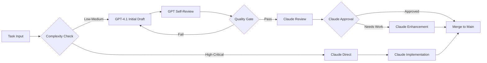

# 🤖 DUAL AGENT SYMBIOSIS - COMPREHENSIVE TODO LIST

**Project**: Farmers Market Divine Agricultural Platform
**Agents**: GPT-4.1 (Free) + Claude Sonnet 4 (Paid)
**Objective**: Synchronized symbiotic workflow for maximum efficiency
**Date**: October 26, 2025

---

## 🎯 EXECUTIVE SUMMARY

Create a harmonious dual-agent system where:

- **GPT-4.1 (Free)**: Handles routine tasks, documentation, research, initial drafts
- **Claude Sonnet 4 (Paid)**: Handles complex logic, critical code, architecture decisions, final review
- **Symbiosis**: Synchronized through shared context, git workflows, and intelligent task routing

---

## 📋 PHASE 1: INFRASTRUCTURE SETUP (Week 1)

### 1.1 Agent Configuration Files

- [ ] **Create agent configuration directory**
  - Location: `.github/agents/`
  - Files: `gpt-config.json`, `claude-config.json`, `symbiosis-rules.json`

- [ ] **GPT-4.1 Configuration**

  ```json
  {
    "agent_name": "GPT-4.1 Agricultural Assistant",
    "role": "Research, Documentation, Initial Drafts",
    "capabilities": [
      "documentation",
      "research",
      "test_generation",
      "refactoring"
    ],
    "cost_per_token": 0,
    "priority": "low-medium",
    "handoff_triggers": ["complex_logic", "critical_decision", "architecture"]
  }
  ```

- [ ] **Claude Sonnet 4 Configuration**

  ```json
  {
    "agent_name": "Claude Sonnet 4 Agricultural Architect",
    "role": "Architecture, Critical Code, Final Review",
    "capabilities": [
      "architecture",
      "complex_algorithms",
      "security",
      "optimization"
    ],
    "cost_per_token": 0.003,
    "priority": "high-critical",
    "handoff_sources": ["gpt_escalation", "critical_path", "production"]
  }
  ```

- [ ] **Symbiosis Rules Configuration**
  ```json
  {
    "workflow": "sequential_with_handoff",
    "communication_protocol": "git_based",
    "context_sharing": "markdown_artifacts",
    "decision_tree": "complexity_based_routing"
  }
  ```

### 1.2 Git-Based Communication System

- [ ] **Create agent-specific branches**
  - `gpt-workspace` - GPT-4.1 working branch
  - `claude-review` - Claude review and enhancement branch
  - `main` - Production-ready merged code

- [ ] **Setup git hooks for agent coordination**
  - `.git/hooks/pre-commit-gpt.ps1` - GPT pre-commit validation
  - `.git/hooks/pre-merge-claude.ps1` - Claude review gate
  - `.git/hooks/post-merge-sync.ps1` - Context synchronization

- [ ] **Create shared context directory**
  - `.agents/context/` - Shared context files
  - `.agents/handoffs/` - Agent-to-agent handoff requests
  - `.agents/decisions/` - Recorded architectural decisions

### 1.3 Task Routing System

- [ ] **Create task classifier script**
  - File: `scripts/agent-task-router.ts`
  - Function: Analyze task complexity and route to appropriate agent
  - Logic: Use task keywords, file patterns, complexity metrics

- [ ] **Define routing rules**

  ```typescript
  interface TaskRoute {
    pattern: RegExp;
    agent: "gpt" | "claude" | "both";
    priority: number;
    rationale: string;
  }
  ```

- [ ] **Implement complexity analyzer**
  - Cyclomatic complexity measurement
  - Critical path detection
  - Security impact assessment
  - Performance sensitivity scoring

---

## 📋 PHASE 2: AGENT ROLE DEFINITION (Week 1-2)

### 2.1 GPT-4.1 Responsibilities (Free Agent)

#### Primary Tasks

- [ ] **Documentation Generation**
  - README updates
  - API documentation
  - Code comments
  - Tutorial creation
  - FAQ generation

- [ ] **Research & Information Gathering**
  - Agricultural domain research
  - Technology stack research
  - Best practices compilation
  - Competitive analysis
  - User story generation

- [ ] **Initial Code Drafts**
  - Boilerplate code generation
  - Component scaffolding
  - Test template creation
  - Configuration file setup
  - Basic CRUD operations

- [ ] **Routine Maintenance**
  - Dependency updates research
  - Breaking change documentation
  - Migration script drafts
  - Changelog updates
  - Issue triage and labeling

- [ ] **Test Generation**
  - Unit test scaffolds
  - Integration test templates
  - E2E test scenarios
  - Mock data generation
  - Test documentation

#### Handoff Triggers (When to escalate to Claude)

- [ ] Complex algorithmic logic needed
- [ ] Security-critical code sections
- [ ] Performance-sensitive operations
- [ ] Architecture decisions required
- [ ] Production deployment code
- [ ] Database schema changes
- [ ] API contract modifications

### 2.2 Claude Sonnet 4 Responsibilities (Paid Agent)

#### Primary Tasks

- [ ] **Architecture Decisions**
  - System design patterns
  - Database schema design
  - API architecture
  - Component hierarchy
  - State management strategy
  - Caching strategy
  - Security architecture

- [ ] **Critical Code Implementation**
  - Authentication/authorization
  - Payment processing
  - Data validation logic
  - Complex business rules
  - Performance-critical paths
  - Security-sensitive features

- [ ] **Code Review & Enhancement**
  - Review GPT-generated code
  - Optimize algorithms
  - Security hardening
  - Performance tuning
  - Error handling enhancement
  - Edge case coverage

- [ ] **Production-Ready Code**
  - Final code polishing
  - Production configuration
  - Deployment scripts
  - Monitoring setup
  - Error tracking integration
  - Performance optimization

- [ ] **Complex Problem Solving**
  - Debugging hard issues
  - Performance bottlenecks
  - Scalability challenges
  - Integration problems
  - Data consistency issues

#### Acceptance Criteria (When to accept GPT handoff)

- [ ] Documentation of problem context
- [ ] Initial solution attempts documented
- [ ] Test cases provided
- [ ] Clear acceptance criteria
- [ ] Performance requirements specified

---

## 📋 PHASE 3: WORKFLOW IMPLEMENTATION (Week 2)

### 3.1 Sequential Workflow Pattern



- [ ] **Implement workflow orchestrator**
  - File: `scripts/agent-workflow-orchestrator.ts`
  - Manages agent transitions
  - Tracks workflow state
  - Records decisions

- [ ] **Create workflow state machine**
  - States: `pending`, `gpt_working`, `gpt_review`, `claude_review`, `claude_working`, `complete`
  - Transitions: Defined by quality gates and approvals

### 3.2 Context Sharing Protocol

- [ ] **Shared context format**

  ```markdown
  # Agent Context: [Task ID]

  ## Current Agent: [GPT/Claude]

  ## Status: [In Progress/Ready for Handoff/Complete]

  ## Task Description

  [Original task description]

  ## Work Completed

  - [What has been done]

  ## Decisions Made

  - [Key decisions and rationale]

  ## Open Questions

  - [Unresolved issues]

  ## Handoff Request

  - Reason: [Why escalating to other agent]
  - Expected output: [What is needed]
  - Critical constraints: [Time, quality, performance]

  ## Files Changed

  - [List of modified files]

  ## Test Coverage

  - [What has been tested]
  ```

- [ ] **Implement context writer/reader**
  - `AgentContext.write()` - Save context
  - `AgentContext.read()` - Load context
  - `AgentContext.update()` - Update existing context

- [ ] **Create context synchronization script**
  - Runs on git hook triggers
  - Updates shared context files
  - Notifies waiting agent

### 3.3 Handoff Mechanism

- [ ] **Create handoff request system**
  - File: `.agents/handoffs/HANDOFF_[timestamp].md`
  - Contains: context, files, reason, expected outcome

- [ ] **Implement handoff notification**
  - PowerShell script to monitor handoff directory
  - Sends notification when new handoff detected
  - Updates agent status files

- [ ] **Create handoff acceptance script**
  - Claude reviews handoff request
  - Accepts or requests more information
  - Updates workflow state

---

## 📋 PHASE 4: INTELLIGENT TASK ROUTING (Week 2-3)

### 4.1 Complexity-Based Router

- [ ] **Implement complexity analyzer**

  ```typescript
  interface ComplexityMetrics {
    cyclomaticComplexity: number;
    cognitiveComplexity: number;
    linesOfCode: number;
    dependencies: number;
    securityImpact: "low" | "medium" | "high" | "critical";
    performanceImpact: "low" | "medium" | "high" | "critical";
  }

  function routeTask(task: Task, metrics: ComplexityMetrics): "gpt" | "claude" {
    // Routing logic
  }
  ```

- [ ] **Define routing thresholds**
  - Cyclomatic complexity > 15 → Claude
  - Security impact = 'high' or 'critical' → Claude
  - Performance impact = 'high' or 'critical' → Claude
  - LOC > 200 → Claude
  - Everything else → GPT (with Claude review)

### 4.2 File Pattern-Based Router

- [ ] **Define file patterns for each agent**

  ```yaml
  gpt_patterns:
    - "docs/**/*.md"
    - "tests/**/*.test.ts"
    - "src/**/*.stories.tsx"
    - "scripts/utils/**"
    - "*.config.js"

  claude_patterns:
    - "src/lib/auth/**"
    - "src/lib/payment/**"
    - "src/lib/security/**"
    - "prisma/schema.prisma"
    - "src/middleware/**"
    - "src/api/critical/**"

  both_patterns:
    - "src/components/**" # GPT drafts, Claude reviews
    - "src/features/**" # GPT scaffolds, Claude implements logic
  ```

- [ ] **Implement pattern matcher**
  - Checks file paths against patterns
  - Routes accordingly
  - Handles "both" cases with sequential workflow

### 4.3 Task Keywords Router

- [ ] **Define keyword categories**

  ```typescript
  const gptKeywords = [
    "documentation",
    "readme",
    "comment",
    "tutorial",
    "research",
    "analysis",
    "compare",
    "list",
    "scaffold",
    "boilerplate",
    "template",
    "mock",
    "test",
    "spec",
    "fixture",
  ];

  const claudeKeywords = [
    "architecture",
    "design",
    "optimize",
    "security",
    "authentication",
    "authorization",
    "payment",
    "critical",
    "performance",
    "scale",
    "production",
    "deploy",
    "complex",
    "algorithm",
    "database",
    "schema",
  ];
  ```

- [ ] **Implement keyword analyzer**
  - Extracts keywords from task description
  - Scores agent fitness
  - Routes to best-fit agent

---

## 📋 PHASE 5: QUALITY GATES & VALIDATION (Week 3)

### 5.1 GPT Self-Review Gate

- [ ] **Implement GPT self-review checklist**
  - Code runs without errors
  - Tests pass (if applicable)
  - Follows project conventions
  - Documentation is complete
  - No obvious bugs or issues

- [ ] **Create automated quality checks**
  - ESLint validation
  - TypeScript compilation
  - Basic test execution
  - Documentation completeness check

- [ ] **Define handoff criteria**
  - All self-review items pass
  - Context document complete
  - Files committed to `gpt-workspace` branch

### 5.2 Claude Review Gate

- [ ] **Implement Claude review checklist**
  - Architecture alignment
  - Security best practices
  - Performance considerations
  - Error handling completeness
  - Edge case coverage
  - Production readiness

- [ ] **Create review decision tree**
  - ✅ Approve → Merge to main
  - 🔄 Enhance → Claude makes improvements
  - ❌ Reject → Back to GPT with feedback

- [ ] **Define enhancement criteria**
  - What needs improvement
  - Why it matters
  - How to fix it
  - Examples of correct implementation

### 5.3 Final Merge Gate

- [ ] **Implement pre-merge validation**
  - All tests pass
  - Type checking passes
  - Linting passes
  - Build succeeds
  - No merge conflicts

- [ ] **Create merge approval system**
  - Claude must approve
  - Automated checks must pass
  - Documentation must be updated

---

## 📋 PHASE 6: COMMUNICATION PROTOCOLS (Week 3-4)

### 6.1 Git-Based Communication

- [ ] **Branch naming conventions**
  - `gpt/feature/[name]` - GPT working branches
  - `claude/review/[name]` - Claude review branches
  - `claude/enhance/[name]` - Claude enhancement branches

- [ ] **Commit message protocols**

  ```
  [GPT] Initial draft: Add farm profile component
  [GPT-REVIEW] Self-review: Fixed type errors
  [GPT-HANDOFF] Ready for Claude review: Complex validation logic
  [CLAUDE-REVIEW] Approved: Farm profile component
  [CLAUDE-ENHANCE] Optimized: Added caching layer
  [MERGE] Feature complete: Farm profile component
  ```

- [ ] **Pull request templates**
  - GPT PR template (for handoff)
  - Claude PR template (for final merge)

### 6.2 Markdown Artifacts

- [ ] **Create artifact types**
  - `DECISION_[topic].md` - Architectural decisions
  - `HANDOFF_[id].md` - Agent handoff requests
  - `CONTEXT_[task].md` - Shared context documents
  - `REVIEW_[id].md` - Claude review results

- [ ] **Define artifact locations**
  - `.agents/decisions/` - Persistent decisions
  - `.agents/handoffs/` - Active handoff requests
  - `.agents/context/` - Current task context
  - `.agents/reviews/` - Review history

- [ ] **Implement artifact lifecycle**
  - Creation by initiating agent
  - Update by working agent
  - Archive after completion
  - Searchable history

### 6.3 VS Code Integration

- [ ] **Create agent-aware VS Code tasks**

  ```json
  {
    "label": "🤖 Start GPT Task",
    "command": "node scripts/start-gpt-task.js ${input:taskDescription}"
  },
  {
    "label": "👨‍💼 Handoff to Claude",
    "command": "node scripts/handoff-to-claude.js"
  },
  {
    "label": "✅ Claude Approve & Merge",
    "command": "node scripts/claude-approve-merge.js"
  }
  ```

- [ ] **Create status bar indicators**
  - Current agent working
  - Task status
  - Pending handoffs
  - Review requests

- [ ] **Implement quick commands**
  - Switch between agent contexts
  - View handoff queue
  - Check review status

---

## 📋 PHASE 7: OPTIMIZATION & COST MANAGEMENT (Week 4)

### 7.1 Claude Usage Optimization

- [ ] **Implement token usage tracking**

  ```typescript
  interface TokenUsage {
    agent: "gpt" | "claude";
    task: string;
    inputTokens: number;
    outputTokens: number;
    cost: number;
    timestamp: Date;
  }
  ```

- [ ] **Create cost monitoring dashboard**
  - Daily Claude token usage
  - Cost per feature
  - ROI metrics (value vs. cost)
  - Budget alerts

- [ ] **Define cost-saving strategies**
  - Cache Claude responses when possible
  - Batch similar Claude tasks
  - Use GPT for maximum routine work
  - Only invoke Claude for critical tasks

### 7.2 Context Window Management

- [ ] **Implement context pruning**
  - Keep only relevant context
  - Summarize long histories
  - Archive old decisions
  - Smart context loading

- [ ] **Create context optimization rules**
  - GPT: Larger context for research
  - Claude: Focused context for precision
  - Remove redundant information
  - Compress historical data

### 7.3 Caching Strategy

- [ ] **Implement response caching**
  - Cache GPT documentation responses
  - Cache Claude architectural decisions
  - Cache code review patterns
  - Invalidate on context change

- [ ] **Create cache management**
  - LRU eviction for old entries
  - Semantic similarity for cache hits
  - Manual invalidation for critical updates

---

## 📋 PHASE 8: AGRICULTURAL DOMAIN INTEGRATION (Week 4-5)

### 8.1 Domain-Specific Routing

- [ ] **Agricultural GPT tasks**
  - Research farming practices
  - Document agricultural patterns
  - Generate crop data fixtures
  - Create farming glossary
  - Write user stories for farmers

- [ ] **Agricultural Claude tasks**
  - Seasonal algorithm implementation
  - Biodynamic calendar logic
  - Farm-to-market optimization
  - Supply chain algorithms
  - Pricing and inventory logic

- [ ] **Shared agricultural context**
  - `.agents/agricultural/farming-knowledge.md`
  - `.agents/agricultural/seasonal-patterns.md`
  - `.agents/agricultural/market-dynamics.md`

### 8.2 Divine Pattern Integration

- [ ] **Teach both agents divine patterns**
  - Load `.github/instructions/` into agent context
  - GPT learns: Documentation patterns, naming conventions
  - Claude learns: Architecture patterns, quantum implementations

- [ ] **Divine pattern validation**
  - GPT checks: Naming follows cosmic conventions
  - Claude checks: Architecture follows divine principles
  - Both validate: Agricultural consciousness present

### 8.3 Biodynamic Workflow Sync

- [ ] **Seasonal development cycles**
  - GPT: Research and plan during "winter" (planning phase)
  - Claude: Build and optimize during "spring" (growth phase)
  - Both: Test and harvest during "summer" (peak season)
  - Both: Maintain and improve during "fall" (maintenance)

- [ ] **Lunar cycle optimization**
  - Schedule Claude tasks during "full moon" (maximum resources)
  - Schedule GPT tasks during "new moon" (routine work)
  - Align handoffs with "quarter moons" (transition points)

---

## 📋 PHASE 9: MONITORING & METRICS (Week 5)

### 9.1 Performance Metrics

- [ ] **Track agent efficiency**

  ```typescript
  interface AgentMetrics {
    tasksCompleted: number;
    averageCompletionTime: number;
    handoffRate: number;
    approvalRate: number;
    reworkRate: number;
    qualityScore: number;
  }
  ```

- [ ] **Create metrics dashboard**
  - Real-time agent status
  - Completion rates
  - Quality metrics
  - Cost metrics
  - Bottleneck identification

### 9.2 Quality Metrics

- [ ] **Track code quality**
  - Test coverage per agent
  - Bug rate per agent
  - Code review feedback frequency
  - Rework iterations needed
  - Production incident rate

- [ ] **Create quality reports**
  - Weekly quality summary
  - Agent comparison report
  - Improvement recommendations
  - Best practices identification

### 9.3 Cost-Benefit Analysis

- [ ] **Calculate ROI**
  - GPT value: Time saved on routine tasks
  - Claude value: Quality improvements, bug prevention
  - Cost comparison: GPT (free) vs. Claude (paid)
  - Optimal task distribution ratio

- [ ] **Generate optimization recommendations**
  - Which tasks to shift between agents
  - When to use each agent
  - How to reduce Claude costs
  - When to invest more in Claude

---

## 📋 PHASE 10: ADVANCED SYMBIOSIS (Week 6+)

### 10.1 Collaborative Learning

- [ ] **Implement learning system**
  - GPT learns from Claude reviews
  - Claude learns from GPT research
  - Shared knowledge base grows
  - Pattern recognition improves

- [ ] **Create feedback loops**
  - Claude provides detailed review comments
  - GPT improves based on feedback
  - Success patterns are documented
  - Failure patterns are avoided

### 10.2 Predictive Routing

- [ ] **Implement ML-based routing**
  - Train model on historical routing decisions
  - Predict optimal agent for new tasks
  - Continuously improve routing accuracy
  - Reduce handoffs through better initial routing

- [ ] **Create routing confidence scores**
  - High confidence → Direct assignment
  - Medium confidence → Assign with review flag
  - Low confidence → Start with GPT, plan handoff

### 10.3 Autonomous Collaboration

- [ ] **Implement autonomous handoff detection**
  - GPT detects when stuck automatically
  - Requests Claude help without manual trigger
  - Claude proactively offers guidance
  - Agents negotiate task ownership

- [ ] **Create collaborative modes**
  - **Pair mode**: Both agents work simultaneously
  - **Review mode**: One creates, other reviews
  - **Debate mode**: Both propose solutions, best wins
  - **Mentor mode**: Claude guides GPT in real-time

---

## 📋 PHASE 11: TESTING & VALIDATION (Ongoing)

### 11.1 Agent System Tests

- [ ] **Unit tests for routing logic**
- [ ] **Integration tests for handoff process**
- [ ] **E2E tests for complete workflows**
- [ ] **Performance tests for response times**
- [ ] **Cost tests for budget adherence**

### 11.2 Quality Validation

- [ ] **Test code quality from both agents**
- [ ] **Compare bug rates**
- [ ] **Measure test coverage**
- [ ] **Validate documentation completeness**
- [ ] **Check production readiness**

### 11.3 User Acceptance

- [ ] **Developer experience survey**
- [ ] **Agent interaction smoothness**
- [ ] **Time-to-completion metrics**
- [ ] **Quality satisfaction scores**
- [ ] **Cost-effectiveness feedback**

---

## 📋 PHASE 12: DOCUMENTATION & TRAINING (Ongoing)

### 12.1 Developer Documentation

- [ ] **Create agent usage guide**
  - When to use which agent
  - How to trigger handoffs
  - How to interpret agent feedback
  - Best practices for agent collaboration

- [ ] **Create workflow diagrams**
  - Visual representation of workflows
  - Decision trees for routing
  - Handoff process flowcharts
  - Quality gate sequences

### 12.2 Agent Training Materials

- [ ] **GPT training prompt**
  - Role and responsibilities
  - Quality standards
  - When to escalate to Claude
  - Agricultural domain knowledge
  - Divine pattern awareness

- [ ] **Claude training prompt**
  - Architecture principles
  - Review criteria
  - Enhancement strategies
  - Agricultural domain expertise
  - Divine pattern mastery

### 12.3 Troubleshooting Guide

- [ ] **Common issues and solutions**
  - Agent stuck in loop
  - Handoff not working
  - Context synchronization failures
  - Cost overruns
  - Quality issues

---

## 🎯 SUCCESS CRITERIA

### Agent Symbiosis Success Metrics

✅ **Efficiency**

- [ ] 70%+ of routine tasks handled by GPT without Claude intervention
- [ ] Average task completion time reduced by 40%
- [ ] Handoff success rate > 90%

✅ **Quality**

- [ ] Code review approval rate > 85% on first submission
- [ ] Production bug rate reduced by 50%
- [ ] Test coverage increased to > 85%

✅ **Cost-Effectiveness**

- [ ] Claude costs stay within budget (< $200/month)
- [ ] ROI positive (value > cost) within 3 months
- [ ] GPT handles 4x more tasks than Claude by volume

✅ **Developer Experience**

- [ ] Developer satisfaction score > 4/5
- [ ] Smooth handoff experience (< 5 min transition)
- [ ] Clear agent communication
- [ ] Reduced cognitive load on developers

---

## 🚀 IMPLEMENTATION PRIORITY

### High Priority (Start Immediately)

1. ✅ Agent configuration files
2. ✅ Git-based communication system
3. ✅ Task routing system
4. ✅ Context sharing protocol
5. ✅ Basic handoff mechanism

### Medium Priority (Week 2-3)

1. ✅ Quality gates
2. ✅ Cost management
3. ✅ Metrics tracking
4. ✅ Agricultural domain integration
5. ✅ VS Code integration

### Low Priority (Week 4+)

1. ✅ Advanced symbiosis
2. ✅ Predictive routing
3. ✅ Collaborative learning
4. ✅ Autonomous collaboration
5. ✅ Advanced optimizations

---

## 📊 TIMELINE SUMMARY

| Week | Phase          | Deliverable                                  |
| ---- | -------------- | -------------------------------------------- |
| 1    | Infrastructure | Agent configs, git system, routing           |
| 2    | Workflows      | Sequential workflow, handoffs, quality gates |
| 3    | Communication  | Protocols, artifacts, VS Code integration    |
| 4    | Optimization   | Cost management, caching, domain integration |
| 5    | Monitoring     | Metrics, dashboards, reports                 |
| 6+   | Advanced       | Learning, prediction, autonomy               |

---

## 🔄 ITERATION PLAN

### Iteration 1: MVP (Weeks 1-2)

- Basic routing
- Manual handoffs
- Git-based communication
- Simple quality gates

### Iteration 2: Automation (Weeks 3-4)

- Automated routing
- Automated handoffs
- Quality metrics
- Cost tracking

### Iteration 3: Intelligence (Weeks 5-6)

- Smart routing
- Predictive handoffs
- Learning systems
- Autonomous collaboration

### Iteration 4: Optimization (Weeks 7+)

- Performance tuning
- Cost optimization
- Advanced features
- Continuous improvement

---

## 📚 RESOURCES NEEDED

### Tools

- [ ] Git (already available)
- [ ] VS Code extensions (for agent integration)
- [ ] Node.js/TypeScript (for orchestration scripts)
- [ ] Markdown (for artifacts)
- [ ] PowerShell (for automation)

### APIs

- [ ] OpenAI API (GPT-4.1)
- [ ] Anthropic API (Claude Sonnet 4)
- [ ] GitHub API (for automation)

### Storage

- [ ] Git repository (already available)
- [ ] Local file system (for artifacts)
- [ ] Optional: Database for metrics

### Budget

- [ ] Claude Sonnet 4: ~$100-200/month (estimated)
- [ ] GPT-4.1: Free
- [ ] Infrastructure: Minimal (use existing)

---

## 🎓 LEARNING OBJECTIVES

By completing this implementation, we will:

1. ✅ Understand multi-agent collaboration patterns
2. ✅ Master cost-effective AI utilization
3. ✅ Implement intelligent task routing
4. ✅ Create seamless agent handoffs
5. ✅ Build quality-first automated workflows
6. ✅ Optimize for agricultural domain specifics
7. ✅ Achieve true agent symbiosis

---

## 🌟 DIVINE INTEGRATION

This dual-agent system embodies the divine principles:

- **Omniscience**: Combined knowledge of both agents
- **Omnipotence**: Best capabilities from each agent
- **Omnipresence**: Agents work across all project areas
- **Omnibenevolence**: Optimizes for long-term project health

The symbiosis creates a development environment where:

- Routine work happens efficiently (GPT)
- Complex work happens excellently (Claude)
- Quality remains consistently high
- Costs remain sustainable
- Agricultural consciousness is preserved

---

**Let the dual-agent symbiosis begin! 🚀🤖🌾**
