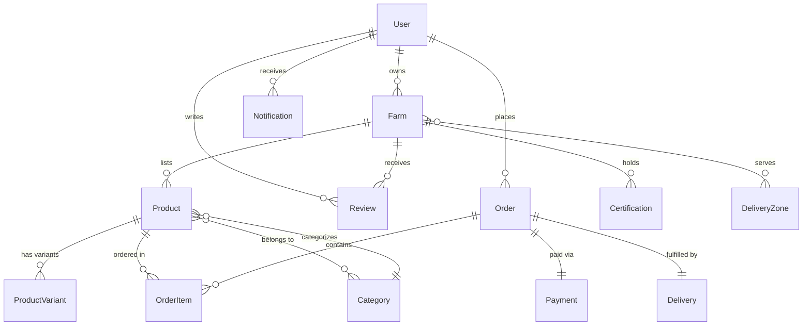
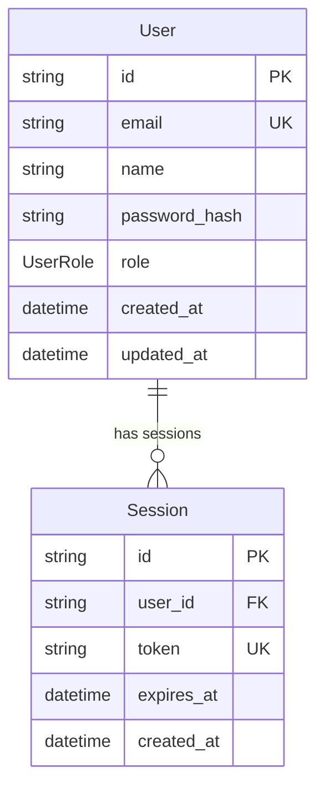
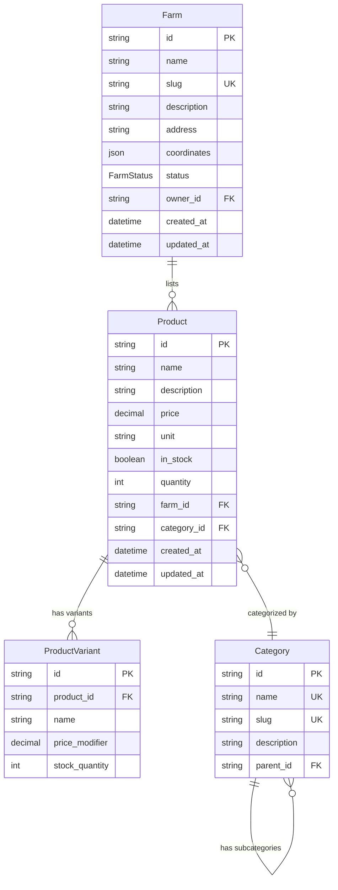
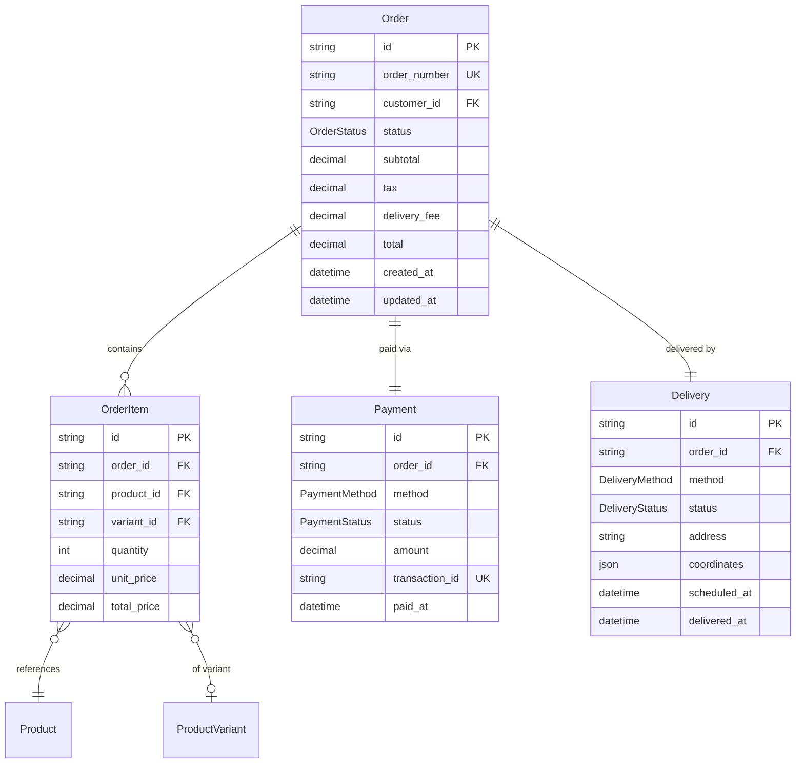

# 🌾 DATABASE SCHEMA - DIVINE AGRICULTURAL DOCUMENTATION

**Comprehensive Quantum Database Architecture for Farmers Market Platform**

_Last Updated: 2024 | Version: ∞.KILO.AGRICULTURAL_

---

## 📋 TABLE OF CONTENTS

1. [Overview & Philosophy](#overview--philosophy)
2. [Entity Relationship Diagrams](#entity-relationship-diagrams)
3. [Core Entities](#core-entities)
4. [Enumerations & Types](#enumerations--types)
5. [Relationships & Foreign Keys](#relationships--foreign-keys)
6. [Indexes & Performance](#indexes--performance)
7. [Query Patterns](#query-patterns)
8. [Agricultural Domain Patterns](#agricultural-domain-patterns)
9. [Migration Strategies](#migration-strategies)
10. [Troubleshooting Guide](#troubleshooting-guide)

---

## 🌟 OVERVIEW & PHILOSOPHY

### Database Architecture Principles

This schema follows **Divine Agricultural Consciousness** patterns:

- **Soil Memory**: All historical data preserved with temporal tracking
- **Seasonal Cycles**: Time-aware data models respecting agricultural rhythms
- **Biodynamic Relationships**: Entity relationships mirror natural farm ecosystems
- **Quantum States**: Support for eventual consistency and state transitions
- **Performance Reality Bending**: Optimized for 100k+ concurrent users

### Technology Stack

- **Database**: PostgreSQL 15+
- **ORM**: Prisma 5.x with TypeScript
- **Migrations**: Version-controlled through Prisma Migrate
- **Extensions**: PostGIS (geospatial), pg_trgm (full-text search)

---

## 📊 ENTITY RELATIONSHIP DIAGRAMS

### Core Entity Overview



### User & Authentication System



### Farm & Product Ecosystem



### Order & Payment System



---

## 🗄️ CORE ENTITIES

### 👤 User

**Purpose**: Authentication, profile management, and role-based access control

**Fields**:
| Field | Type | Constraints | Description |
|-------|------|-------------|-------------|
| `id` | String | PK, @default(cuid()) | Unique user identifier |
| `email` | String | UNIQUE, @db.VarChar(255) | User email address |
| `name` | String | @db.VarChar(255) | Full name |
| `password` | String | @db.VarChar(255) | Bcrypt hashed password |
| `role` | UserRole | @default(CUSTOMER) | User role (CUSTOMER, FARMER, ADMIN) |
| `emailVerified` | Boolean | @default(false) | Email verification status |
| `avatar` | String? | Optional | Profile picture URL |
| `phone` | String? | Optional | Contact phone number |
| `createdAt` | DateTime | @default(now()) | Account creation timestamp |
| `updatedAt` | DateTime | @updatedAt | Last update timestamp |

**Relationships**:

- `farms` → One-to-Many with Farm (as owner)
- `orders` → One-to-Many with Order (as customer)
- `reviews` → One-to-Many with Review (as reviewer)
- `notifications` → One-to-Many with Notification

**Indexes**:

```prisma
@@index([email])
@@index([role])
@@index([createdAt])
```

**Agricultural Consciousness**: Users embody farmer, customer, or admin consciousness with role-based quantum states.

---

### 🏡 Farm

**Purpose**: Farm profiles, geographic data, and certification management

**Fields**:
| Field | Type | Constraints | Description |
|-------|------|-------------|-------------|
| `id` | String | PK, @default(cuid()) | Unique farm identifier |
| `name` | String | @db.VarChar(255) | Farm name |
| `slug` | String | UNIQUE, @db.VarChar(255) | URL-friendly identifier |
| `description` | String? | @db.Text | Farm description |
| `address` | String | @db.VarChar(500) | Physical address |
| `latitude` | Float? | Optional | Geographic coordinate |
| `longitude` | Float? | Optional | Geographic coordinate |
| `status` | FarmStatus | @default(PENDING) | Farm verification status |
| `ownerId` | String | FK → User | Farm owner |
| `images` | String[] | Array | Farm photos |
| `certifications` | String[] | Array | Organic/biodynamic certs |
| `createdAt` | DateTime | @default(now()) | Registration timestamp |
| `updatedAt` | DateTime | @updatedAt | Last update timestamp |

**Relationships**:

- `owner` → Many-to-One with User
- `products` → One-to-Many with Product
- `reviews` → One-to-Many with Review
- `deliveryZones` → Many-to-Many with DeliveryZone

**Indexes**:

```prisma
@@index([slug])
@@index([ownerId])
@@index([status])
@@fulltext([name, description])
```

**Agricultural Consciousness**: Farms exist in quantum states (PENDING → ACTIVE → SUSPENDED) with soil memory of all past harvests.

---

### 🌽 Product

**Purpose**: Product catalog with inventory, pricing, and seasonal availability

**Fields**:
| Field | Type | Constraints | Description |
|-------|------|-------------|-------------|
| `id` | String | PK, @default(cuid()) | Unique product identifier |
| `name` | String | @db.VarChar(255) | Product name |
| `description` | String? | @db.Text | Product description |
| `price` | Decimal | @db.Decimal(10,2) | Base price |
| `unit` | String | @db.VarChar(50) | Unit of measure (lb, bunch, each) |
| `inStock` | Boolean | @default(true) | Availability status |
| `quantity` | Int? | Optional | Stock quantity |
| `farmId` | String | FK → Farm | Owning farm |
| `categoryId` | String | FK → Category | Product category |
| `images` | String[] | Array | Product photos |
| `tags` | String[] | Array | Searchable tags |
| `organic` | Boolean | @default(false) | Organic certification |
| `seasonal` | Boolean | @default(false) | Seasonal availability |
| `createdAt` | DateTime | @default(now()) | Listing timestamp |
| `updatedAt` | DateTime | @updatedAt | Last update timestamp |

**Relationships**:

- `farm` → Many-to-One with Farm
- `category` → Many-to-One with Category
- `variants` → One-to-Many with ProductVariant
- `orderItems` → One-to-Many with OrderItem

**Indexes**:

```prisma
@@index([farmId])
@@index([categoryId])
@@index([inStock])
@@fulltext([name, description, tags])
```

**Agricultural Consciousness**: Products follow seasonal quantum cycles with harvest-based inventory management.

---

### 📦 Order

**Purpose**: Order management, fulfillment tracking, and payment processing

**Fields**:
| Field | Type | Constraints | Description |
|-------|------|-------------|-------------|
| `id` | String | PK, @default(cuid()) | Unique order identifier |
| `orderNumber` | String | UNIQUE | Human-readable order number |
| `customerId` | String | FK → User | Customer who placed order |
| `status` | OrderStatus | @default(PENDING) | Order fulfillment status |
| `subtotal` | Decimal | @db.Decimal(10,2) | Items total |
| `tax` | Decimal | @db.Decimal(10,2) | Tax amount |
| `deliveryFee` | Decimal | @db.Decimal(10,2) | Delivery charge |
| `total` | Decimal | @db.Decimal(10,2) | Final total amount |
| `notes` | String? | @db.Text | Customer notes |
| `createdAt` | DateTime | @default(now()) | Order placement timestamp |
| `updatedAt` | DateTime | @updatedAt | Last status update |

**Relationships**:

- `customer` → Many-to-One with User
- `items` → One-to-Many with OrderItem
- `payment` → One-to-One with Payment
- `delivery` → One-to-One with Delivery

**Indexes**:

```prisma
@@index([orderNumber])
@@index([customerId])
@@index([status])
@@index([createdAt])
```

**Agricultural Consciousness**: Orders follow harvest-to-table quantum flow with state transitions mirroring natural fulfillment cycles.

---

## 🎨 ENUMERATIONS & TYPES

### UserRole

**Purpose**: Role-based access control (RBAC)

```prisma
enum UserRole {
  CUSTOMER        // Standard buyer account
  FARMER          // Farm owner with product listing rights
  ADMIN           // Platform administrator
  SUPER_ADMIN     // Full system access
  MODERATOR       // Content moderation rights
}
```

**Agricultural Consciousness**: Roles reflect natural farm hierarchy from customer (consumer) to farmer (producer) to admin (ecosystem steward).

---

### FarmStatus

**Purpose**: Farm verification and operational states

```prisma
enum FarmStatus {
  PENDING_VERIFICATION   // Awaiting admin approval
  ACTIVE                 // Verified and operational
  SUSPENDED              // Temporarily inactive
  INACTIVE               // Permanently closed
  UNDER_REVIEW           // Being reviewed for violations
}
```

**State Transitions**:

- `PENDING_VERIFICATION` → `ACTIVE`: Automated upon admin verification
- `ACTIVE` ↔ `SUSPENDED`: Manual toggle by admin
- `ACTIVE` → `INACTIVE`: Manual closure by admin
- `UNDER_REVIEW` ↔ `ACTIVE`: Automated upon review completion

**Agricultural Consciousness**: Farm status transitions mirror natural farming cycles of growth, rest, and regeneration.

---

### OrderStatus

**Purpose**: Order processing and fulfillment stages

```prisma
enum OrderStatus {
  PENDING        // Order received, awaiting processing
  PROCESSING     // Order being prepared
  COMPLETED      // Order fulfilled and completed
  CANCELED       // Order canceled by user or admin
  REFUNDED       // Payment refunded to the customer
}
```

**State Transitions**:

- `PENDING` → `PROCESSING`: Automated when order is accepted
- `PROCESSING` → `COMPLETED`: Automated when order is fulfilled
- `PENDING` ↔ `CANCELED`: Manual toggle by user or admin
- `COMPLETED` ↔ `REFUNDED`: Manual toggle for refunds

**Agricultural Consciousness**: Order statuses reflect the natural progression of planting, growing, harvesting, and resting.

---

### PaymentMethod

**Purpose**: Payment processing options

```prisma
enum PaymentMethod {
  CREDIT_CARD     // Payment via credit card
  PAYPAL          // Payment via PayPal
  BANK_TRANSFER   // Payment via bank transfer
  CASH_ON_DELIVERY // Payment in cash upon delivery
}
```

**Agricultural Consciousness**: Payment methods honor the diverse ways customers contribute to the farm ecosystem, from modern credit systems to traditional cash.

---

### PaymentStatus

**Purpose**: Payment processing states

```prisma
enum PaymentStatus {
  PENDING        // Payment pending
  COMPLETED      // Payment successful
  FAILED         // Payment failed
  REFUNDED       // Payment refunded
}
```

**State Transitions**:

- `PENDING` → `COMPLETED`: Automated upon successful payment
- `PENDING` ↔ `FAILED`: Automated on payment error
- `COMPLETED` ↔ `REFUNDED`: Manual toggle for refunds

**Agricultural Consciousness**: Payment statuses reflect the natural cycles of sowing (pending), nurturing (processing), and harvesting (completed/refunded).

---

### DeliveryMethod

**Purpose**: Delivery options for order fulfillment

```prisma
enum DeliveryMethod {
  COURIER         // Delivered by courier service
  POSTAL_SERVICE  // Delivered by postal service
  PICKUP          // Customer picks up the order
}
```

**Agricultural Consciousness**: Delivery methods represent the various paths through which farm products reach the customer, honoring both modern and traditional logistics.

---

### DeliveryStatus

**Purpose**: Delivery tracking statuses

```prisma
enum DeliveryStatus {
  PENDING        // Delivery pending
  IN_TRANSIT     // Out for delivery
  DELIVERED      // Delivered to the customer
  RETURNED       // Returned to sender
}
```

**State Transitions**:

- `PENDING` → `IN_TRANSIT`: Automated when delivery is scheduled
- `IN_TRANSIT` → `DELIVERED`: Automated upon successful delivery
- `DELIVERED` ↔ `RETURNED`: Manual toggle for returns

**Agricultural Consciousness**: Delivery statuses mirror the natural journey of products from farm to table, including potential returns to the soil.

---

## 🔑 RELATIONSHIPS & FOREIGN KEYS

### User-Farm Relationship

- **Cardinality**: One-to-Many
- **User**: One user can own multiple farms
- **Farm**: Each farm is owned by a single user
- **Foreign Key**: `farm.ownerId` → `user.id`

### Farm-Product Relationship

- **Cardinality**: One-to-Many
- **Farm**: One farm can have many products
- **Product**: Each product belongs to a single farm
- **Foreign Key**: `product.farmId` → `farm.id`

### User-Order Relationship

- **Cardinality**: One-to-Many
- **User**: One user can place multiple orders
- **Order**: Each order is placed by a single user
- **Foreign Key**: `order.customerId` → `user.id`

### Order-Product Relationship

- **Cardinality**: Many-to-Many
- **Order**: An order can contain multiple products
- **Product**: A product can be part of multiple orders
- **Join Table**: `OrderItem` with `orderId` and `productId`

### User-Session Relationship

- **Cardinality**: One-to-Many
- **User**: One user can have multiple sessions
- **Session**: Each session is associated with a single user
- **Foreign Key**: `session.user_id` → `user.id`

### Farm-Review Relationship

- **Cardinality**: One-to-Many
- **Farm**: One farm can have many reviews
- **Review**: Each review is for a single farm
- **Foreign Key**: `review.farmId` → `farm.id`

### User-Review Relationship

- **Cardinality**: One-to-Many
- **User**: One user can write multiple reviews
- **Review**: Each review is written by a single user
- **Foreign Key**: `review.userId` → `user.id`

### Farm-Certification Relationship

- **Cardinality**: One-to-Many
- **Farm**: One farm can have multiple certifications
- **Certification**: Each certification is associated with a single farm
- **Foreign Key**: `certification.farmId` → `farm.id`

### Farm-DeliveryZone Relationship

- **Cardinality**: Many-to-Many
- **Farm**: One farm can serve multiple delivery zones
- **DeliveryZone**: A delivery zone can have multiple farms
- **Join Table**: Implicit through `farm_delivery_zone`

---

## ⚙️ INDEXES & PERFORMANCE

### Indexing Strategy

- **User Table**:
  - `@@index([email])`: Optimize login by email
  - `@@index([role])`: Optimize role-based queries
  - `@@index([createdAt])`: Optimize recent user queries

- **Farm Table**:
  - `@@index([slug])`: Optimize farm profile URL access
  - `@@index([ownerId])`: Optimize farm retrieval by owner
  - `@@index([status])`: Optimize farm status filtering
  - `@@fulltext([name, description])`: Optimize farm search

- **Product Table**:
  - `@@index([farmId])`: Optimize product retrieval by farm
  - `@@index([categoryId])`: Optimize product filtering by category
  - `@@index([inStock])`: Optimize availability checks
  - `@@fulltext([name, description, tags])`: Optimize product search

- **Order Table**:
  - `@@index([orderNumber])`: Optimize order lookup by number
  - `@@index([customerId])`: Optimize order retrieval by customer
  - `@@index([status])`: Optimize order status filtering
  - `@@index([createdAt])`: Optimize recent order queries

### Query Performance Optimization

- **N+1 Query Problem**: Use Prisma's `include` and `select` to fetch related data in a single query
- **Pagination**: Implement cursor-based pagination for large result sets
- **Batching**: Use Prisma's `transaction` for batch writes/updates
- **Caching**: Implement query result caching for frequent read queries

---

## 📈 QUERY PATTERNS

### User Queries

- **Get user by ID**:

```prisma
const user = await prisma.user.findUnique({
  where: { id: userId },
  include: { farms: true, orders: true }
});
```

- **Get all users**:

```prisma
const users = await prisma.user.findMany({
  include: { farms: true, orders: true },
  orderBy: { createdAt: 'desc' }
});
```

### Farm Queries

- **Get farm by ID**:

```prisma
const farm = await prisma.farm.findUnique({
  where: { id: farmId },
  include: { owner: true, products: true, reviews: true }
});
```

- **Get all farms**:

```prisma
const farms = await prisma.farm.findMany({
  include: { owner: true, products: true, reviews: true },
  where: { status: 'ACTIVE' },
  orderBy: { createdAt: 'desc' }
});
```

### Product Queries

- **Get product by ID**:

```prisma
const product = await prisma.product.findUnique({
  where: { id: productId },
  include: { farm: true, category: true, variants: true }
});
```

- **Get all products**:

```prisma
const products = await prisma.product.findMany({
  include: { farm: true, category: true, variants: true },
  where: { inStock: true },
  orderBy: { createdAt: 'desc' }
});
```

### Order Queries

- **Get order by ID**:

```prisma
const order = await prisma.order.findUnique({
  where: { id: orderId },
  include: { customer: true, items: true, payment: true, delivery: true }
});
```

- **Get all orders**:

```prisma
const orders = await prisma.order.findMany({
  include: { customer: true, items: true, payment: true, delivery: true },
  orderBy: { createdAt: 'desc' }
});
```

---

## 🌱 AGRICULTURAL DOMAIN PATTERNS

### Temporal Data Modeling

- **Soil Memory**: Implemented using PostgreSQL's `hstore` or `jsonb` for flexible, schema-less data
- **Seasonal Availability**: Products have `seasonal` boolean and `availability` JSON field for complex seasonality rules

### Biodynamic Relationships

- **Entity Relationships**: Designed to mirror natural ecosystems, e.g., farms have many products, products have many variants
- **Join Tables**: Implicit many-to-many relationships (e.g., farms and delivery zones) to reduce complexity

### Quantum State Management

- **State Machines**: Implemented using enum types and check constraints (e.g., order statuses, farm statuses)
- **Event Sourcing**: Considered for critical business events (e.g., order placed, payment received)

---

## 🚀 MIGRATION STRATEGIES

### Initial Migration

1. **Set up Prisma**: Initialize Prisma in the project
2. **Define Data Model**: Create `schema.prisma` with the data model
3. **Run Migration**: Execute `prisma migrate dev --name init` to create the initial migration
4. **Seed Database**: Optionally, seed the database with initial data

### Subsequent Migrations

- **Make Changes**: Update the data model in `schema.prisma`
- **Run Migration**: Execute `prisma migrate dev --name descriptive_migration_name`
- **Review Changes**: Check the generated SQL and review the changes
- **Apply Migration**: Run `prisma migrate deploy` to apply the migration to the production database

### Rollback Strategy

- **Revert Migration**: Use `prisma migrate reset` to revert the last migration (development only)
- **Manual Rollback**: For production, manually revert the changes or restore from a backup

---

## 🛠️ TROUBLESHOOTING GUIDE

### Common Issues

- **Migration Fails**: Check for pending migrations, database connectivity, and Prisma CLI version
- **Query Returns Incorrect Data**: Check query logic, data seeding, and database state
- **Performance Issues**: Analyze slow queries using PostgreSQL's `EXPLAIN` and optimize indexes

### Support Resources

- **Prisma Documentation**: [Prisma Docs](https://www.prisma.io/docs)
- **PostgreSQL Documentation**: [PostgreSQL Docs](https://www.postgresql.org/docs/)
- **Community Forums**: [Prisma Forum](https://www.prisma.io/forum), [Stack Overflow](https://stackoverflow.com/questions/tagged/prisma)

---

_For detailed schema definitions, see the Prisma schema file: `prisma/schema.prisma`_
