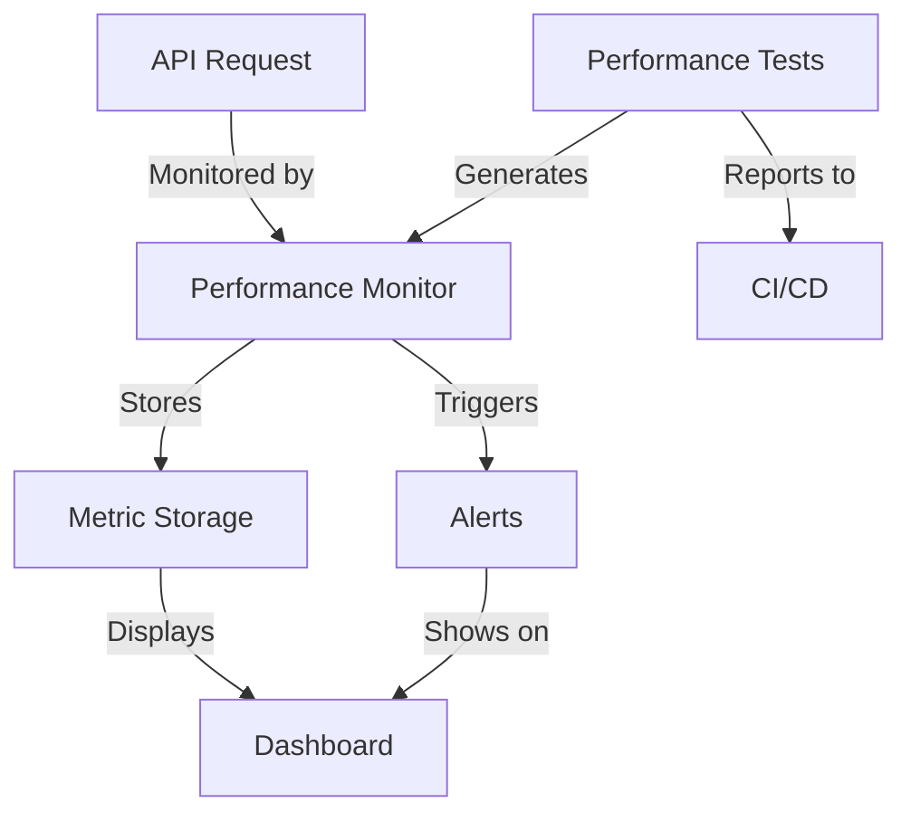

# Performance Monitoring System Documentation

## System Architecture

### 1. Components

#### Performance Monitor

- Real-time metric collection
- In-memory metric storage
- Alert generation
- Metric aggregation and analysis

```typescript
interface PerformanceMetric {
  timestamp: number;
  duration: number;
  route: string;
  method: string;
  status: number;
  queryCount?: number;
  cacheHit?: boolean;
}
```

#### Monitoring Dashboard

- Real-time visualization
- Trend analysis
- Alert display
- Performance reports

#### Performance Testing Framework

- Load testing with k6
- Automated test scenarios
- Regression detection
- CI/CD integration

### 2. Data Flow



## Alert Response Procedures

### 1. High Response Time Alert

**Threshold**: > 1000ms (p95)
**Response Steps**:

1. Check system metrics (CPU, Memory, Network)
2. Review recent deployments
3. Analyze database performance
4. Check external service dependencies
5. Scale resources if needed

### 2. Low Cache Hit Rate Alert

**Threshold**: < 70%
**Response Steps**:

1. Review cache configuration
2. Check cache invalidation patterns
3. Analyze cache key strategy
4. Monitor cache memory usage
5. Adjust TTL settings if needed

### 3. High Query Count Alert

**Threshold**: > 10 queries per request
**Response Steps**:

1. Identify affected endpoints
2. Review query patterns
3. Implement query batching
4. Add missing indexes
5. Optimize data fetching

### 4. Error Rate Alert

**Threshold**: > 1%
**Response Steps**:

1. Review error logs
2. Check application logs
3. Analyze error patterns
4. Test affected endpoints
5. Deploy fixes if needed

## Performance Testing Guide

### 1. Running Tests Locally

```bash
# Install dependencies
npm install

# Start test environment
npm run test:setup

# Run performance tests
npm run test:performance

# Generate report
npm run test:report
```

### 2. Test Scenarios

#### Product Listing (30% load)

- GET /api/products
- Expected p95: < 200ms
- Cache hit rate: > 80%

#### Market Data (20% load)

- GET /api/markets/statistics
- Expected p95: < 300ms
- Max query count: 5

#### Crop Tracking (25% load)

- GET /api/crops/status
- Expected p95: < 250ms
- Real-time updates

#### User Operations (25% load)

- GET /api/user/preferences
- GET /api/user/dashboard
- Expected p95: < 150ms

### 3. Analyzing Results

```typescript
// Example: Analyzing test results
const runner = new PerformanceTestRunner();
const results = await runner.runTests();
const comparison = runner.compareWithBaseline(results);

if (comparison.regressions.length > 0) {
  console.warn("Performance regressions detected:", comparison.regressions);
}
```

## Monitoring Dashboard Guide

### 1. Navigation

- **Time Range**: Select from 1h, 24h, 7d, or 30d
- **Metrics View**: Response time, cache rate, error rate, throughput
- **Alert History**: View recent and active alerts
- **Trend Analysis**: Compare periods and detect patterns

### 2. Key Metrics

#### Response Time

- Average: Overall response time
- p95: 95th percentile latency
- p99: 99th percentile latency

#### Cache Performance

- Hit Rate: Percentage of cache hits
- Response Time: Cache response latency
- Memory Usage: Cache memory consumption

#### Database Metrics

- Query Count: Queries per request
- Query Time: Average query duration
- Connection Pool: Pool utilization

#### System Health

- Error Rate: Request failure rate
- Throughput: Requests per second
- Resource Usage: CPU, memory, network

### 3. Custom Views

```typescript
// Example: Creating a custom metric view
const MetricView: React.FC<MetricViewProps> = ({ metric, timeRange }) => {
  const data = useMetricData(metric, timeRange);
  return (
    <div className="metric-card">
      <MetricsChart data={data} timeRange={timeRange} />
      <MetricSummary data={data} />
    </div>
  );
};
```

### 4. Alert Configuration

```typescript
// Example: Configuring alert thresholds
const alertConfig = {
  responseTime: {
    warning: 500, // ms
    critical: 1000, // ms
  },
  cacheHitRate: {
    warning: 0.8, // 80%
    critical: 0.7, // 70%
  },
  errorRate: {
    warning: 0.01, // 1%
    critical: 0.05, // 5%
  },
};
```

## Maintenance and Troubleshooting

### 1. Regular Maintenance

#### Daily Tasks

- Review alert history
- Check performance trends
- Validate monitoring system health

#### Weekly Tasks

- Analyze performance patterns
- Update baselines if needed
- Review and adjust thresholds

#### Monthly Tasks

- Clean up old metrics
- Validate monitoring coverage
- Update documentation

### 2. Common Issues

#### High Memory Usage

1. Check metric retention settings
2. Review data aggregation
3. Adjust cleanup intervals

#### Missing Metrics

1. Verify monitoring middleware
2. Check route configuration
3. Validate metric collection

#### False Alerts

1. Review threshold configuration
2. Check baseline accuracy
3. Adjust sensitivity settings

## Best Practices

### 1. Performance Monitoring

- Monitor all critical endpoints
- Set appropriate thresholds
- Keep baseline updated
- Track trends over time

### 2. Alert Management

- Set meaningful thresholds
- Avoid alert fatigue
- Document response procedures
- Maintain escalation paths

### 3. Testing Strategy

- Regular performance tests
- Realistic test scenarios
- Representative data sets
- Consistent environments

---

\*This documentation is maintained by the performance engineering team.
